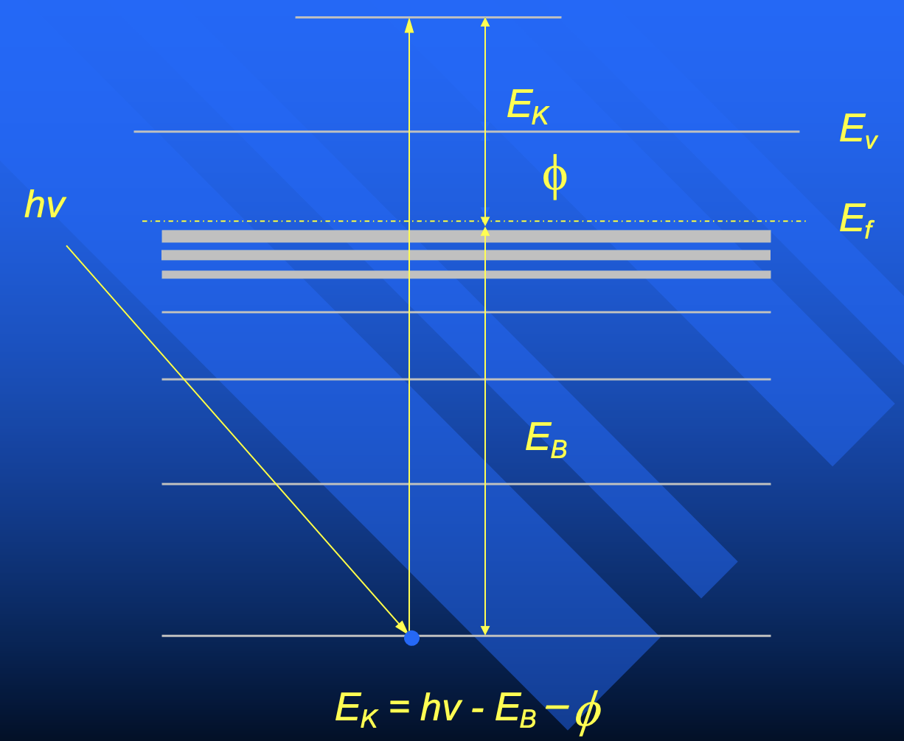
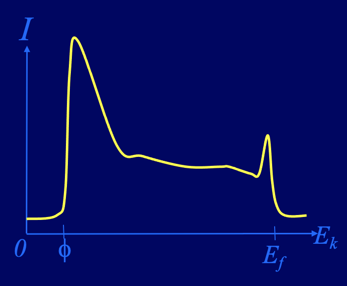
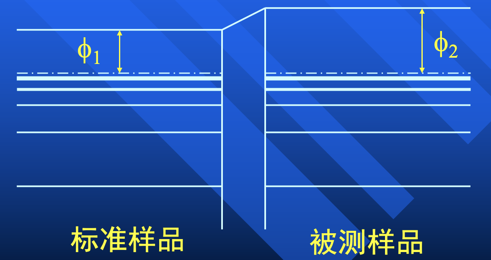
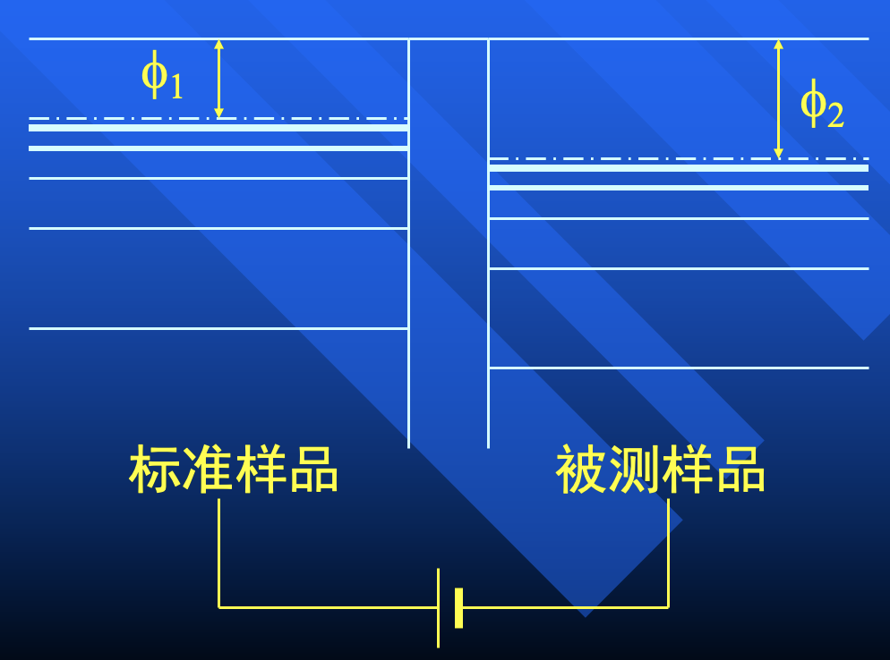

# 功函数测量

固体力学中使用行星轨道模型就能解释绝大部分问题。电子吸收光电子能量发生能级跃迁

$$
E_k = h \nu - E_B - \phi
$$

自由电子只能在样品里自由移动，不能自由逸散

## 功函数的起源

真正起源还未知。

认为功函数是固体的内势。没有内势，电子就会逸散，固体不稳定存在。因为固体稳定存在，所以有内势 

不同材料、不同晶面、粗糙度不同都会导致内势不同

## 研究功函数的意义

- 低功函数材料适合做发射电极
- 建立均匀、稳定空间电场
- 研究接触电势差（器件输运性质）

## 功函数测量

### 直接测量

- [UPS](./Lec08.md)：用紫外线打出光电子
    - 光电子动能范围 $0 \sim h \nu - \phi$
    - 但也不能只测最大动能，可能会有漂移（也就是测出来的是相对值），和最小能量相减得到的区间就是 $h \nu - \phi$.
- [LEED](./Lec12.md)
    - 直接打电子，用阻挡栅
    - 比较老的方法了

### 间接测量

开尔文测量：加电压使被测样品和标准样品的功函数达到相等，此时无电流流过电路，测出这个电压 $V_0$ 就是两者的功函数差 $\phi_2 - \phi_1$

