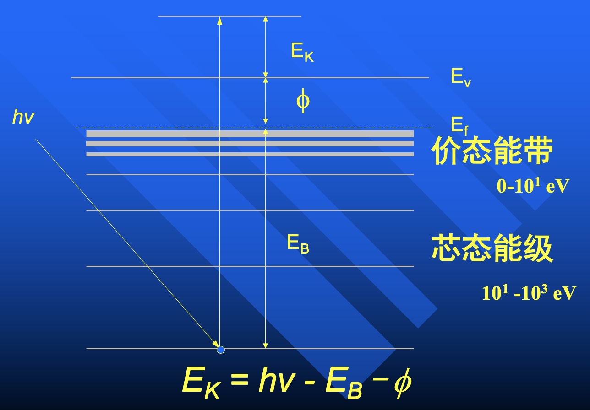
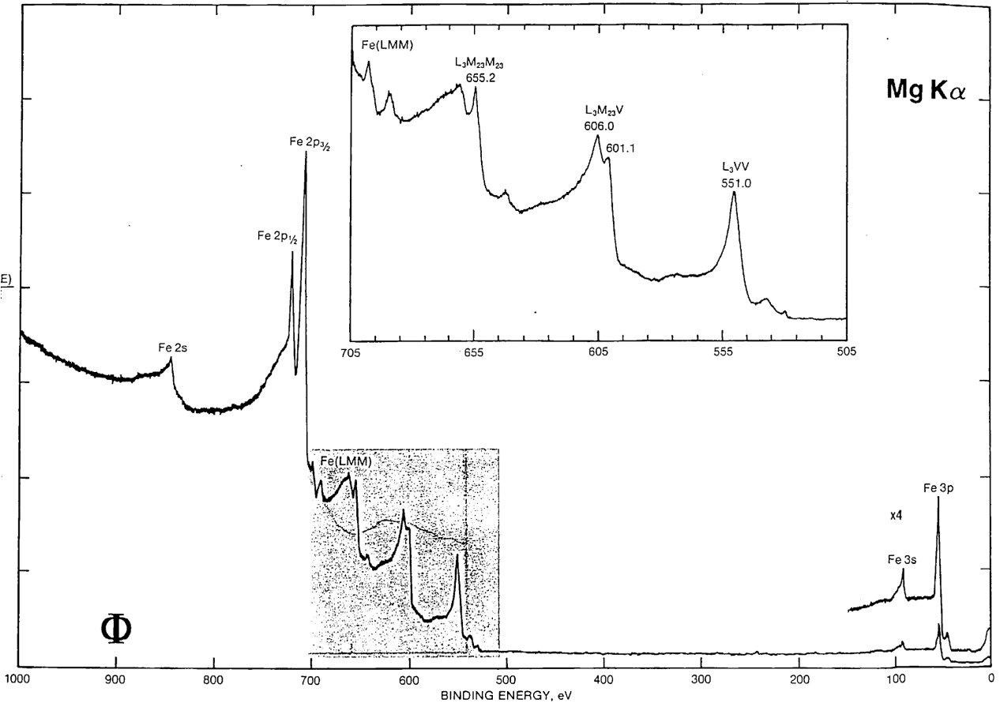
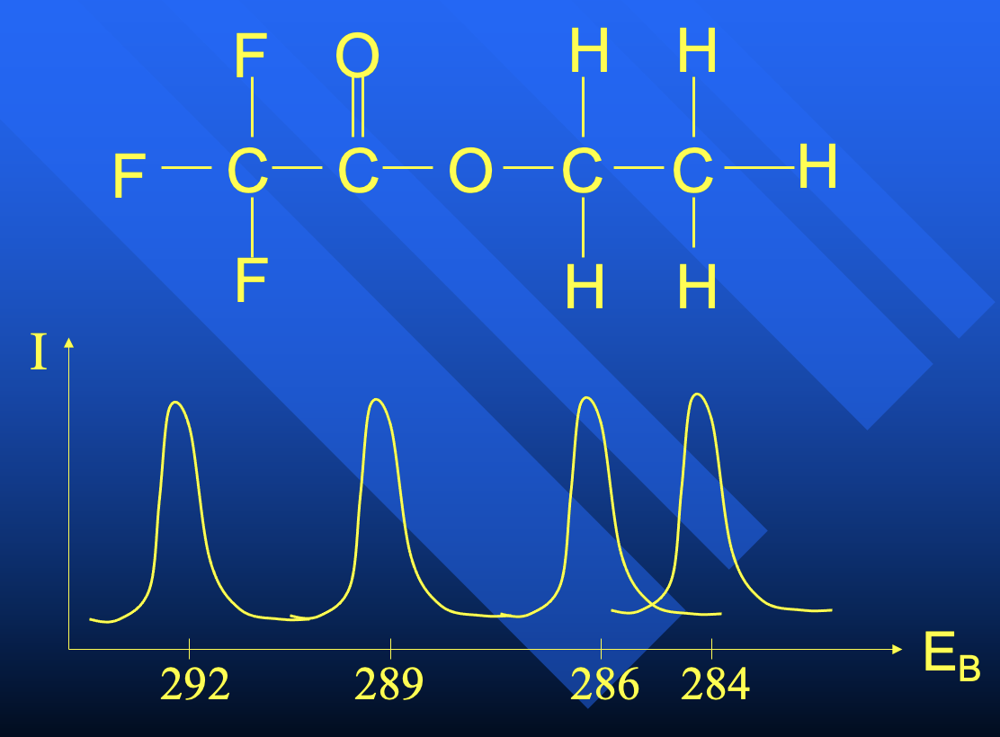
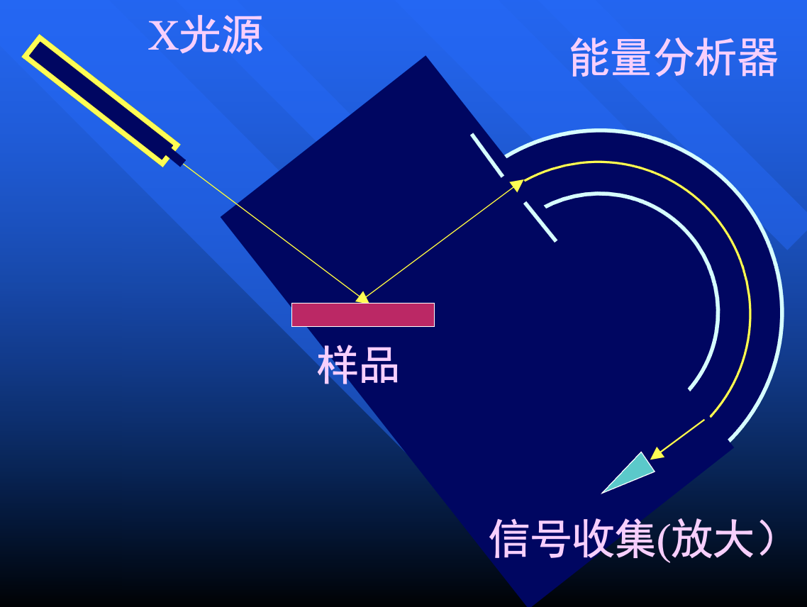
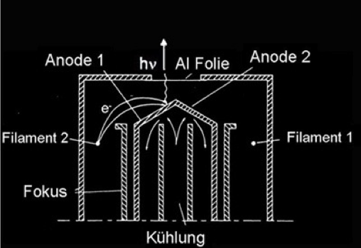
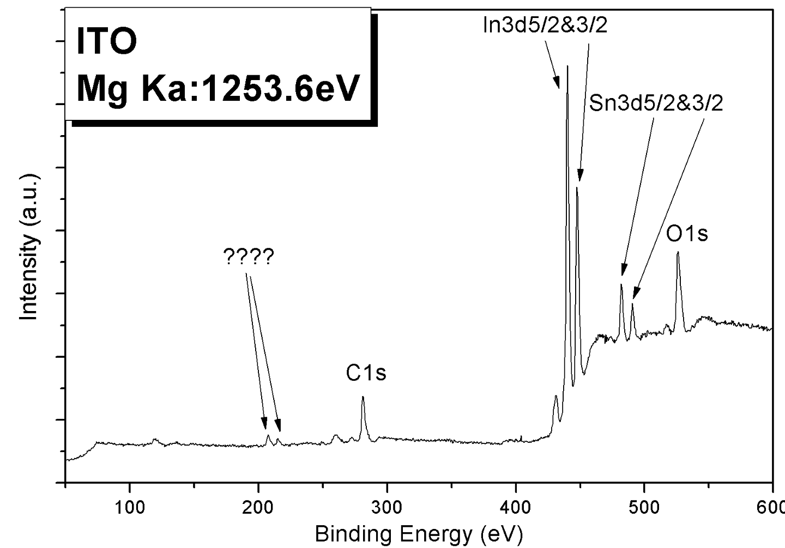
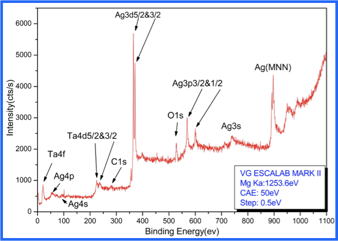

# X-光电子能谱（XPS）

!!! question "为什么谱峰强度不同？"
    

    - 电子态上电子数目不同
    - atomic sensitivity factor，光电离截面

XPS 测量：

- 芯态能级
- 化学位移
- 结构信息

!!! tip "元素得失电子引起的芯态能级位移"
    - 失去电子，原子变小，束缚作用变大，芯态能级变高
    - 得到电子，原子变大，束缚作用变小，芯态能级变低
    
    一个简化的例子：

    

## XPS 实验装置

## X 光的产生

### 产生原理

韧致辐射（实际上就是逆光电效应），特征谱线

### X 光源

X 光枪为什么安装窗口：

1. 隔离电场（电子不能飞到电极上）
2. 热辐射屏蔽
3. 隔绝脏东西

X 光枪窗口的材料为什么用铝膜：

1. 轻金属
2. 薄（延展性好）
3. 光要纯
      - 用的是镁靶和铝靶，镁靶产生的光能量更低
      - 如果用镁做窗口，铝靶产生的光（高能）可能会把镁窗打出镁光（低能），就不纯净了
      - 用铝做窗口，镁靶产生的光（低能）无法把铝窗打出铝光（高能），铝靶产生的光达到窗口还是铝光，所以纯净

!!! info "X-ray "Ghost" lines"
    
    
    镁光和铝光差 $233 \, \mathrm{eV}$！可能是 Al 原子污染了 Mg 靶
    
靶底：铜（用来散热）

    

## X 光谱

### 台阶、信噪比

XPS 谱图“台阶”产生的原因：样品是固体，不是单原子。X 光打到表面下面的原子，产生的光电子会有损耗（因为表面的原子挡着），越深层的原子损耗越大，变为本底

> :bulb: XPS 需要光电子无损地出来！
>
> 爱因斯坦的光电方程没有任何关于损耗的修正 

结合能越大（动能越小）的电子越不容易逸出，损耗越大，信噪比越差

单晶更有序，台阶更明显；氧化层在逸出光电子后会产生正电场，进一步增加损耗

表面是否清洁：看谱图中是否有 C 1s 峰；看能量差较大的两个峰的强度比

### Satellite peak & Shake-up peak

-   结合能小：Satellite peak
    -   Mg 的三色光：$\alpha_{1,2}, \alpha_3, \alpha_4$（$\alpha_5, \alpha_6, \beta$ 强度太弱可以忽略），其中 $\alpha_{1,2}$ 是主峰，$\alpha_3, \alpha_4$ 能量更高，打出来的光电子动能更大，也就是结合能更小
    -   不可消除。本质：光源不纯！不论样品的价态是否改变，Satellite peak 的相对位置和强度都不变。
-   结合能大：Shake-up peak
    -   尚没有特别好的解释
    -   和元素种类、价态有关
    -   化学环境的不同，会造成原子之间的相互作用

### XPS 的局限性

-   样品导电性要好
    -   如果导电性差，内部会形成电场，对光电子动能有影响，就不准了
    -   但是稳定后，能建立起稳定电场，测量还是可以的
    -   电子中和枪
        -   热发：稳定，动能较小不干扰
        -   真能中和吗？
-   检出灵敏度问题
    -   从来没有氢原子、氦原子 XPS 谱！因为轨道能量太低，出来的光电子被噪声淹没了。
-   元素的光电离截面问题
-   探测深度问题
-   表面偏析问题：表面 $\neq$ 体！
-   定量分析困难！
    -   本底的扣除
        -   非常难搞！
    -   表面分布的确定
        -   聚在一起信号就弱了
    -   信号大小的要求
    -   样品性质的影响
    -   :exclamation: **关键在于比对**（和文献标准值，和实验前后）
-   有些元素谱峰形状不利于分析
    -   $\mathrm{V_2 O_5}$
-   影响结合能 $E_b$ 位移的因素众多
    -   化学价态
    -   work function
    -   表面极化
    -   空间电场影响
    -   谱仪的因素
    
    !!! note "校正"
        只要知道一个元素的峰的位置就可以校正！常用校正方法：以 C 1s 峰为参考

        一般（就相信）是游离态的碳。并不绝对科学，但是是没办法的办法

        正确的校正：

        -   选择已知价态的元素谱峰进行校正
            -   e.g. 测 $\mathrm{Si}$ 会有两个峰，结合能高的是 $\mathrm{SiO_2}$.
        -   选择具有特殊性质的元素谱峰

    !!! question "利用 XPS 进行深度分析"
        :thinking: 原理：不同深度出射的光电子的角度不同

        必须用 ARPES（电子透镜抹除角度信息）！但是如果表面不平整（纳米级别），法线方向就会变！样品转过一个角度，电场变了，谱图也会变...

-   系统的局限性
    -   超高真空系统对样品的要求
        > 有动科的拿大肠里的shit来测的 
    -   系统测试和传样对样品的要求
        > 还有考古的拿样品来鉴定真假的 
    -   系统处理能力（样品清洁、加热等）
    -   样品会不会被 X 光分解

虽然有很多局限性，但 50 年来，还没有比 XPS 更好的方法，只是在技术上修修补补。