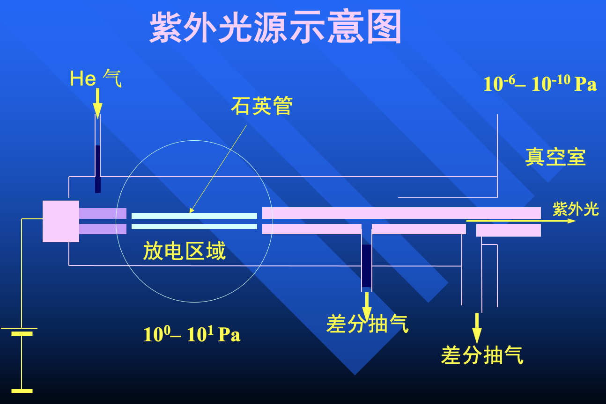
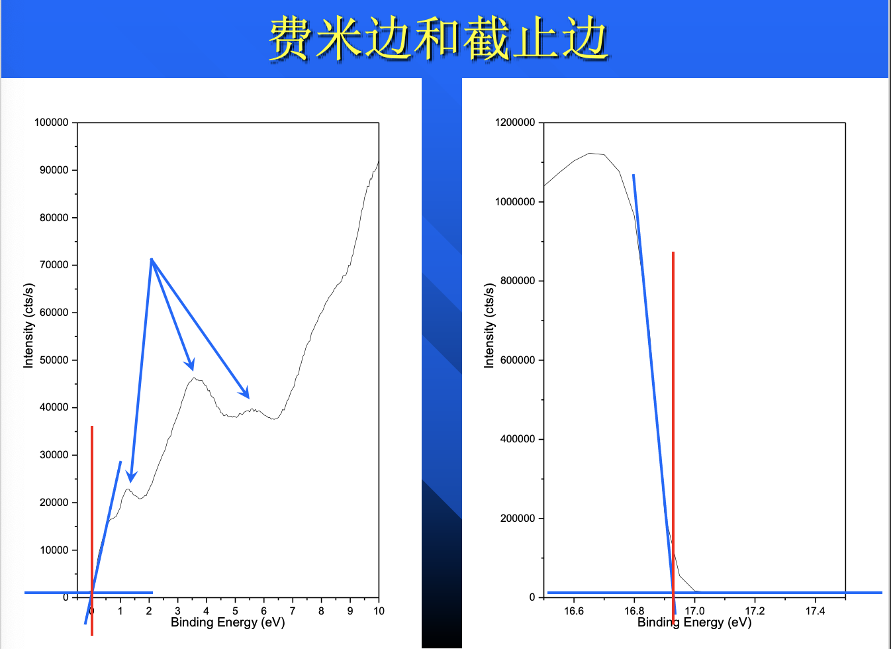

# 紫外光电子能谱（UPS）

紫外线的能量和价态能量相近 $10^1 \, \mathrm{eV}$，光电离截面更大，任何材料对紫外线来说都是不透明的

气体放电的气压是恒定的（$10^0 \sim 10^1 \, \mathrm{Pa}$），而样品又在超高真空的环境中。因为任何材料都反射紫外线，所以紫外光区必须直接和样品室相连，这只能要求{++差分抽气系统 + 细长缝++}

两级差分系统

1.  漏洞小
2.  漏洞细长
3.  气压差低

要先进氦气，再开一级真空。不然先开一级真空（机械泵）的话，放电区是高真空，机械泵的油就会倒吸

测量：

- 价态能带
- 分子轨道空间分布
- 分子结构信息

UPS 测价态能量，出射光电子动能小，本底更多，峰不明显

角分辨紫外光电子能谱（ARUPS）

!!! tip "UPS 的优点和缺点"
    - 优点：表明灵敏、价电子态测量准确
    - 缺点：光源气体放电、差分抽气复杂；谱图分析很难