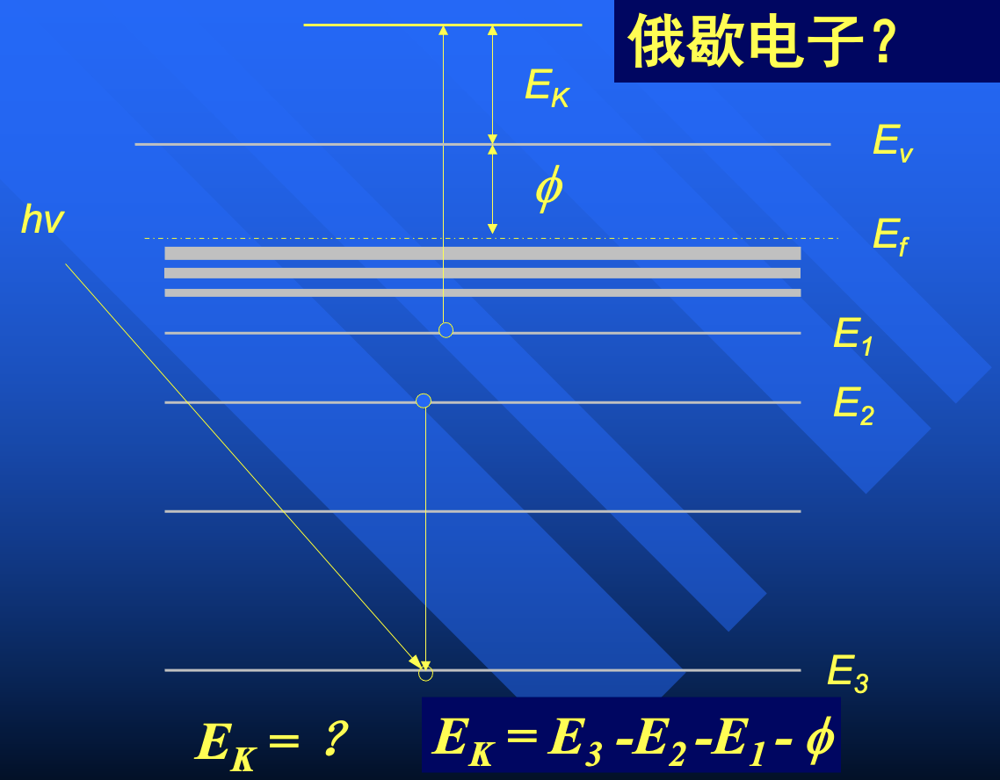
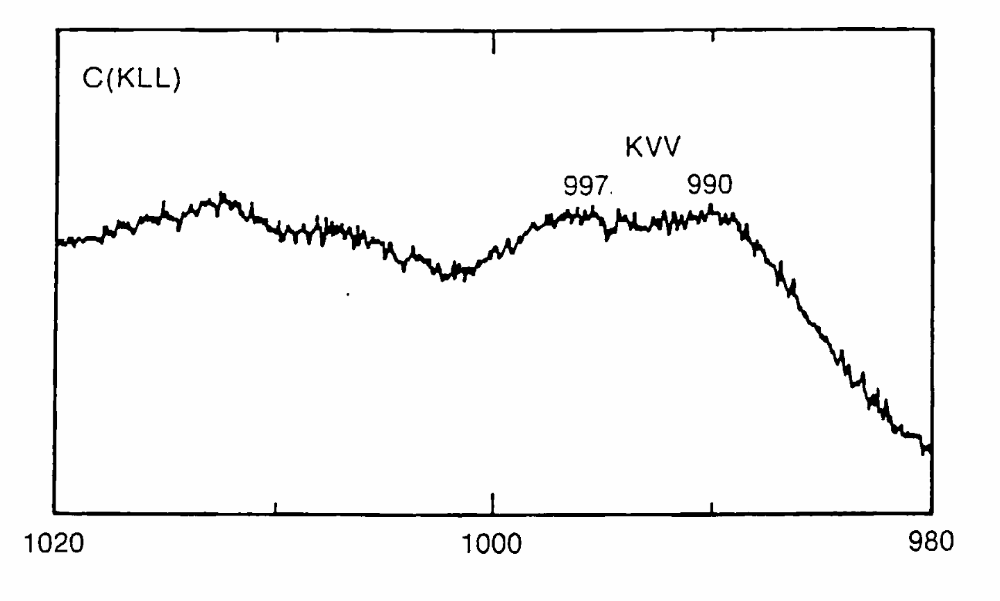
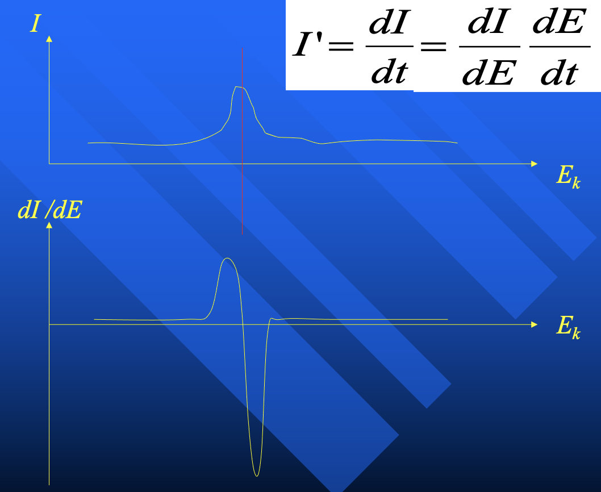
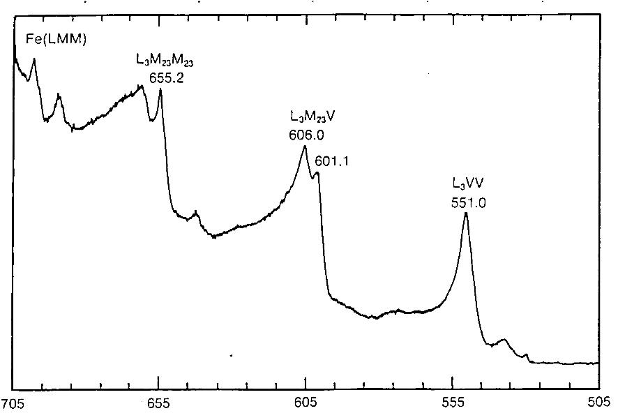

# 扫描电子显微镜（SEM）

Scanning Electron Microscopy, 1932

用电子束扫描样品表面，产生二次电子

绝缘体样品需要镀金

SEM 景深很大（因为电子束是汇聚的），适合看表面形貌

## 俄歇电子能谱（AES）

Auger Electron Spectroscopy

$E_3$ 的电子被打空，$E_2$ 的电子跃迁到 $E_3$ 能级，释放出的能量把 $E_1$ 的电子打飞了

AES 电子产额：原子序数太小，没有足够的能级；原子序数太大，能级太密集，跳来跳去

由于 AES 对入射源要求不高（俄歇电子能量只和能级差有关，能激发出来就行了），所以也可以{++用电子束激发++}。用电子方便啊！

电子束的本底噪声太大了，和俄歇电子混在一起 $\implies$ 使用锁相放大器（Lock-in Amplifier）来提取信号

> 信电的老本行：通信原理，从混频中提取信号
>
> $$I = \int \cos \omega_0 t \cdot \cos \omega t \, dt$$

俄歇电子出射的原始信号不太明显，所以求导：

只要取一个清晰的位置当作峰即可。

由于俄歇涉及三个能级，所以分析得很精准是不太可能的。但是由于每个元素都有独特的俄歇电子能级结构，因此可以作为成分分析的依据（指纹）

!!! tip "俄歇电子用于 XPS 的校准"
    俄歇的电子的出射动能是与入射源无关的，但是 XPS 的电子出射动能与入射光子能量有关。

    不同光源，导致在 XPS 谱图中的俄歇峰位置不同。

## 扫描俄歇电子显微镜（SAM）

- 微区激发
- 微区采集

SAM 属于微区激发（因为电子束是聚焦的），不过由于高能电子有扩散效应，激发区域通常不会小于 1 $\mathrm{\mu m}$. 而且如果长时间扫同一个区域，会把样品烧坏！

> 虽然 1 $\mathrm{\mu m}$ 的分辨率现在已经看不上眼了，但在当时已经是非常了不起了！现在已经不怎么用俄歇了，但是俄歇现象会作为干扰存在，需要知道原理
>
> 当年的革命性技术，已经沦落到作为干扰存在了...

## 光电子显微镜（PEEM）

紫外线是很难聚焦的，不然光刻机早就做出来了。既然微区激发已经没戏了，那么就只能微区采集了。