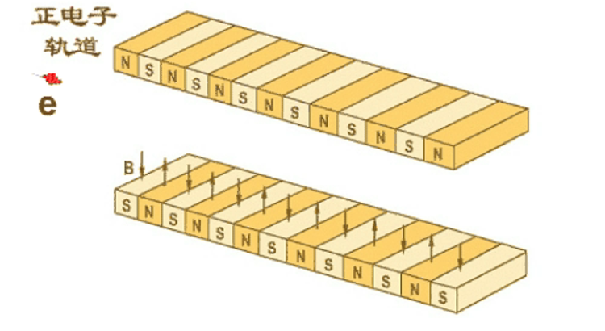

# 同步辐射

加速器历史沿革：

-   回旋加速器（D型盒）
-   直线加速器
    > 越建越长，1930年 Lawrence 提出：要不我们还是回到回旋加速器吧 
-   同步加速器

对撞机：

-   美国，LEP（Large Electron-Positron Collider）
    -   最高能量：$1000 \, \mathrm{GeV}$
    -   周长：$27 \, \mathrm{km}$
-   大型强子对撞机（LHC, Large Hadron Collider）
    -   两束质子加速到 $7 \, \mathrm{TeV}$ 后对撞
    -   周长：$27 \, \mathrm{km}$
-   USA Superconducting Super Collider（SSC）
    -   （计划建造）直径：$54 \, \mathrm{miles}$
    -   在克林顿的老家德州建的，后来被砍掉了，挖的洞又用水泥填了 

## 同步辐射的发现

1947，美国纽约州通用电气公司的实验室，$70 \, \mathrm{MeV}$ 的电子同步加速器，“蓝白色的弧光”。$40 \, \mathrm{MeV}$，黄光；$30 \, \mathrm{MeV}$，红光，强度变弱；$20 \, \mathrm{MeV}$ 时就看不见了。

{++电子作加速运动时所辐射的电磁波++} 称为**同步辐射**（因为是在同步加速器上首先发现的）。

## 同步辐射装置简介

### 储存环

在圆弧形真空盒的上下方安装着二极磁铁，使电子沿圆形轨道运动

### 插入件

在已有的同步辐射光源上进一步提高辐射光的能量

Ginzburg：插入元件

-   扭摆器（Wiggler）
    
    

    在存储环的局部区域增大磁场

-   波荡器（Undulator）

    