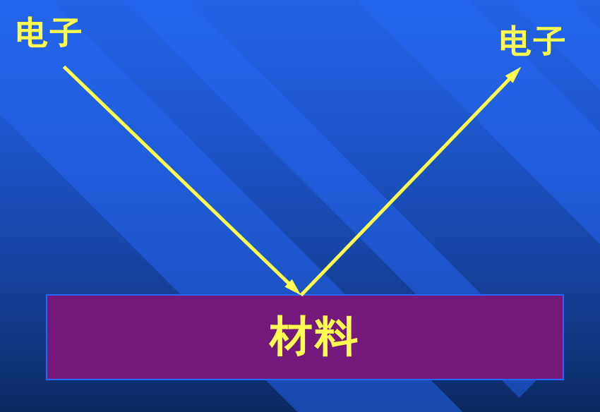
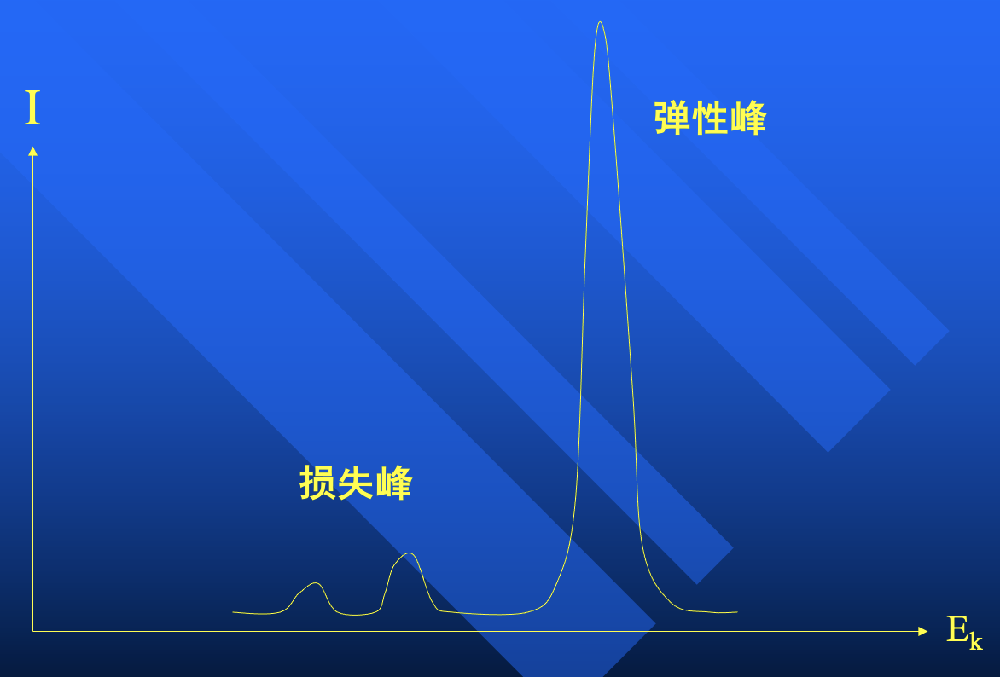
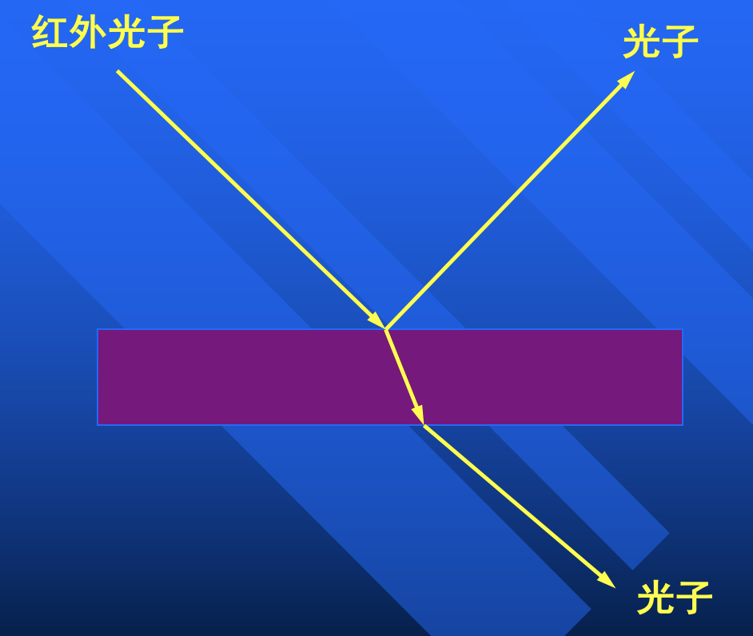
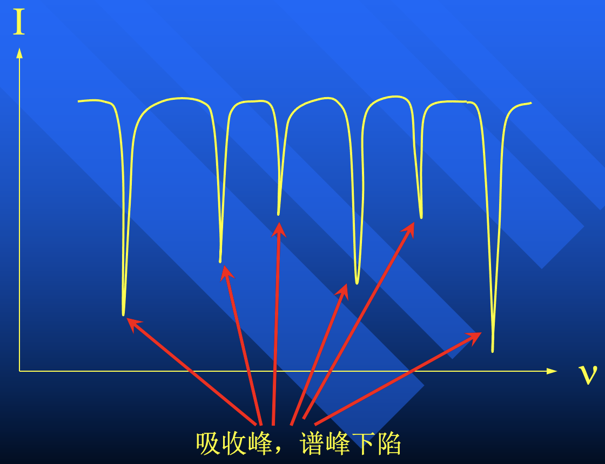

# 电子能量损失谱（EELS）

> 老师调这玩意调得非常痛苦 

用低能电子入射，测出射电子。大部分是弹性散射，对应很高的弹性峰；通过损失峰得到电子能量损失的信息。

## 电子能量损失在何处？

-   电子的带间跃迁（如 AES）
-   产生元激发（极化子，声子等）
-   激发吸附分子、原子振动

!!! info "电子枪（热发）"
    构成：灯丝、加速电压、聚焦、偏转

    用途：

    - 低能电子衍射（LEED）
    - 俄歇电子能谱（AES）
    - 电子能量损失谱（EELS）
    - 电子中和枪
    
    **电子枪的性能要求**

    | 用途 | 能量 | 单色性 | 聚焦性 |
    | --- | :---: | :---: | :---: |
    | LEED | $10$-$100 \, \mathrm{eV}$ | 一般 | 高 |
    | AES | $10^3 \, \mathrm{eV}$ | 低 | 高 |
    | EELS | $10^0 \, \mathrm{eV}$ | 高 | 高 |
    | 电子中和枪 | $10^0 \, \mathrm{eV}$ | 低 | 低 |

## HREELS

:warning: 高分辨率，电子能量不会高！回想能量分析器，相对分辨率 $R = \Delta E/E$ 在仪器做好之后已经定死了，想要减小 $\Delta E$，必须减小 $E$.

## 红外吸收光谱（IRS）

光子入射比电子简单得多！

| 仪器 | 分辨率 | 表面灵敏度 | 聚焦性 |
| --- | :---: | :---: | :---: |
| EELS | $10^0 \, \mathrm{meV}$ | 高 | 高 |
| IRS | $<10^0 \, \mathrm{meV}$ | 低 | 一般 |

测吸收谱

红外的表面灵敏度低，因为红外的穿透深度比较大。

## 光致发光谱（PL）

光子入射，测出射光子。