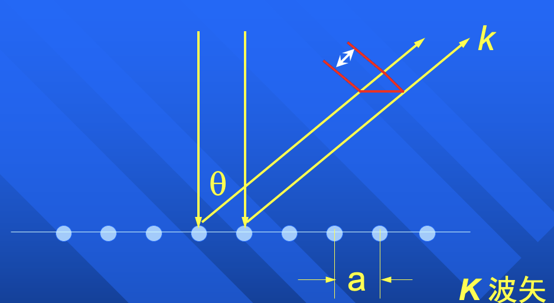
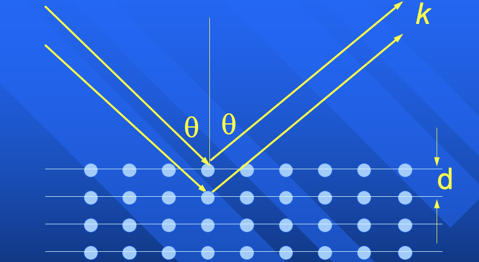

# 低能电子衍射（LEED）

C.J. Davisson 和 L.H. Germer：俩背锅的实验管理员，有一天真空坏了，里面的镍晶体氧化了，薄薄的氧化层看起来是彩色的，说明可以发生衍射！

> 衍射：长程有序结构

用电子束入射，测衍射图样。

$$
\lambda = \frac{h}{p} = \frac{h}{\sqrt{2 m E}} \approx \frac{12.5}{\sqrt{E}}
$$

这里 $\lambda$ 的单位为 Å，$E$ 单位为 eV. 要和晶体发生衍射，波长为几个 Å，电子能量大致 $< 100 \, \mathrm{eV}$.

衍射加强条件（**垂直表面入射**）：

$$
\begin{equation} \tag{1} \label{eq:LEED_cond}
    a \sin \theta = n \lambda
\end{equation}
$$

用波矢 $k = \frac{\omega}{v} = \frac{2\pi}{\lambda}$ 表示，同乘以 $k$ 得 $a k \sin \theta$

$$
a
$$

自从 STM 出现之后，LEED 就没什么人用来测结构了，而是用于检查表面有序度，类似于 STM 的预检。

## RHEED

晶体一边生长，一边检测

高能电子入射，电子屏不用加高压加速（而 LEED 需要）

## X 光衍射（XRD）

光波波长

$$
\lambda = \frac{c}{\nu} = \frac{hc}{E} = \frac{1.25 \times 10^4}{E}
$$

衍射加强条件：

$$
\begin{equation} \tag{2} \label{eq:XRD_cond}
    2 d \cos \theta = n \lambda
\end{equation}
$$

### 劳厄法

入射方向固定，不同方向的晶面有着不同的 $d$ 和 $\theta$，为了在（有限区域的）光屏上观察到衍射图样，需要使用{++连续谱++}的 X 光源。一个晶面方向对应一条衍射线

### 德拜法

多晶粉末，X 光必须是特征谱

对比标准数据库，得到样品组分

> SCI 潮的时候（一篇奖励几w）有人靠测标准数据发家致富了，那时候还没有分区...

## TEM

微区分析（XPS 是不可以的）

样品要薄

TEM 的⾼能电⼦束可以⽤来做电⼦源，再加装电⼦能量分析器就可以做 EELS。