# 晶体结构、晶向和晶面

## 1 常见的三维晶体结构

- 简单立方结构（simple cubic, SC）
- 面心立方结构（face-centered cubic, FCC）
- 体心立方结构（body-centered cubic, BCC）
- 简单六角结构（simple hexagonal, SH）
- 六角密堆积结构（hexagonal close-packed, HCP）
- 金刚石结构 & 闪锌矿结构
- 纤锌矿结构

### 1.1 简单立方结构

用一个立方体的顶点原子表示格点，

$$
\mathbf{R}_l = l_1 \mathbf{a}_1 + l_2 \mathbf{a}_2 + l_3 \mathbf{a}_3
$$

- 简单立方格子：$\mathbf{a}_1 = a \mathbf{i}, \mathbf{a}_2 = a \mathbf{j}, \mathbf{a}_3 = a \mathbf{k}$

### 1.2 面心立方结构

- 面心和顶角空间位置相同
- 原胞：从顶点出发，向附近的三个面心连线作为基矢

$$
\begin{aligned}
    \mathbf{a}_1 &= \frac{a}{2} (\mathbf{j} + \mathbf{k}) \\
    \mathbf{a}_2 &= \frac{a}{2} (\mathbf{k} + \mathbf{i}) \\
    \mathbf{a}_3 &= \frac{a}{2} (\mathbf{i} + \mathbf{j})
\end{aligned}
$$

### 1.3 体心立方结构

- 体心和顶角空间位置相同，沿着体对角线平移 $\frac{\sqrt{3}}{2} a$
- 原胞：从体心出发，向附近三个顶点做不共面连线作为基矢

$$
\begin{aligned}
    \mathbf{a}_1 &= \frac{a}{2} (-\mathbf{i} + \mathbf{j} + \mathbf{k}) \\
    \mathbf{a}_2 &= \frac{a}{2} (\mathbf{i} - \mathbf{j} + \mathbf{k}) \\
    \mathbf{a}_3 &= \frac{a}{2} (\mathbf{i} + \mathbf{j} - \mathbf{k})
\end{aligned}
$$

### 1.4 简单六角结构

有两个晶格常数 $a$ 和 $c$，其中 $a$ 是六角形底面边长，$c$ 是六角柱高度

$$
\begin{aligned}
    \mathbf{a}_1 &= \frac{a}{2} (\sqrt{3} \mathbf{i} + \mathbf{j}) \\
    \mathbf{a}_2 &= \frac{a}{2} (-\sqrt{3} \mathbf{i} + \mathbf{j}) \\
    \mathbf{a}_3 &= c \mathbf{k}
\end{aligned}
$$

### 1.5 六角密堆积结构

ABAB...

- 二维问题 1910 年被挪威数学家 Axel Thue 证明：六角密堆积是最紧密的圆形堆积方式
- 原子位置不可表示格点！第三层会指到空隙！
- 每个原胞包含两个原子

$\mathbf{r}_1 = (0,0,0), \, \mathbf{r}_2 = (\frac{2}{3}, \frac{1}{3}, \frac{1}{2})$

#### 立方密堆积

ABCABC..

- 每个点都可用来表示格点，也是面心立方结构

### 1.6 金刚石结构 & 闪锌矿结构

结构完全一样，只是闪锌矿 $\mathrm{ZnS}$ 把一半的原子换成了 $\mathrm{Zn}$，另一半是 $\mathrm{S}$. 相比面心立方结构，在晶胞内多了 4 个原子，分别位于体对角线的四分之一处。

- S 的位置可由 Zn 的位置沿对角线平移 1/4 对角线得到
    - Zn 原子组成面心立方，所以 S 原子组成另外一套面心立方
    - 物理化学性质不同
- 金刚石是两个面心立方子晶格交错组成的

由于反演对称性的缺失，闪锌矿具有压电效应（piezoelectricity），而金刚石具有中心反演对称，所以没有压电效应。

### 1.7 纤锌矿结构

- Zn 和 S 都分别形成六角密堆积结构
    - 简单六角 Bravais 格子 + 两原子基元
- 嵌套的复式格子

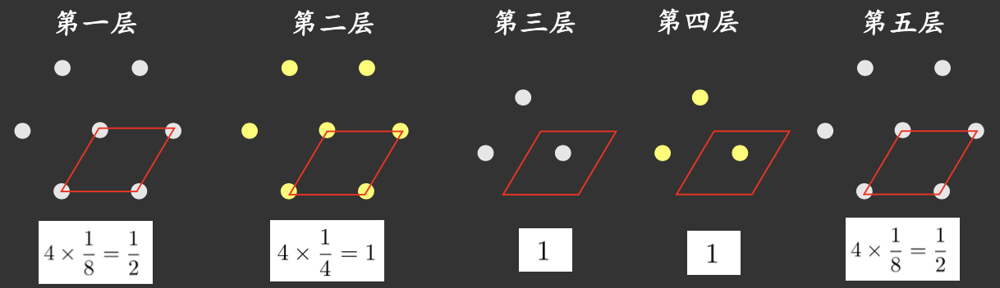

!!! example "另外两种常见的复式格子"
    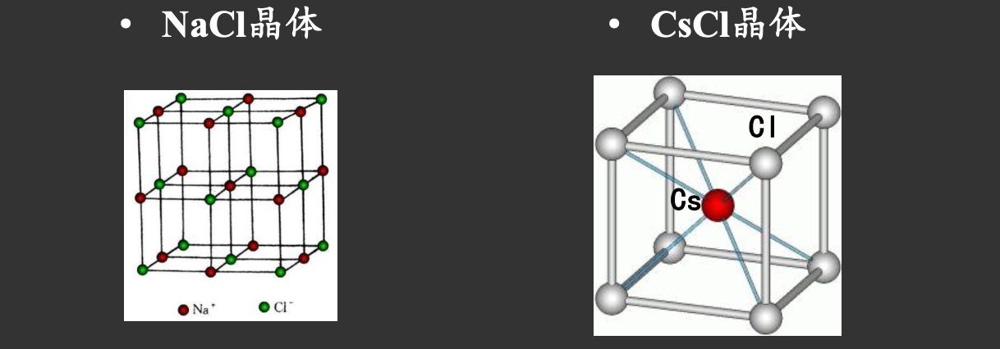

    - NaCl 晶体
        - Na 和 Cl 各自形成一个面心立方格子
    - CsCl 晶体
        - Cs 和 Cl 各自形成一个简单立方格子

!!! info "拓展：钙钛矿结构"
    !!! info inline end ""
        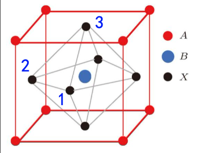

        既是晶胞也是原胞，把所有不等价原子包进去了，且只有一套。
    
    钙钛矿结构以 $\mathrm{CaTiO_3}$ 的结构为代表，许多铁电、介电、压电、光电以及高温超导材料都具有钙钛矿结构

    - Ca, Ti：简单立方结构
    - O：有三种不同的氧原子，都是简单立方结构

## 2 晶列和晶向指数

-   **晶列**：通过任意两个格点作一条直线，这一直线称为晶列。
    - 晶格中所有格点都在一簇簇平行的晶列上
    - 晶列上的格点有周期性
    - 晶列有无穷多簇
-   **晶向**：从任一格点沿着晶列方向出发，到最近邻格点的平移矢量。
-   **晶向指数**：即晶向格矢 $\mathbf{R} = l_1 \mathbf{a}_1 + l_2 \mathbf{a}_2 + l_3 \mathbf{a}_3$ 的方向向量 $[l_1, l_2, l_3]$.
    
    > 已默认 $l_1, l_2, l_3$ 互质。
    >
    > 显然这种定义依赖于基矢 $\mathbf{a}_1, \mathbf{a}_2, \mathbf{a}_3$ 的选取，故约定以晶胞基矢为参考。
    >
    > $$\mathbf{R} = m \mathbf{a} + n \mathbf{b} + p \mathbf{c}$$

!!! example "例子"
    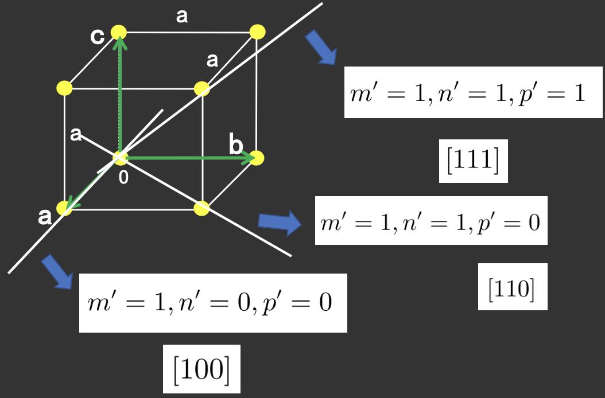

    如果是负数，就在上面加一个横杠，如 $[\bar{1} 0 0]$.

## 3 晶面和 Miller 指数

**晶面**：晶格中的所有格点也可以看成在一族平行、等间距的平面上

性质：

- 每一晶面上的格点都有二维周期性
- 互相平行的晶面构成一族晶面族，同族的格点具有相同的二维周期性
- 每族晶面必须包含所有格点
- 同族晶面中，相邻晶面的面间距相等，记为 $d$.
- 有无限多族晶面满足这些性质

用晶面的方向来区分不同的晶面族。约定以晶胞基矢为参考。

### 晶面方向指数（晶胞基矢下的 Miller 指数）

晶面与三个晶胞基轴的截距分别为 $u \mathbf{a}_1, v \mathbf{a}_2, w \mathbf{a}_3$，用 $u, v, w$ 的倒数比约分后的一组整数 $(h, k, l)$ 来表示晶面方向的晶面指数。

$$
h : k : l = \frac{1}{u} : \frac{1}{v} : \frac{1}{w}
$$

这样的好处：

1.  方便处理平行坐标轴时的无穷截距
2.  同一族晶面具有相同指数
3.  晶面 $(hkl)$ 正好垂直于倒格矢 $\mathbf{G}_{hkl} = h \mathbf{b}_1 + k \mathbf{b}_2 + l \mathbf{b}_3$

!!! example "立方晶系常见晶面"
    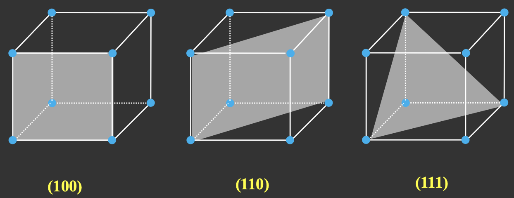

    :point_right: 晶面指数越简单，间距越大

在晶面族中，属于{==同一**组**==}晶面族的写成 $\{hkl\}$. 例如，$\{100\}$ 包含 $(100), (010), (001), (\bar{1} 00), (0 \bar{1} 0), (00 \bar{1})$ 六个晶面，它们在理想无限晶体中完全等价。

## 4 晶体按对称性分类

-   7 个晶系
    {==晶系是按晶格允许的**点对称性等级**来分的==}

    - 看晶格**至少具有什么特征旋转轴**
-   14 个 Bravais 格子
    {==每个晶系包含 1~4 种 Bravais 格子==}

### 晶系划分

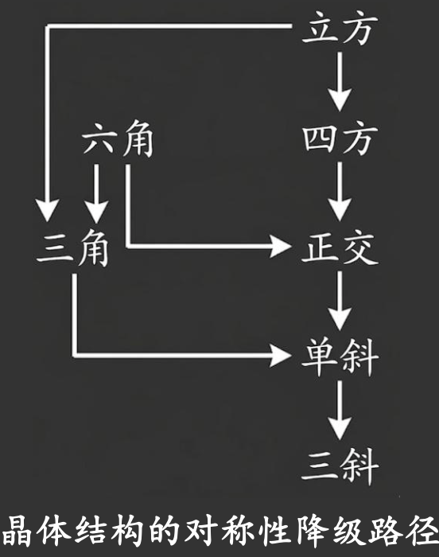

-   **三斜（Triclinic）**
    
    $$
    \begin{gather}
        \alpha \neq \beta \neq \gamma \neq 90^\circ \\
        a \neq b \neq c
    \end{gather}
    $$

    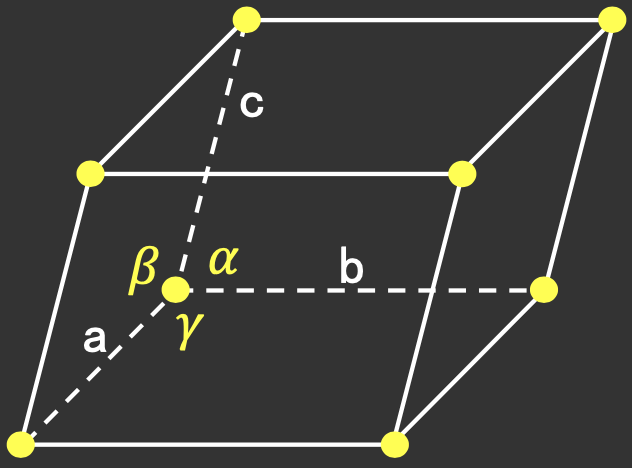

    ---

    对称性最低，对应两个点群 $1, \bar{1}$（无旋转轴，只有单位元和反演）

-   **单斜（Monoclinic）**

    $$
    \begin{gather}
        \alpha = \gamma = 90^\circ \neq \beta \\
        a \neq b \neq c
    \end{gather}
    $$

    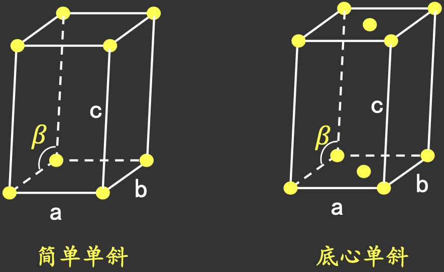

-   **正交（Orthorhombic）**

    $$
    \begin{gather}
        \alpha = \beta = \gamma = 90^\circ \\
        a \neq b \neq c
    \end{gather}
    $$

    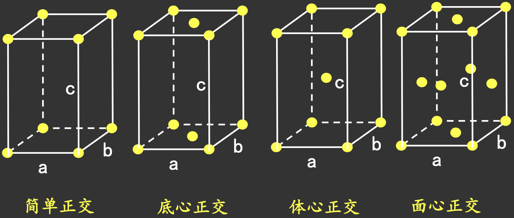

-   **正方/四方（Tetragonal）**

    $$
    \begin{gather}
        \alpha = \beta = \gamma = 90^\circ \\
        a = b \neq c
    \end{gather}
    $$

    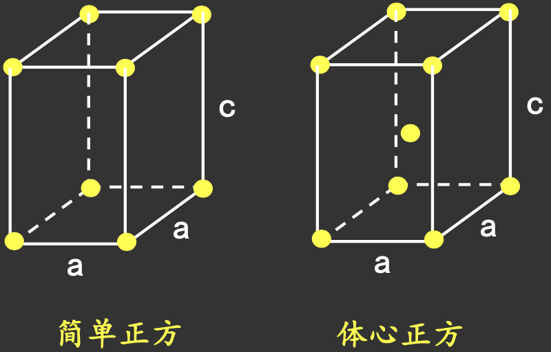

    ---

    :thinking: 有没有底心正方？$\implies$ 可约化为更小的简单正方！

    :bulb: 是否属于独立 Bravais 格子，取决于是否能通过重新选取更小的基矢，化为另一种已知格子

-   **六角/六方（Hexagonal）**

    $$
    \begin{gather}
        \alpha = \beta = 90^\circ, \gamma = 120^\circ \\
        a = b \neq c
    \end{gather}
    $$

    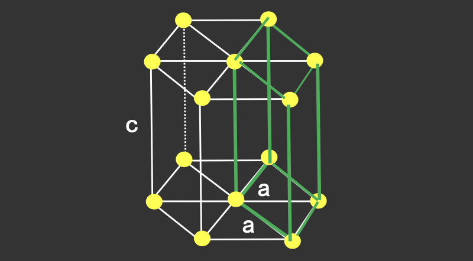

-   **三角/三方（Trigonal）**

    $$
    \begin{gather}
        \alpha = \beta = \gamma \neq 90^\circ \\
        a = b = c
    \end{gather}
    $$

    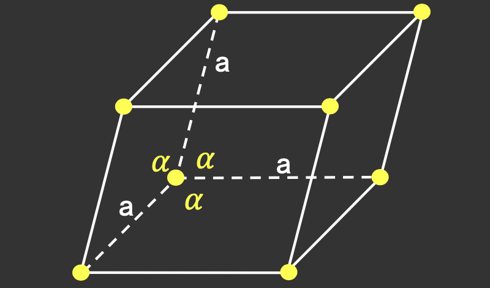

-   **立方（Cubic）**

    $$
    \begin{gather}
        \alpha = \beta = \gamma = 90^\circ \\
        a = b = c
    \end{gather}
    $$

    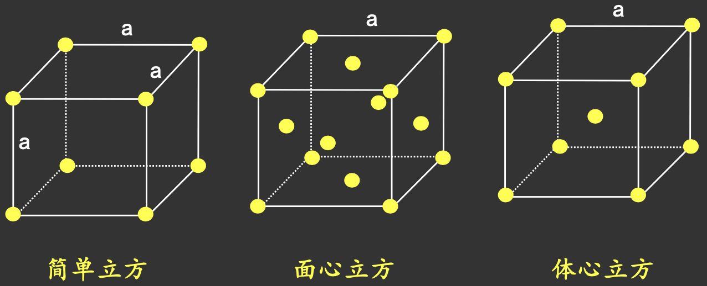

### 十四种 Bravais 格子

> 历史上，弗兰肯海姆是第一个进行点阵类型数研究的人，1842年，他数成了 15 类点阵.
>
> Bravais (1854)：14 类点阵，获得了冠名权

## 5 晶体的对称操作、平移群和点群

### 平移对称性和平移群

晶体具有离散平移对称性

$$
\rho(\mathbf{r}) = \rho(\mathbf{r} + \mathbf{R})
$$

{==平移对称性：把整个结构沿某些特定矢量平移后，系统完全不变==}

如果存在三个不共面的基本平移矢量 $\mathbf{a}_1, \mathbf{a}_2, \mathbf{a}_3$，那么所有允许的平移可以写成

$$
\mathbf{R} = n_1 \mathbf{a}_1 + n_2 \mathbf{a}_2 + n_3 \mathbf{a}_3, \quad n_i \in \mathbb{Z}.
$$

这些平移操作构成了一个集合，就称为晶体的**平移群**（translation group）。

!!! info "群的性质"
    设 $Q$ 表示某晶体的所有平移对称操作所构成的集合。若 $Q$ 构成一个群，则必须满足以下四个条件：

    1.  **封闭性**（closure）
        对任意两个元素 $A, B \in Q$，它们的复合操作仍属于 $Q$：

        $$
        A B \in Q
        $$

    2.  **单位元**（identity element）
        集合 $Q$ 中存在一个特殊元素 $E$，对于任意元素 $A \in Q$，都有

        $$
        E A = A E = A
        $$

        $E$ 就表示恒等操作，不做任何变换。

    3.  **逆元**（inverse element）
        对 $\forall A \in Q, \exists A^{-1} \in Q$, s.t.

        $$
        A A^{-1} = A^{-1} A = E
        $$

        $A^{-1}$ 表示 $A$ 的逆操作，能够将 $A$ 的变换效果完全抵消。

    4.  **结合律**（associativity）
        对 $\forall A, B, C \in Q$，都有

        $$
        (A B) C = A (B C)
        $$

        即操作顺序不影响结果。

### 点对称操作和点群

{==点群是保持晶体结构不变并固定至少一个点的所有空间刚性变换所构成的群.==}

这些操作包括：

-   旋转 $C_n$
-   镜面反射 $m$
-   反演 $i$
-   旋转反射 $S_n$

所有这些操作构成一个有限群。

#### 三维晶体点群按晶系分类

三维空间中，所有可能的有限群结构共有 32 种

| 晶系 | Hermann-Mauguin 符号 | Schönflies 符号 | 最高对称轴 |
| :---: | :------------------: | :------------: | :---------: |
| 三斜（Triclinic） | $1, \bar{1}$ | $C_1, C_i$ | 1 |
| 单斜（Monoclinic）| $2, m, 2/m$ | $C_2, C_s, C_{2h}$ | 2（一个二重轴）|
| 正交（Orthorhombic） | $222, mm2, mmm$ | $D_2, C_{2v}, D_{2h}$ | 2（三个二重轴）|
| 四方（Tetragonal） | $4, \bar{4}, 4/m, 422, 4mm, \bar{4}2m, 4/mmm$ | $C_4, S_4, C_{4h}, D_4, C_{4v}, D_{2d}, D_{4h}$ | 4（一个四重轴）|
| 六角（Hexagonal） | $6, \bar{6}, 6/m, 622, 6mm, \bar{6}2m, 6/mmm$ | $C_6, C_{3h}, C_{6h}, D_6, C_{6v}, D_{3h}, D_{6h}$ | 6（一个六重轴）|
| 三角（Trigonal） | $3, \bar{3}, 32, 3m, \bar{3}m$ | $C_3, C_{3i}, D_3, C_{3v}, D_{3d}$ | 3（一个三重轴）|
| 立方（Cubic） | $23, m\bar{3}, 432, \bar{4}3m, m\bar{3}m$ | $T, T_h, O, T_d, O_h$ | 4 + 3（四重轴和三重轴）|

#### 逆元

$$
g \in G \implies g^{-1} \in G
$$

设 $g \in G$，将晶体映射到自身 $g(S) = S$，两个同时取 $g^{-1}$，得到 $g^{-1}(S) = S$，