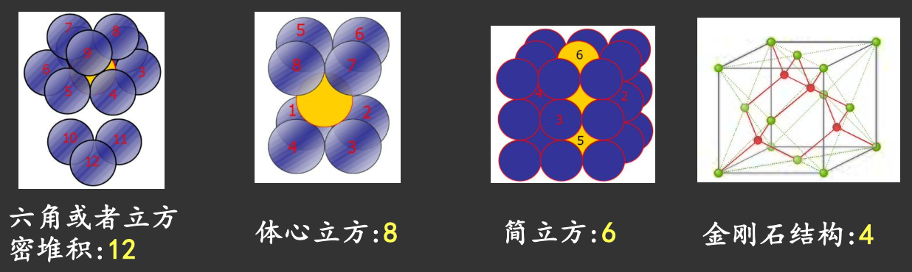

# 固体中的原子结合

> - 原子为什么能够结合成稳定的固体？
> - 不同结合方式有何物理差异？

## 密堆积和配位数

在一定温度下，原子在晶体中总是尽可能地{++通过**紧密排列**来降低体系自由能++}，而简单情况下原子可看作等体积刚性球。

:question: 如何最紧密堆积？$\implies$ **Kepler 堆积问题**（1611）

配位数：一个原子的最近邻原子数

最大配位数（密堆积）：$12 = 6 + 3 + 3$

由对称性限制，可能的配位数是 $12, 8, 6, 4, 3, 2$

## 能量角度理解晶体的形成

结合能 $W$：自由粒子体系与晶体体系的能量差

### 离子性结合

-   基本特征：通过电子转移形成带电离子，以离子作为结合单元构成晶体

**Evjen 晶胞法**：近邻、次近邻、次次近邻...

$$
E = - \frac{e^2}{4 \pi \varepsilon_0 a} \underset{\text{马德隆常数 } \alpha}{\underbrace{\left( \frac{6}{2} - \frac{12}{4 \sqrt{2}} + \frac{8}{8 \sqrt{3}}  - \ldots \right)}}
$$

$\mathrm{NaCl}$ 的马德隆常数 $\alpha = 1.748$

原子间距 $\downarrow$，晶体体积 $\downarrow$，电子整体密度 $\uparrow$，电子云交叠，产生排斥作用，体系能量升高。

排斥势难以由第一性原理直接导出，故采用经验形式

$$
V_{rep} = \frac{B}{r^n}
$$

体系内能

$$
U = Nu = N\left( -\frac{\alpha e^2}{4 \pi \varepsilon_0 r} + \frac{B}{r^n} \right)
$$

-   重叠排斥为短程相互作用，随距离变化极为陡峭（$n \gg 1$）

#### 平衡条件和稳定条件

$$
f(r) = - \frac{d u(r)}{d r}
$$

-   平衡条件：合力为零
    
    $$
    f(r_0) = -\left. \frac{d u(r)}{d r} \right|_{r_0} = 0 \implies B = \frac{\alpha e^2}{4 \pi \varepsilon_0 n} \frac{r_0^{n - 1}}{n}
    $$

    **结合能**

    $$
    W = -Nu(r_0) = \frac{N \alpha e^2}{4 \pi \varepsilon_0 r_0} \left( 1 - \frac{1}{n} \right)
    $$

    由于 $n \gg 1$，所以结合能主要由库伦吸引决定（排斥项只在短程起作用）

-   稳定条件

### 共价结合

-   基本机制：两个原子各提供一个电子（自旋相反），形成成对电子态（bonding state）
-   核心特征：“**饱和性**”
    -   每个原子可形成的共价键数目存在上限
    -   若价电子数 $N \geq 4$，则
        
        $$\text{键数} = 8 - N$$

        成键满足“**八隅体规则**”：8 个价电子
    -   若价电子数 $N < 4$，则
        
        $$\text{键数} = N$$

        成键后相对稳定，是 *局部* 最低能量状态
-   方向性：共价键只沿特定方向形成
    -   来源于轨道空间结构

#### 能量角度理解共价键的形成

1.  原子接近 $\to$ 波函数重叠 $\to$ 形成新的量子态
2.  电子成对（自旋相反）占据低能态 $\to$ 能量降低 $\to$ 成键

降低的能量即为成键能

$\mathrm{H}_2$ 分子：两个原子核 $(a, b)$ + 两个电子 $(1, 2)$. 此为四体问题（Four-body problem）！无法解析求解，采用近似方法：**分子轨道法**

!!! note "分子轨道法"
    原始多体哈密顿量，绝热近似，认为原子核不动，忽略了原子核的动能和相互势能（为常数）

    $$
    H = - \frac{\hbar^2}{2 m} \nabla_1^2 - \frac{\hbar^2}{2 m} \nabla_2^2 + V_{a1} + V_{a2} + V_{b1} + V_{b2} + \textcolor{crimson}{V_{12}}
    $$

    因为 $V_{12}$ 的耦合，上面的哈密顿量无法对角化严格求解，故将其忽略，得到单电子薛定谔方程

    $$
    H_i \psi_i = \left( -\frac{\hbar^2}{2m} \nabla_i^2 + V_{ai} + V_{bi} \right) \psi_i = E_i \psi_i
    $$

    电子在两个原子核形成的有效势场中运动，$\psi_i(\mathbf{r}_i)$ 称为**分子轨道波函数**.

!!! note "分子轨道的构造：LCAO 方法"
    分子轨道描述电子在{++整个分子范围++}内的概率分布，而不是局域在某一个原子上。

    -   基本假设
        分子轨道可以表示为原子轨道的线性组合（Linear Combination of Atomic Orbitals, LCAO）：

        $$
        \psi_i(\mathbf{r}) = 
        $$

!!! tip "概率密度与成键/反键的本质"
    概率密度表达式

    $$
    \big| \psi_\pm (\mathbf{r}) \big|^2 = \frac{1}{2 (1 \pm S)} \Big( \big|\varphi_a(\mathbf{r}) \big|^2 + \big|\varphi_b(\mathbf{r}) \big|^2 \textcolor{orange}{\pm 2 \mathrm{Re} [\varphi_a^*(\mathbf{r}) \varphi_b(\mathbf{r})]} \Big)
    $$

    -   成键态：干涉项为正，中间电子密度增加
    -   反键态：干涉项为负，中间电子密度减少

    成键本质：电子分布在原子核间区域概率密度的增强

概率密度的演算

设核点中点为 $x = 0$，两个 1s 轨道到中点的距离为 $R/2$，则

$$
\varphi_a(0) = \varphi_b(0) = A \mathrm{e}^{-R/(2 a_0)} \equiv \varphi_0
$$

能量的升降来源于电子在原子核间区域的重新分布。电子在核间时，同时靠近两个原子核，所以势能项 $V = -\frac{e^2}{r_a} - \frac{e^2}{r_b}$ 更小，势能显著降低（主要）；电子动能相比于两个孤立原子中的电子会略微上升（次要）。

!!! question "成键态电子动能增加是由于 Pauli 不相容原理导致的吗？"
    否。:point_right: 是波函数的空间结构变化引起的！

    电子气/约束多电子体系，电子密度增加导致被填充的态变多，动能增加，这是 Pauli 不相容原理引起的。

    但是单个波函数，不存在被迫占据高能态的问题！那么波函数的局域程度变化使动能升高的原理是什么？

    :point_right: Heisenberg 不确定性原理！$\Delta x \downarrow \implies \Delta p \uparrow \implies T \uparrow$

    $$
    \braket{T} = \left\langle \frac{p^2}{2m} \right\rangle \propto \braket{p^2}, \, (\Delta p)^2 = \braket{p^2} - \braket{p}^2, \braket{p} \xlongequal{\text{对称体系}} 0 \implies \braket{T} \propto (\Delta p)^2
    $$

对于反键态，动能显著增加！从波函数的空间局域理解：弥散的波函数随空间的变化小，而局域的波函数随空间的变化大。

$$
T \propto \int \psi^* (- \nabla^2) \psi \, d^3 r
$$

局域强，梯度大，动能显著上升。同时势能也增加了：

$$
V = -\frac{e^2}{r_a} - \frac{e^2}{r_b}
$$

核间电子被挤到两边，中间电子密度几乎为零

| 性质 | 成键态 | 反键态 |
| :---: | :---: | :---: |
| 波函数 | 同相相加 | 反相相加 |
| 核间区域 | 电子密度增加 | 电子密度减少 |
| 动能 $T$ | 略微增加 | 显著增加 |
| 势能 $V$ | 显著降低 | 升高 |
| 总能量 | 降低（稳定） | 升高（不稳定） |

!!! example "从原子轨道到共价成键：以金刚石为例"
    碳原子基态电子组态：$1s^2 2s^2 2p^2$，只有 2 个未成对电子，但为什么金刚石可以和周围 4 个碳原子形成共价键？

    :exploding_head: 杂化轨道电子组态：$1s^2 2s^1 2p^3$，形成四个等价轨道！

    有一个 $2s \to 2p$，能量略微升高！成键降低的能量必须弥补这个升高的能量。
    
    -   处于杂化轨道状态的电子平均能量成为**杂化能**：

        $$
        \varepsilon_h = \frac{1}{4} (\varepsilon_{s} + 3 \varepsilon_p)
        $$

    -   增加的能量称为**晋升能（promotion energy）**

    -   成键后，体系能量的降低称为**成键能（bond energy）**
    -   当原子距离过近时，短程排斥相互作用会迅速增强，使体系能量升高 $\phi(d)$
    
    综上，总的结合能

    $$
    W = 
    $$

!!! quote "化学键研究的先驱"
    Linus Carl Pauling (1901-1994)，1954 Nobel 化学奖，1963 Nobel 和平奖

    杂化轨道理论认为，在形成化学键的过程中，原子轨道本身会重新组合，