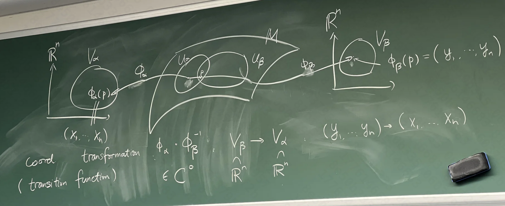

## 基本概念

### 集合

一堆东西放在一起：$X = \{a, b, \ldots\}$

子集：$A \subset X \iff \forall a \in A, a \in X$，真子集：$A \subsetneq X$

集合 $X$，赋予一个结构 $T$，称为拓扑，是包含 $X$ 的开集的集合。

- 事件（Event）：占据特定时间点、空间点的几何点
    - 没有内在结构，没有大小
    > 如果考虑量子引力，时空收缩到无限小是不存在的。这里只考虑“经典”理论。
- 时空（Spacetime）：$\{\text{事件}\}$
  
> 只有一个集合无法讨论问题，需要引入结构：拓扑

### 拓扑

一个集合 $X$，它的子集 $T = \{U_\alpha \subset X | \alpha \in A\}$ 

> :warning: 不是开集，不一定是闭集

**开集（open set）**满足：

1.  $X, \varnothing \in T$
2.  设 $U_1, U_2, \ldots, U_n \in T$，则它们的（有限多）交集 $\bigcap_{\alpha = 1}^n U_\alpha \in T$
3.  设 $U_\alpha \in T$，则它们的（可以无限多）并集 $\bigcup_{\alpha \in A} U_\alpha \in T$

-   通常拓扑（usual topology）在 $\mathbb{R}$ 上的定义：

    $$
    U \in T \iff \forall x \in U, \exists (a,b) \subset U, \text{ s.t. } x \in (a,b)
    $$

-   离散拓扑（discrete topology，最“精致”的拓扑）：$U \subset X \iff U \in T$
-   凝聚拓扑（indiscrete topology）：$T = \{X, \varnothing\}$

$B = \{V_\alpha \subset X \}$ 是 $T$ 的一个**基（basis）**，如果

1.  $\bigcup_{\alpha} V_\alpha = X$
2.  $V_\alpha, V_\beta \in B$，如果 $x \in V_\alpha \cap V_\beta$，则存在 $V_\gamma \in B$，使得 $x \in V_\gamma \subset (V_\alpha \cap V_\beta)$

从 $B$ 就可以得到拓扑 $T$：$U \in T \iff U = \bigcup_{\alpha} V_\alpha$

- $\mathbb{R}^n$ 上的通常拓扑

$$
U \subset \mathbb{R}^n \iff \forall x \in U, \exists \mathbb{B}(x, r) = \{y \in \mathbb{R}^n | \sum_{i=1}^n (x_i - y_i)^2 < r^2\} \subset U
$$

:bulb: 直观解释：对于任意一个点 $x$，都可以找到一个半径为 $r$ 的球 $\mathbb{B}(x, r)$，使得这个点被包裹在一个完全包含在 $U$ 内的球里

笛卡尔积

$$
X \times Y = \{(x,y) | x \in X, y \in Y\}
$$

设 $T_X, T_Y$ 分别是 $X, Y$ 的拓扑，则 $X \times Y$ 的**积拓扑（product topology）**的基

$$
B = \{U \times V | U \in T_X, V \in T_Y\}
$$

!!! tip "通常拓扑和积拓扑是等价的"
    设通常拓扑的元素 $U \in T_u$ 和积拓扑的元素 $V \in T_p$，则 $T_u \subset T_p$（以 $\mathbb{R}^2$ 为例，对于通常拓扑的圆盘总能找到一个积拓扑的矩形包含它），又有 $T_p \subset T_u$（对于积拓扑的矩形总能找到一个通常拓扑的圆盘包含它），所以 $T_u = T_p$.

对于 $Y \subset X$，构造拓扑：

- 若 $Y \in T_X$，则 $Y$ 的拓扑 $T_Y = \{U \subset Y | U \in T_X\}$
- 若 $Y \notin T_X$，则 $T_Y = \{U \cap Y | U \in T_X\}$

这称为**诱导拓扑（induced topology）**，$(Y, T_Y)$ 是 $(X, T_X)$ 的一个**拓扑子空间（subspace）**。

### 连续映射

考虑映射 $f: (X, T_X) \to (Y, T_Y)$，如果对于 $\forall U \in T_Y$，有 $f^{-1}(U) = \{x \in X | f(x) \in U\} \in T_X$，则称 $f$ 是**连续的（continuous）**，记作 $f \in C^0$.

**同胚（homeomorphism）**是一个双射 $f: X \to Y$，使得 $f$ 和 $f^{-1}$ 都是连续的。

### 闭集

**闭集（closed set）**是指其补集是开集的集合，即 $X \setminus U \in T$，记作 $U \in T^c$。

- 闭集 $[a,b] \implies$ 开集 $(-\infty, a) \cup (b, +\infty)$
- 既不是开集，也不是闭集： $(a,b]$
- 既是开集，也是闭集：$\varnothing, X$

设 $S \subset X$，

- 闭包（closure）$\overline{S}$：包含 $S$ 的最小闭集
- 内核（interior）$\overset{\circ}{S}$：包含在 $S$ 内的最大开集
- 边界（boundary）$\partial S = \overline{S} \setminus \overset{\circ}{S}$

开覆盖（open cover）

$\{U_\alpha \in T | \alpha \in A\}$，对 $\forall x \in X, \exists U_\alpha \text{ s.t. } x \in U_\alpha$，则称 $\{U_\alpha\}$ 是 $X$ 的一个开覆盖。

### 拓扑流形

若拓扑空间 $(M, T)$ 是一个 $n$ 维**拓扑流形（topological manifold）**，则

1.  $M$ 是 Hausdorff 空间：$\forall p \neq q \in M, \exists U_p, U_q \in T$，使得 $p \in U_p, q \in U_q$，且 $U_p \cap U_q = \varnothing$
    > 这不仅是数学的要求，还有物理的要求。忽略这一点，将会破坏决定论。
    >
    > 排除了凝聚拓扑。

    !!! example "一个诡异的例子"
        实数轴上挖掉 $0$，再加上两个 $0$

        $$
        \Big( \mathbb{R} \setminus \{0\} \Big) \cup 0_A \cup 0_B
        $$

        定义拓扑

        $$
        \begin{aligned}
            (-\varepsilon, 0) \cup \{0_A\} \cup (0, \varepsilon) &\in T \\
            (-\varepsilon, 0) \cup \{0_B\} \cup (0, \varepsilon) &\in T
        \end{aligned}
        $$

        则这个空间不满足 Hausdorff 条件。

2.  $M$ 是局部欧几里得空间（local Euclidean）：$\forall p \in M, \exists U_p \in T$，使得 $p \in U_p$，且 $U_p$ 与 $\mathbb{R}^n$ 同胚，即 $\exists \phi: U_p \to V \subset \mathbb{R}^n, V \in T_{\mathbb{R}^n}$ (usual topology)
3.  $M$ 是第二可数的（second countable）：$M$ 的拓扑 $T$ 有一个可数的基 $B = \{V_\alpha | \alpha \in A\}$，即 $\forall U \in T, \exists V_\alpha \in B$，使得 $U = \bigcup_{\alpha} V_\alpha$
    > 比较数学，绝大部分物理学家都不关心第二可数的要求。但它排除了离散拓扑。

> 一些奇怪的时空解（比如闭合的时空线），来源于选择了不同的拓扑。物理的因果要求会排除这些解。

8字结：不能映射到 $\mathbb{R}$，因为中间的点擦去后分为了四段，而实数轴上擦去一个点后只能分为两段。

同理，两个对顶圆锥也不能映射到 $\mathbb{R}^2$，因为圆锥顶点去掉后分为上下两个圆锥面，而 $\mathbb{R}^2$ 上去掉一个点后只能分为一个连通空间和一个孤立点。

!!! example "有趣的例子：Orbifold"
    $\mathbb{R} / \mathbb{Z}_2$. 是否为一个流形？需要分类讨论。

    - $n = 2$，$\mathbb{R}^2 / \mathbb{Z}_k$ 将平面分成 $k$ 份，相当于圆锥面，可以压扁，与 $\mathbb{R}^2$ 同胚，是一个流形。
    - $n = 3$，$\mathbb{R}^3 / \mathbb{Z}_2$，考虑原点附近很小的球 $B((0,0,0), \varepsilon)$

    $$
    \mathbb{R}^3 \setminus B((0,0,0), \varepsilon) \cong \mathbb{R} \mathbb{P}^2 \xcancel{\cong} \mathbb{R}^2
    $$

### 微分流形

如果拓扑流形 $M$ 

1.  开覆盖 $\{U_\alpha\}$，映射 $\phi_\alpha: U_\alpha \to V_\alpha \subset \mathbb{R}^m$
2.  对于 $U_\alpha \cap U_\beta \neq \varnothing$，映射 $\phi_\alpha \circ \phi_\beta^{-1}: \phi_\beta(U_\alpha \cap U_\beta) \to \phi_\alpha(U_\alpha \cap U_\beta) \in C^\infty$

微分同胚（diffeomorphism）是一个双射 $f: M \to N$，使得 $f$ 和 $f^{-1}$ 都是微分的，即 $f, f^{-1} \in C^\infty$.

!!! info "4-流形"
    设拓扑流形 $M$ 与 $\mathbb{R}^n$ 拓扑同胚（$M \sim \mathbb{R}^n$）。若 $n \neq 4$，则 $M$ 与 $\mathbb{R}^n$ 微分同胚（$M \cong \mathbb{R}^n$）。但当 $n = 4$ 时，存在无数个与 $\mathbb{R}^4$ 拓扑同胚但不微分同胚的流形！

    这个问题至今未解决。

#### 求导

