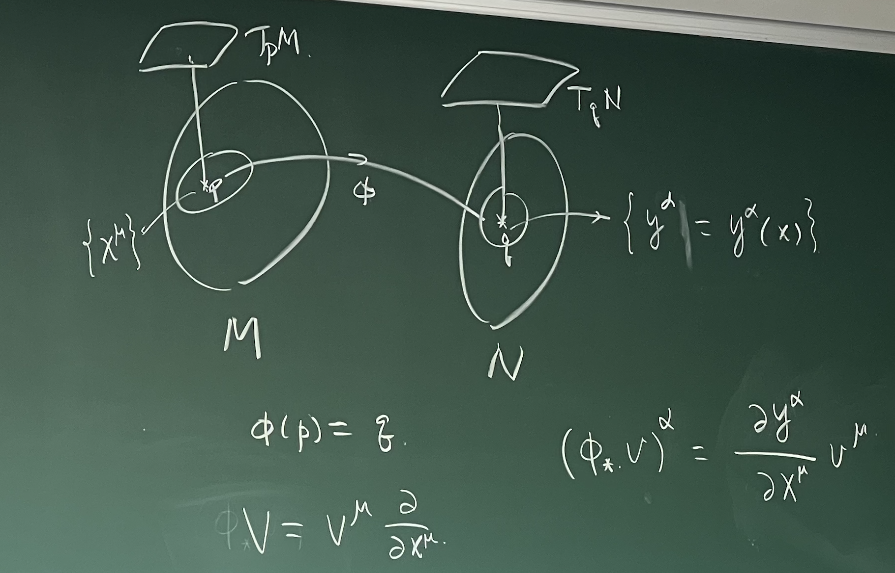

## 李导数

$\phi: M \to N$，切空间中的向量 $v \in T_p M$ 可以通过 $\phi$ 映射到 $T_{\phi(p)} N$ 中，记为 $\phi_* v \in T_{\phi(p)} N$，称为 $v$ 沿着 $\phi$ 的 push forward（推前操作）。

对 $f \in C^\infty(N)$，定义 $f: N \to \mathbb{R}$，则 $(\phi_* v)(f) = v(f \circ \phi)$. 而 $f \circ \phi: M \to \mathbb{R}, f \circ \phi \in C^\infty(M)$.

$$
(\phi_* v)^\alpha = \frac{\partial y^\alpha}{\partial x^\mu} v^\mu 
$$

对于 $\alpha \in T^*_q N$，定义 $\phi^* \alpha \in T^*_p M$，称为 $\alpha$ 沿着 $\phi$ 的 pull back（拉回操作）。对 $v \in T_p M$，有 $(\phi^* \alpha)(v) = \alpha(\phi_* v)$.

$$
(\phi^* \alpha)_\mu = \frac{\partial y^\alpha}{\partial x^\mu} \alpha_\alpha
$$

如果 $\phi$ 是微分同胚 $\phi \in \mathrm{Diff}(M, N), \, T \in T_q^{(r, s)}(N)$，则 $\phi^* T \in T_p^{(r, s)}(M)$ 满足

$$
(\phi^* T)_p (\alpha_1, \ldots, \alpha_r;\; v_1, \ldots, v_s) = T_q \Big( (\phi^{-1})^* \alpha^1, \ldots, (\phi^{-1})^* \alpha^r;\; \phi_* v_1, \ldots, \phi_* v_s \Big)
$$

进而

$$
\left.(\phi^* T)_p^{\mu_1, \ldots, \mu_r}\right._{\nu_1, \ldots, \nu_s} = \frac{\partial x^{\mu_1}}{\partial y^{\alpha_1}} \cdots \frac{\partial x^{\mu_r}}{\partial y^{\alpha_r}} \frac{\partial y^{\beta_1}}{\partial x^{\nu_1}} \cdots \frac{\partial y^{\beta_s}}{\partial x^{\nu_s}} \left.T_q^{\alpha_1, \ldots, \alpha_r}\right._{\beta_1, \ldots, \beta_s}
$$

含参量的微分同胚：$t \in \mathbb{R}, \phi_t: M \to M$. 特例与性质：$\phi_0 = \mathrm{id}_M, \phi_{t_1} \circ \phi_{t_2} = \phi_{t_1 + t_2}$. 因此令 $\phi_t := \exp(tV)$, $V$ 是一个向量场，$\exp(tV)$ 是 $V$ 的流（flow）。定义 $T_p \in T_p^{(r, s)}(M)$ 沿着 $V$ 的 **Lie derivative**（李导数）为

$$
\begin{equation}
    \mathscr{L}_V T_p = \lim_{t \to 0} \frac{\Big(\phi_{-t}^* T_{\phi_t(p)}\Big) - T_p}{t}
\end{equation}
$$

举点具体例子：$\mathscr{L}_V X$（$X$ 是一个向量场）和 $\mathscr{L}_V \omega$（$\omega$ 是一个 1-形式）。

$\phi_t: M \to M$，$\{x^\mu\}$ 是 $p$ 点的坐标，$\{y^\mu \}$ 是 $q = \phi_t(p)$ 点的坐标。

!!! note "弱等效原理（WEP）"
    物体的惯性质量 $m_I$ 和引力质量 $m_G$ 是相等的。也就是说，物体的加速度与其组成无关。

    $$
    m_I \vec{a} = \vec{F} = m_G \vec{g} \implies \vec{a} = \frac{m_G}{m_I} \vec{g}
    $$

    $m_{I} = m_{G} = m$.

!!! tip "推广：爱因斯坦等效原理（EEP）"
    自由落体坐标系 $\{\xi^\alpha\} \overset{\phi}{\longrightarrow} \{x^\mu \}$ 无重力场

    自由落体：时空中的一条直线

    $$
    \frac{\mathrm{d}^2 \xi^\alpha}{\mathrm{d} \tau^2} = 0, \, \mathrm{d} \tau^2 = - \eta_{\alpha \beta} \,\mathrm{d} \xi^\alpha \mathrm{d} \xi^\beta
    $$

    也就是

    $$
    \begin{aligned}
        0 &= \frac{\mathrm{d}}{\mathrm{d} \tau} \left( \frac{\mathrm{d} \xi^\alpha}{\mathrm{d} \tau} \right) = \frac{\mathrm{d}}{\mathrm{d} \tau} \left( \frac{\partial \xi^\alpha}{\partial x^\mu} \frac{\mathrm{d} x^\mu}{\mathrm{d} \tau} \right) \\
        &= \frac{\partial \xi^\alpha}{\partial x^\mu} \frac{\mathrm{d}^2 x^\mu}{\mathrm{d} \tau^2} + \frac{\partial^2 \xi^\alpha}{\partial x^\mu \partial x^\nu} \frac{\mathrm{d} x^\mu}{\mathrm{d} \tau} \frac{\mathrm{d} x^\nu}{\mathrm{d} \tau}
    \end{aligned}
    $$

    这正是**测地线方程**

    $$
    \frac{\mathrm{d}^2 x^\mu}{\mathrm{d} \tau^2} + \underset{\Gamma^\lambda_{\mu \nu}}{\underbrace{\frac{\partial x^\lambda}{\partial \xi^\alpha} \frac{\partial^2 \xi^\alpha}{\partial x^\mu \partial x^\nu}}} \frac{\mathrm{d} x^\mu}{\mathrm{d} \tau} \frac{\mathrm{d} x^\nu}{\mathrm{d} \tau} = 0
    $$

:question: 李导数什么时候会用到？考虑对称性的时候。

## 能动张量

$$
S = \int \mathrm{d}^4 x \, \mathcal{L}(\Phi, \partial_\mu \Phi), \quad x^\nu \to x^\nu + a^\nu
$$

$a$ 是一个固定的常数，但在广义相对论中最好看成一个矢量场 $a^\nu (x)$，则 $V = a^\nu (x) \partial_\nu$

Noether theorem：守恒流

$$
\left.T^{(N) \mu}\right._\nu = \frac{\partial \mathcal{L}}{\partial (\partial_\mu \Phi)} \partial_\nu \Phi - \left.\delta^\mu\right._\nu \mathcal{L}, \quad \mathcal{L} = -\frac{1}{4} F_{\alpha \beta} F^{\alpha \beta}
$$

-   $(1,1)$ tensor. $\partial_\mu \left.T^\mu \right._\nu = 0$
-   不对称：$\left.T^{(N)}\right._{\mu \nu} = \eta_{\mu \rho} \left.T^{\rho}\right._\nu \overset{?}{=} \left.T^{(N)}\right._{\nu \mu}$
    
    $$
    \left.T^{(N)}\right._{\mu \nu} = - F_{\mu \rho} \partial_\nu A^\rho + \frac{1}{4} \eta_{\mu \nu} F_{\alpha \beta} F^{\alpha \beta}
    $$

    从上式看出关于 $\mu, \nu$ 不是对称的。Belinfante-Rosenfeld tensor：$\left.T^{(B)}\right._{\mu \nu} = \left.T^{(N)}\right._{\mu \nu} + \partial_\rho X^\rho_{\;\;\mu \nu}$，其中 $X^\rho_{\;\;\mu \nu} = - X^\rho_{\;\;\nu \mu}$.

<!-- 可以通过 Belinfante-Rosenfeld procedure 将其改为对称的能动张量 $\left.T^{(B)}\right._{\mu \nu}$：

$$
\left.T^{(B)}\right._{\mu \nu} = \left.T^{(N)}\right._{\mu \nu} + \frac{1}{2} \partial_\rho \left( S_{\nu \mu}^\rho + S_{\mu \nu}^\rho - S_{\nu \rho}^\mu \right)
$$ -->

$$
S = \int \mathrm{d}^4 x \, \sqrt{-g} \, \mathcal{L}, \quad g = \det(g_{\mu \nu})
$$
