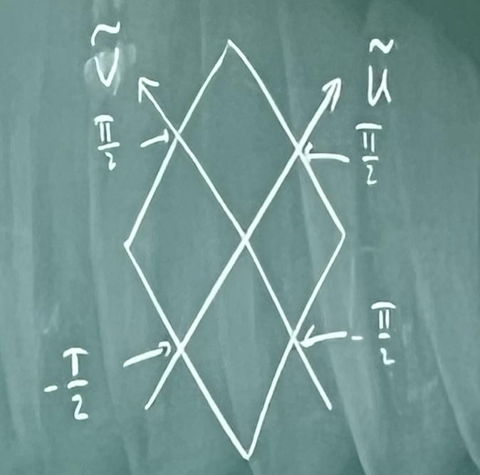
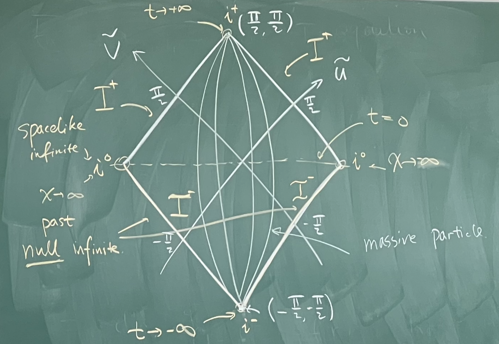
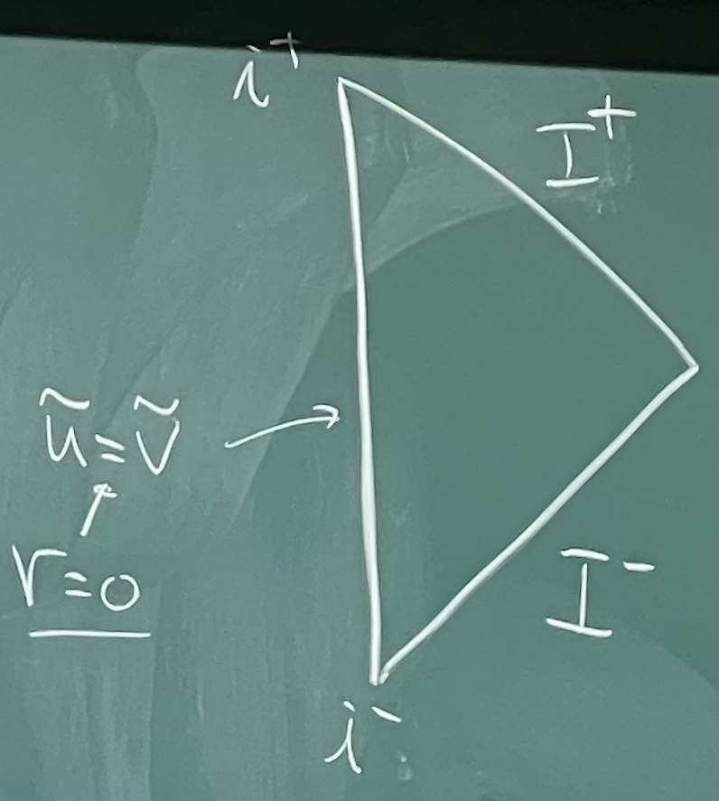
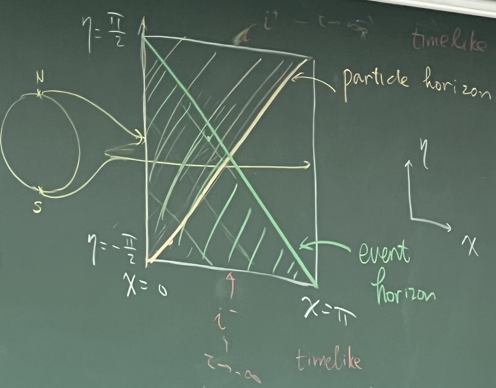

## 爱因斯坦场方程

### 历史发展

牛顿：

$$
\begin{gather}
    \vec{a} = - \nabla \phi \\
    \phi = - \frac{G M}{r} \\
    \nabla^2 \phi = 4 \pi G \rho
\end{gather}
$$

爱因斯坦：

$$
\frac{d^2 x^\mu}{d \tau^2} + \Gamma^\mu_{\rho \sigma} \frac{d x^\rho}{d \tau} \frac{d x^\sigma}{d \tau} = 0 \xrightarrow{C \to \infty} \Gamma^\mu_{00}
$$

度规 $g_{\mu \nu} = \eta_{\mu \nu} + h_{\mu \nu}$，$h_{00} \to - 2 \phi$

在历史上，爱因斯坦从协变性出发，

$$
\nabla^2 (h_{00}) \propto \rho, \quad (\partial^2 \rho)_{\mu \nu} \propto T_{\mu \nu}
$$

> 物理学家要有对美的认知

!!! tip "关于自然单位制"
    $c$ 是一个运动学参数，$G$ 是一个动力学参数。运动学参数不会在本质上影响动力学，所以设 $c = 1$.

    很多量子引力的教材会设 $c = \hbar = G = 1$.

!!! quote "关于宇宙常数"
    $$
    G_{\mu \nu} + \textcolor{crimson}{\Lambda} g_{\mu \nu} = \kappa T_{\mu \nu}
    $$

    爱因斯坦曾经引入宇宙常数 $\Lambda$ 来构造一个静态的宇宙模型，但是哈勃望远镜的观测表明宇宙在膨胀，所以 $\Lambda$ 被认为是一个多余的项，曾被爱因斯坦称为“他一生最大的失误”。

    但是现在我们知道，宇宙在加速膨胀，所以 $\Lambda$ 可能是一个非常重要的项。

### 从变分原理推导

作用量

$$
\begin{equation} \tag{1}
    \mathcal{S} = \int \mathrm{d}^4 x \sqrt{-g} \, \mathscr{L}(g_{\mu \nu}, \partial g_{\mu \nu}, \partial^2 g_{\mu \nu})
\end{equation}
$$

- $\Lambda = \text{const.}$
- $R = g^{\mu \nu} R_{\mu \nu}$
- $R_{\mu \nu} R^{\mu \nu}$ ..？

经典引力，大尺度：$R$ 项占主导

- $g_{\mu \nu} = [\mathrm{L}^0]$，例如 $\eta_{\mu \nu} = \mathrm{diag}(-1, +1, +1, +1)$.
- $\Gamma^\mu_{\rho \sigma} \sim \frac{\partial}{\partial x} g = [\mathrm{L}^{-1}]$.
- $R^\rho_{\mu \sigma \nu} \sim \frac{\partial^2}{\partial x^2} g = [\mathrm{L}^{-2}]$.

$$
\mathscr{L} \sim \underset{[\mathrm{L}^0]}{\Lambda} + \underset{[\mathrm{L}^{-2}]}{R} + \ell_p^2 (R^2, R_{\mu \nu} R^{\mu \nu} + \ldots)
$$

这里以 $R$ 为基准，将后面的高阶项乘以普朗克长度 $\ell_p$ 以匹配量纲。普朗克长度很小，在宏观尺度下后面的高阶项可忽略。

!!! question "为什么不在 $\Lambda$ 前面乘 $\ell_p^{-2}$？"
    这是一个很好的问题：宇宙学常数问题是引力物理学中很大的一个谜题。观测得到 $\Lambda$ 比 $\ell_p^{-2}$ 小了 120 个数量级！

    在更高维空间中，是可以有更复杂的结构的。但是在四维空间中，高阶项是纯粹的拓扑项，不会对方程的解产生影响。可以证明，爱因斯坦场方程是四维空间中唯一的二阶方程。

$\mathscr{L} \to R$，得到 Einstein-Hilbert action：

$$
\begin{equation} \tag{2}
    \mathcal{S}_{\mathrm{EH}} = \int \mathrm{d}^4 x \sqrt{-g} R, \quad R = R_{\mu \nu} g^{\mu \nu}
\end{equation}
$$

作变分 $g^{\mu \nu} \to g^{\mu \nu} + \delta g^{\mu \nu}$，

$$
\delta \mathcal{S}_{\mathrm{EH}} = \int \mathrm{d}^4 x \left[ \Big(\delta \sqrt{-g} \Big) R + \sqrt{-g} (\delta R_{\mu \nu}) g^{\mu \nu} + \sqrt{-g} R_{\mu \nu} (\delta g^{\mu \nu}) \right]
$$

-   对于 $\delta (\sqrt{-g})$
    有关系 $g = \det g_{\mu \nu}$. 行列式求变分，需要用到 $\det A = \exp (\mathrm{Tr} \log A)$[^1]
    
    [^1]: 因为 $A \xrightarrow{\text{diag}} (a_1, \ldots, a_n)$，有 $\prod_{i = 1}^n a_i = \exp (\sum_{i = 1}^n \log a_i)$

    $$
    \begin{aligned}
        \delta g &= g \, g^{\mu \nu} \delta g_{\mu \nu} \\
        \delta \sqrt{-g} &= \frac{1}{2} \frac{1}{\sqrt{-g}} \delta (-g) = - \frac{1}{2} \sqrt{-g} \, g^{\mu \nu} \delta g_{\mu \nu}
    \end{aligned}
    $$

-   对于 $\delta R_{\mu \nu}$

    $$
    \delta \Gamma^\rho_{\mu \nu} = \frac{1}{2} g^{\rho \sigma} \big( \nabla_\mu \delta g_{\sigma \nu} + \nabla_\nu \delta g_{\sigma \mu} - \nabla_\sigma \delta g_{\mu \nu} \big)
    $$

    而

    $$
    \delta R_{\mu \nu} = \nabla_\rho \delta \Gamma^\rho_{\mu \nu} - \nabla_\nu \delta \Gamma^\rho_{\mu \nu}
    $$

    $\Gamma^{\rho}_{\mu \nu}(p) = 0, \partial \Gamma (p) \neq 0$

    $$
    R^\sigma_{\rho \mu \nu} = \partial_\mu \Gamma^\sigma_{\nu \rho} - \partial_\nu \Gamma^\sigma_{\mu \rho} \implies \delta R^\sigma_{\rho \mu \nu} = \nabla_\mu \delta \Gamma^\sigma_{\nu \rho} - \nabla_\nu \delta \Gamma^\sigma_{\mu \rho}
    $$

$$
\delta \mathcal{S}_{\mathrm{EH}} = \int \mathrm{d}^4 x \left[ - \frac{1}{2} \sqrt{-g} R g^{\mu \nu} + \nabla_\mu X^\mu + R^{\mu \nu} \sqrt{-g} \right] \delta g_{\mu \nu}
$$

现在考虑

$$
\mathcal{S} = \frac{1}{16 \pi G} \mathcal{S}_{\mathrm{EH}} + \mathcal{S}_{\mathrm{matter}}
$$

变分 $\delta \mathcal{S} = 0$ 给出爱因斯坦场方程：

$$
\begin{equation} \tag{3} \label{eq:Einstein-field}
    \boxed{
        R_{\mu \nu} - \frac{1}{2} R g_{\mu \nu} = 8 \pi G T_{\mu \nu}
    }
\end{equation}
$$

对于宇宙常数

$$
\mathcal{S}_\Lambda = - \int \mathrm{d}^4 x \sqrt{-g} \; 2 \Lambda
$$

含这一项的场方程：

$$
\begin{equation} \tag{4}
    \boxed{
        R_{\mu \nu} - \frac{1}{2} R g_{\mu \nu} + \Lambda g_{\mu \nu} = \kappa T_{\mu \nu}
    }
\end{equation}
$$

乘以 $g^{\mu \nu}$ 进行缩并，

$$
R - \frac{1}{2} R \cdot 4 + \Lambda \cdot 4 = \kappa T \implies R = 4 \Lambda - \kappa T
$$

回代场方程

$$
\begin{aligned}
    R_{\mu \nu} &= \kappa T_{\mu \nu} + \frac{1}{2} (4 \Lambda - \kappa T) g_{\mu \nu} \\
    &= \kappa \left( T_{\mu \nu} - \frac{1}{2} T g_{\mu \nu} \right) + 2 \Lambda g_{\mu \nu}
\end{aligned}
$$

### 真空解

真空中没有物质，$T_{\mu \nu} = 0 \implies T = 0$，则场方程变为

$$
R_{\mu \nu} = \Lambda g_{\mu \nu}
$$

1.  $\Lambda = 0$：$d s^2 = - dt^2 + d \vec{x}^2$，即 **Minkowski 空间**
2.  $\Lambda > 0$：**de Sitter 空间**

    $$
    d s^2 = - f^2(r) d t^2 + f^{-2}(r) d r^2 + r^2 (d \theta^2 + \sin^2 \theta d \phi^2)
    $$

    关于 $f(r)$ 的导出，

    $$
    \left \{
        \begin{aligned}
            R_{tt} &= f^3 \left(f'' + \frac{2 f'}{r} + \frac{f'^2}{f} \right) = - f^4 R_{rr} = 0 \\
            R_{\theta \theta} &= (1 - f^2 - 2 f f' r) = 0 \\
            R_{\phi \phi} &= \sin^2 \theta R_{\theta \theta} = 0
        \end{aligned}
    \right. \implies f(r) = \sqrt{1 - \frac{r^2}{R^2}}, \, R^2 = \frac{3}{\Lambda}
    $$

    代入线元得到

    $$
    d s^2 = - \left( 1 - \frac{r^2}{R^2} \right) d t^2 + \left( 1 - \frac{r^2}{R^2} \right)^{-1} d r^2 + r^2 \underset{d \Omega^2}{\underbrace{(d \theta^2 + \sin^2 \theta d \phi^2)}}
    $$

    宇宙学常数项在各时空点处相同，所以各个时空点的曲率也相同，所以它就像是五维超球的四维超曲面（类比三维球体的二维球面），所以说，de Sitter 空间是最大对称的。

3.  $\Lambda < 0$：**anti-de Sitter 空间**（AdS space）

    $$
    d s^2 = - \left( 1 + \frac{r^2}{R^2} \right) d t^2 + \left( 1 + \frac{r^2}{R^2} \right)^{-1} d r^2 + r^2 d \Omega^2, \, R^2 = - \frac{3}{\Lambda}
    $$

    在 $\mathbb{R}^{1,4}$ 中，AdS 空间是一个双曲面：

    $$
    d s^2_{\mathbb{R}^{1,4}} = - (d X^0)^2 + \sum_{I = 1}^4 (d X^I)^2
    $$

    且

    $$
    -(X^0)^2 + \underset{= \underset{r^2}{\underbrace{\sum_{I = 1}^3 (X^I)^2}} + (X^4)^2}{\underbrace{\quad \sum_{I = 1}^4 (X^I)^2 \quad}} = R^2 \iff R^2 - r^2 = -(X^0)^2 + (X^4)^2
    $$

    做代换

    $$
    \begin{aligned}
        X^0 &= \sqrt{R^2 - r^2} \sinh \Big( \frac{t}{R} \Big) \\
        X^4 &= \sqrt{R^2 - r^2} \cosh \Big( \frac{t}{R} \Big)
    \end{aligned}
    $$

    则

    $$
    \begin{aligned}
        d X^0 &= \sqrt{1 - \frac{r^2}{R^2}} \cosh \Big( \frac{t}{R} \Big) d t - \frac{r}{\sqrt{R^2 - r^2}} \sinh \Big( \frac{t}{R} \Big) d r \\
        d X^4 &= \sqrt{1 - \frac{r^2}{R^2}} \sinh \Big( \frac{t}{R} \Big) d t + \frac{r}{\sqrt{R^2 - r^2}} \cosh \Big( \frac{t}{R} \Big) d r
    \end{aligned}
    $$

    $\sum_{I = 1}^3 (d X^I)^2 = dr^2 + r^2 d \Omega_2^2, \; d s^2_{\mathbb{R}^{1,4}} \Big|_{d X^0, \ldots, d X^I} = d s^2_{dS}$ ？啥意思

    若令

    $$
    \begin{aligned}
        X^0 &= R \sinh \Big( \frac{\tau}{R} \Big) \\
        X^I &= R \cosh \Big( \frac{\tau}{R} \Big) y^I, \quad \sum_{I = 1}^4 (y^I)^2 = 1
    \end{aligned}
    $$

    则

    $$
    d s^2_{\mathbb{R}^{1,4}} \Big|_{d X^0, \ldots, d X^4} = - d \tau^2 + R^2 \cosh^2 \Big( \frac{\tau}{R} \Big) d \Omega_3^2
    $$

    这里的 $d \Omega_3^2$ 是三维球面 $S^3$ 的线元，$R$ 是 $S^3$ 的半径。

### Penrose Diagram

光子的世界线：$d s^2 = 0$.

$$
d s^2 = g_{\mu \nu} d x^\mu d x^\nu \; \mapsto \; d s^2 = \mathrm{e}^{2 \Omega(x)} g_{\mu \nu} d x^\mu d x^\nu
$$

上式的 $\mathrm{e}^{2 \Omega(x)}$ 称为**共形变换（Conformal transformation）**.

#### Penrose Diagram 的构造

简单起见，考虑无限大的平直时空 $\mathbb{R}^{1,1}$：$d s^2 = - dt^2 + dx^2$，时间和坐标都是无界的。

1.  light-cone coordinate
    
    $$
    u = t - x, \quad v = t + x
    $$

    则
    
    $$d s^2 = - du dv, \, -\infty < u, v < \infty.$$
    
    $u = u_0$ 或 $v = v_0$ 是光子世界线。

2.  compactify coordinate（紧化坐标）
    
    !!! info inline end ""
        
    
    为了把无穷远拉到有限的地方，引入正切函数进行变换

    $$
    u = \tan \tilde{u}, \quad v = \tan \tilde{v}
    $$

    其中 $\tilde{u}, \tilde{v} \in (-\frac{\pi}{2}, \frac{\pi}{2})$. 代入 $d s^2 = - du dv$ 得到

    $$
    d s^2 = - \frac{1}{\cos^2 \tilde{u} \cos^2 \tilde{v}} d \tilde{u} d \tilde{v}
    $$

    为了画图方便，令 $d \tilde{s}^2 = \cos^2 \tilde{u} \cos^2 \tilde{v} \, d s^2$，也就是去掉共形因子，得到

    $$
    d \tilde{s}^2 = - d \tilde{u} d \tilde{v}
    $$

Penrose 图的更多细节：

#### 四维 Minkowski 空间的 Penrose Diagram

在 $\mathbb{R}^{3,1}$ 中，

$$
d s^2 = - d t^2 + d r^2 + r^2 d \Omega_2^2
$$

!!! info inline end ""
    

光锥坐标：

$$
u = t - r, \quad v = t + r, \quad -\infty < t < \infty, \, 0 < r < \infty
$$

线元变为

$$
d s^2 = - du dv + \frac{1}{4} (u - v)^2 d \Omega_2^2
$$

紧化坐标：

$$
d \tilde{s}^2 = - d \tilde{u} d \tilde{v} + \sin^2 (\tilde{u} - \tilde{v}) d \Omega_2^2
$$

#### de Sitter 空间的 Penrose Diagram

de Sitter 空间的线元：

$$
d s^2 = - d \tau^2 + R^2 \cosh^2 \Big( \frac{\tau}{R} \Big) d \Omega_3^2, \quad -\infty < \tau < \infty
$$

!!! info inline end ""
    

引入 **Conformal time** $\eta$：

$$
\frac{d \eta}{d \tau} = \frac{1}{R \cosh (\tau / R)} \implies \cos \eta = \frac{1}{\cosh (\tau / R)}
$$

回代得到

$$
\begin{aligned}
    d s^2 &= \frac{R^2}{\cos^2 \eta} \left( - d \eta^2 + d \Omega_3^2 \right), \quad - \frac{\pi}{2} < \eta < \frac{\pi}{2} \\
    &= d \chi^2 + \sin^2 \chi \, d \Omega_2^2, \quad 0 \leq \chi \leq \pi
\end{aligned}
$$

de Sitter 空间的彭罗斯图没有类光。宇宙有两个阶段是 de Sitter 阶段：

- 早期宇宙的暴涨阶段
- 未来宇宙的加速膨胀阶段

#### Anti-de Sitter 空间的 Penrose Diagram

AdS$_4$ 空间的线元：

$$
d s^2 = - \cosh^2 \rho \, d t^2 + R^2 d \rho^2 + R^2 \sinh^2 \rho \, d \Omega_2^2, \quad \rho \in [0, +\infty)
$$

做变换

$$
\rho \to \psi: \quad \cos \psi = \frac{1}{\cosh \rho}, \, \psi \in [0, \frac{\pi}{2}); \quad \tilde{t} = \frac{t}{R} \in (-\infty, \infty)
$$

线元变为

$$
d s^2 = \frac{R^2}{\cos^2 \psi} \left( - d \tilde{t}^2 + \underset{d \Omega_3^2}{\underbrace{d \psi^2 + \sin^2 \psi \, d \Omega_2^2}} \right)
$$
