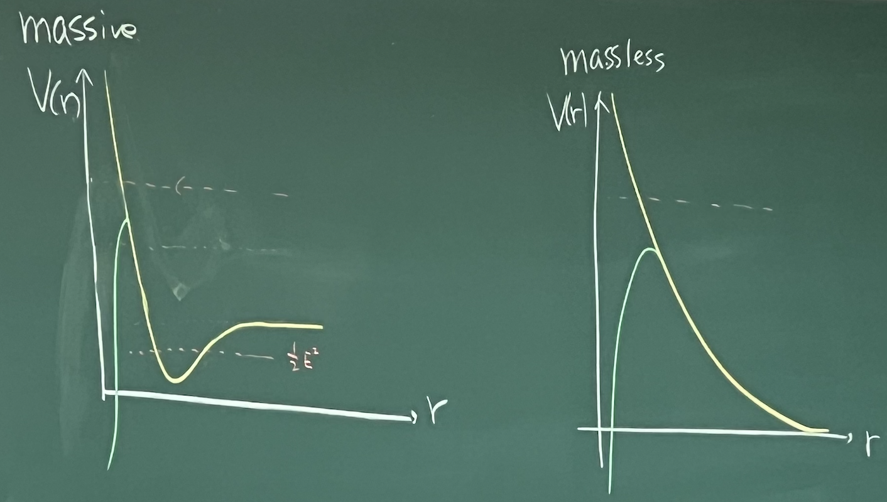

## Schwarzchild metric

$$
d s^2 = - \left( 1 - \frac{2 G M}{r} \right) d t^2 + \left( 1 - \frac{2 G M}{r} \right)^{-1} d r^2 + r^2 d \Omega^2
$$

$\theta = \frac{\pi}{2}$，Killing vector

$$
\begin{aligned}
    K &= \partial_t \implies \left(1 - \frac{2 G M}{r}\right) \frac{d t}{d \lambda} = E \\
    K &= \partial_\phi \implies r^2 \frac{d \phi}{d \lambda} = L
\end{aligned}
$$

由此

$$
g_{\mu \nu} \frac{d x^\mu}{d \lambda} \frac{d x^\nu}{d \lambda} = - \left( 1 - \frac{2 G M}{r} \right) \left( \frac{d t}{d \lambda} \right)^2 + \left( 1 - \frac{2 G M}{r} \right)^{-1} \left( \frac{d r}{d \lambda} \right)^2 + r^2 \left( \frac{d \phi}{d \lambda} \right)^2 = - \epsilon \, \begin{cases}
    \epsilon = 1 & \text{massive particle} \\
    \epsilon = 0 & \text{massless particle}
\end{cases}
$$

> 广义相对论中，无质量的粒子一般称为光子。

对比牛顿力学（我们期待牛顿力学是广义相对论在弱场、慢速极限下的近似），

$$
\begin{equation} \tag{1} \label{eq:motion}
    \frac{1}{2} \left( \frac{d r}{d \lambda} \right)^2 + V(r) = \frac{1}{2} E^2
\end{equation}
$$

其中势能

$$
V(r) = \frac{1}{2} \epsilon - \frac{GM}{r} \epsilon + \frac{L^2}{2 r^2} - \underset{\text{GR correction}}{\underbrace{\textcolor{crimson}{\frac{G M L^2}{r^3}}}}
$$

对于有质量的粒子，

$$
V(r) = \frac{1}{2} - \frac{G M}{r} + \frac{L^2}{2 r^2} - \frac{G M L^2}{r^3}
$$

> 在这里的归一化下，动量是无量纲的

求极值点，

$$
\left.\frac{\partial V}{\partial r}\right|_{r=r_c} = 0 \implies r_c = \frac{L^2 \pm \sqrt{L^4 - 12 G^2 M^2 L^2}}{2 G M}
$$

1.  $L^2 < 12 G^2 M^2$，不存在极值点，粒子会不断接近
2.  $L^2 > 12 G^2 M^2$，存在稳定轨道 $r_{c_+}$

对于无质量粒子

$$
\left.\frac{\partial V}{\partial r}\right|_{r=r_c} = 0 \implies r_c = 3 G M
$$

是不稳定的。

## 水星进动

每年水星的近日点会进动 $43''$，这个现象无法用牛顿力学解释。

令 $u = \frac{L^2}{GMr}$（无量纲），

$$
\frac{d r}{d \lambda} = \frac{L^2}{GM} \frac{d}{d \lambda} (u^{-1}) = - \frac{L^2}{GM} u^{-2} \frac{d u}{d \phi} \frac{d \phi}{d \lambda}
$$

利用 $r^2 \frac{d \phi}{d \lambda} = L$，上式化为

$$
\frac{d r}{d \lambda} = - \frac{G M}{L} \frac{d u}{d \phi}
$$

令 $\xi = (GM / L)^2$（无量纲），则 \eqref{eq:motion} 可以写成

$$
\xi  \left( \frac{d u}{d \phi} \right)^2 + (1 - 2 \xi u)(\xi u^2 + 1) = E^2
$$

对 $\phi$ 求导，

$$
2 \xi \frac{d u}{d \phi} \frac{d^2 u}{d \phi^2} + \left(- 2 \xi \frac{d u}{d \phi} \right)(\xi u^2 + 1) + (1 - 2 \xi u) \cdot 2 \xi u \frac{d u}{d \phi} = 0
$$

整理得到

$$
2 \xi \frac{d u}{d \phi} \left( \frac{d^2 u}{d \phi^2} + u - 3 \xi u^2 - 1 \right) = 0
$$

$\frac{d u}{d \phi} \neq 0$，所以有

$$
\begin{equation} \tag{2} \label{eq:mercury-precession}
    \frac{d^2 u}{d \phi^2} - 3 \xi u^2 + u - 1 = 0
\end{equation}
$$

这是个非线性方程。由于 $\xi \sim 10^{-8} \ll 1$，可以使用微扰的方法。设 $u = u_0 + \xi u_1 + \mathcal{O}(\xi^2)$.

-   零阶解 $\mathcal{O}(\xi^0)$

    $$
    \begin{equation} \tag{3} \label{eq:mercury-0th}
        \frac{d^2 (u_0 - 1)}{d \phi^2} + u_0 - 1 = 0
    \end{equation}
    $$

    容易解得

    $$
    u_0 = 1 + A_0 \cos \phi + B_0 \sin \phi = 1 + e_0 \cos (\phi - \cancelto{0}{\phi_0})
    $$

-   一阶解 $\mathcal{O}(\xi^1)$

    $$
    \begin{equation} \tag{4} \label{eq:mercury-1st}
        \frac{d^2 u_1}{d \phi^2} + u_1 = 3 u_0^2 = 3 \big( 1 + e_0 \cos \phi \big)^2
    \end{equation}
    $$

    解得

    $$
    u_1 = 3 \left( 1 + \frac{e_0^2}{2} \right) - \frac{e_0^2}{2} \cos 2 \phi + 3 e_0 \phi \sin \phi + A_1 \cos \phi + B_1 \sin \phi
    $$

\eqref{eq:mercury-0th} \eqref{eq:mercury-1st} 加在一起，

$$
u = C + e \cos (\phi - \cancel{\alpha}) - \frac{\xi e^2}{2} \cos 2 \phi + 3 \xi e \phi \sin \phi + \mathcal{O}(\xi^2), \, e = e_0 + \xi e_1
$$

## 卫星

狭义相对论的时间膨胀效应会使卫星每天慢 7 μs，广义相对论的引力时间膨胀效应会使卫星每天快 45 μs，综合起来就是快了 38 μs。如果不进行修正的话，每天就会产生 10 公里（乘以光速）的定位误差。

