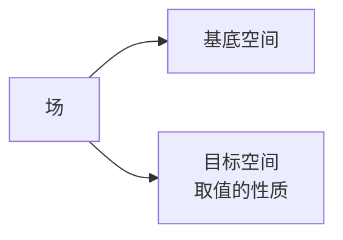

# 静电场的局域性质

- 曲线 $d\vec{l}$
  $$
  \begin{aligned}
  \int_L \vec{E} \cdot d\vec{l} &= -\mathcal{E}_i/q + \mathcal{E}_f/q = \int_L \int_V \frac{\rho(\vec{x}) dV}{4\pi\epsilon_0} \boxed{\frac{\vec{x} - \vec{x}'}{\left|\vec{x} - \vec{x}'\right|^3}} \cdot d\vec{x} \\
  &= -\int_L \sum_i dx_i \left(\int_V \frac{\rho(\vec{x}) dV'}{4\pi\epsilon_0} \frac{1}{\left|\vec{x} - \vec{x}'\right|}\right) \\
  \end{aligned}
  $$
  - $$\frac{\vec{x} - \vec{x}_i}{\left|\vec{x} - \vec{x}_i\right|^3} = -\sum_i \partial_{x_i} \frac{1}{\left|\vec{x} - \vec{x}_i\right|}$$
  - 环量 $$\oint_L \vec{E} \cdot d\vec{l} = 0$$
  - 这告诉我们：电场线只可能：
    1. 从点到点
    2. 从点到无穷远
    3. 从无穷远到无穷远
- 曲面 $d\vec{S}$
  - $\int_S \vec{E} \cdot d\vec{S}$
  - 通量 $$\oiint_S \vec{E} \cdot d\vec{S} = \frac{Q_S}{\epsilon_0}$$
  - 这告诉我们，通量和场线数量在概念上是一样的

---

$$\int_{\cancel{L}} \vec{E} \cdot d\vec{l} = \int \boxed{E_1 dx_1 + E_2 dx_2 + E_3 dx_3}$$

- 不考虑路径 $L$，被积函数 $\vec{E} \cdot d\vec{l}$ 总可以写成方框里的形式
- 这整个东西是在 $\mathbb{R}^3$ 上完整分布的，只有在具体积分时才将 $dx_1, dx_2, dx_3$ 约束到 $L$ 给出的 $x_i = x_i(t)$ 上
- 此即为**微分形式**

$$\int_{\cancel{S}} \vec{E} \cdot d\vec{S} = \int \boxed{E_1 dx_2 dx_3 + E_2 dx_3 dx_1 + E_3 dx_1 dx_2}$$

> 大前提：在 $\mathbb{R}^3$ 上讨论，参数记为 $(t_1, t_2, t_3)$

- 0 - 形式
  - 一个微分形式都没有（普通函数）
  - 例：$f(\vec{x}), f(t_1, t_2, t_3)$
  $$\omega^{(0)} \equiv f$$
- 1 - 形式 $dt_i$
  $$\omega^{(1)} = f_1 dt_1 + f_2 dt_2 + f_3 dt_3$$
- 2 - 形式 $dt_i \wedge dt_j$
  $$\omega^{(2)} = f_1 dt_2 \wedge dt_3 + f_2 dt_3 \wedge dt_1 + f_3 dt_1 \wedge dt_2$$
- 3 - 形式 $dt_1 \wedge dt_2 \wedge dt_3$
  $$\omega^{(3)} = f dt_1 \wedge dt_2 \wedge dt_3$$

$$
\int_L \vec{E} \cdot d\vec{l} = -\int_L \underset{\mathrm{d} \,\text{外微分}}{\underbrace{\sum_i dx_i \frac{\partial}{\partial x_i}}} \Phi
$$

$$d\omega = \sum_i dx_i \wedge \frac{\partial}{\partial x_i} \omega$$

只能做 0 - 形式 $\to$ 1 - 形式 $\to$ 2 - 形式 $\to$ 3 - 形式的外微分

!!! note "Stokes 定理（广义）"
    $$\int_{\partial R^{(k+1)}} \omega^{(k)} = \int_{R^{(k+1)}} \mathrm{d}\omega^{(k)}$$

    - $k = 0$ 时
        $$\int_L \mathrm{d}f = \sum_{\text{端点}} f = f_f - f_i$$
    - $k = 1$ 时
        $$
        \begin{aligned}
        \omega^{(1)} &= f_1 dx_1 + f_2 dx_2 + f_3 dx_3 \\
        \mathrm{d}\omega^{(1)} &= \partial_2 f_1 dx_2 \wedge dx_1 + \partial_3 f_1 dx_3 \wedge dx_1 \\
        &+ \partial_1 f_2 dx_1 \wedge dx_2 + \partial_3 f_2 dx_3 \wedge dx_2 \\
        &+ \partial_1 f_3 dx_1 \wedge dx_3 + \partial_2 f_3 dx_2 \wedge dx_3 \\
        &= \left(\partial_2 f_3 - \partial_3 f_2\right) dx_2 \wedge dx_3 + \left(\partial_3 f_1 - \partial_1 f_3\right) dx_3 \wedge dx_1 + \left(\partial_1 f_2 - \partial_2 f_1\right) dx_1 \wedge dx_2
        \end{aligned}
        $$
        
        在直角坐标系下，此即为 $$\oint_{\partial S} \vec{E} \cdot d\vec{l} = \int_S \left(\nabla \times \vec{E}\right) \cdot d\vec{S}$$

        $$\iff\nabla \times \vec{E} = 0$$

        $$\iff \mathrm{d}\left(\vec{E} \cdot d\vec{l}\right) = 0$$

        注意到 $\vec{E} \cdot d\vec{l} = -\mathrm{d}\Phi$，所以有 $\mathrm{d}^2\Phi = 0$。事实上，
        
        $$\mathrm{d}^2  = \

        梯度场 $\vec{E} = -\nabla \Phi$

    - $k = 2$ 时
        $$
        \begin{aligned}
        \omega^{(2)} &= f_1 dx_2 \wedge dx_3 + f_2 dx_3 \wedge dx_1 + f_3 dx_1 \wedge dx_2 \\
        \mathrm{d}\omega^{(2)} &= \left(\partial_1 f_1 + \partial_2 f_2 + \partial_3 f_3\right) dx_1 \wedge dx_2 \wedge dx_3
        \end{aligned}
        $$

        在直角坐标系下，此即为 $$\int_{\partial V} \vec{E} \cdot d\vec{S} = \int_V \left(\nabla \cdot \vec{E}\right) dV$$

        $$\iff\nabla \cdot \vec{E} = \frac{\rho}{\epsilon_0}$$

        $$\iff \mathrm{d}\left(\vec{E} \cdot d\vec{S}\right) = \frac{\rho}{\epsilon_0} dV$$

