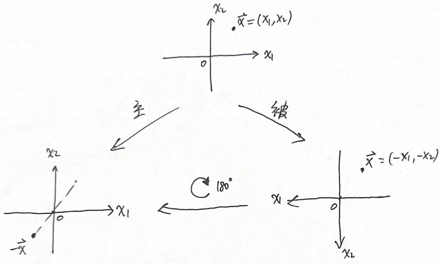

> 2026/04/14 10:00
> 
> - 静磁场与静电场的比较

!!! info "两种观点：主动与被动"
    对于一种变换操作，例如 $\vec{x} \to -\vec{x}$，有两种观点看问题。如果不提前澄清，会造成混淆。

    | 观点 | 观测者 | 物理系统 |
    | :---: | :---: | :---: |
    | 主动观点 | 不变 | 变 |
    | 被动观点 | 变 | 不变 |

    对于主动观点，观测者架设起来的坐标系、标度都不变，变的是物理系统；对于被动观点，物理系统不变，变的是观测者本身的坐标系统。

    > 例：给一个完美球形拍照。在旋转操作下，球拍出来的照片是一样的。
    >
    > - 主动观点：摄像机不动，让球转
    > - 被动观点：球不动，让摄像机转

    {++通常采用**主动**观点++}，原因是这会减少测量的麻烦。因为主动观点下，坐标系统不变，进行前后的对比参照是很自然的事情；而被动观点下，坐标系统变了，为了让新的坐标系和旧的坐标系“对齐”（比如，物理对象得在同一个位置，对于宇称变换，坐标原点、坐标轴得重合），又需要把新坐标系转回去，而这就又相当于做了主动观点的事情（坐标系回到原先的状态）。

    > 例：宇称变换 $\vec{x} \to -\vec{x}$
    >
    > 

对于质点，宇称变换下 $\vec{x} \overset{\mathcal{P}}{\longrightarrow} -\vec{x} \equiv \vec{x}'$，而我们现在关心{++场的值在宇称变换下会有什么变化++}。

$$
\begin{aligned}
    & \text{标量（场）} && f(\vec{x}) \overset{\mathcal{P}}{\longrightarrow} f'(\vec{x}') \xlongequal{场的值} f(\vec{x}) \textcolor{gray}{= f(-\vec{x}')} &&& \rho(\vec{x}) \\
    & \text{赝标量} && \tilde{f}(\vec{x}) \overset{\mathcal{P}}{\longrightarrow} \tilde{f}'(\vec{x}') = - \tilde{f}(\vec{x}) &&& \vec{A} \cdot (\vec{B} \times \vec{C}) \\
    & \text{矢量} && \vec{v}(\vec{x}) \overset{\mathcal{P}}{\longrightarrow} \vec{v}'(\vec{x}') = - \vec{v}(\vec{x}) &&& \vec{J}(\vec{x}), \vec{E} \\
    & \text{赝矢量} && \vec{w}(\vec{x}) \overset{\mathcal{P}}{\longrightarrow} \vec{w}'(\vec{x}') = \vec{w}(\vec{x}) &&& \vec{B}
\end{aligned}
$$

从电磁场的规律出发，对于电场

$$
\nabla \cdot \vec{E}(\vec{x}) = \frac{\rho(\vec{x})}{\varepsilon_0} \overset{\mathcal{P}}{\longrightarrow} \nabla' \cdot \vec{E}'(\vec{x}') = \frac{\rho'(\vec{x}')}{\varepsilon_0} 
$$