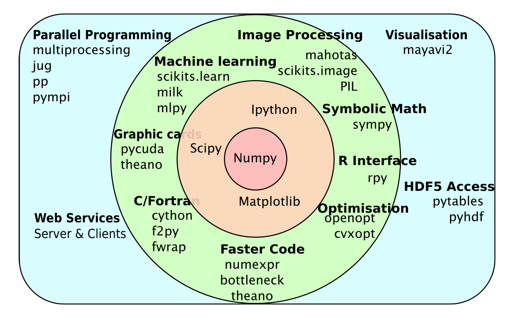
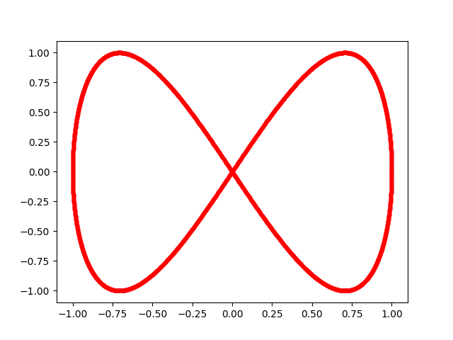

# Python 科学计算

## Numpy



- `array`
- `reshape`
- `transpose`
- `concatenate`
- `append`
- `linalg.inv`
- `linalg.solve`
- `linalg.eig`

## Matplotlib

!!! example "Lissajous 李萨如图形"
    李萨如图形：两个垂直方向的正弦波的叠加。

    $$
    \left\{
    \begin{aligned}
    x(t) &= A \cos(at) \\
    y(t) &= B \cos(bt + \phi)
    \end{aligned}
    \right.
    $$

    ```python
    import numpy as np
    import matplotlib.pyplot as plt
    t = np.linspace(0, 2*np.pi, 4000)
    x = np.cos(t)
    y = np.cos(2*t + np.pi/2)
    plt.plot(x, y, 'r.')
    plt.show()
    ```

    

### Params

#### `plt.plot`

- `'bo'`, `'r.'`, `'g-'`, `'k--'` etc.
- `linewidth`
- `color`
- `linstyle`
- `label`

#### 坐标轴

- `plt.xlabel`
- `plt.xlim`
- `plt.xticks(np.linspace(xmin,xmax,n,endpoint=True))`
- `plt.title`

绘制子图：`plt.subplot(row, col, k)`

### 其它类型

- 直方图：`plt.hist`
- 散点图：`plt.scatter`
- 等高线图：`plt.contourf`
- 向量图：`plt.quiver`
- 流线图：`plt.streamplot`
- 曲面网格图：`Axes3D.plot_surface`

## VPython

## 数据处理

### 读取txt数据

通用方法（built-in `open`）：

```python
with open('data.txt', 'r') as f:
    data = f.readlines()
```

结构体浮点数据：

```python
data = np.loadtxt('data.txt')
```