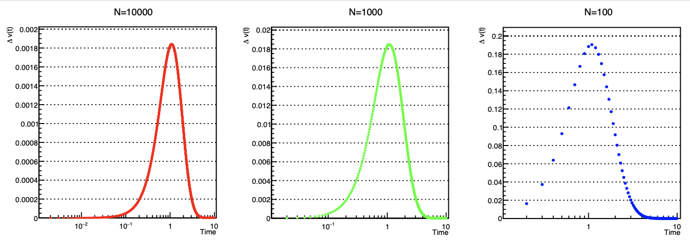

# 差分法求解微分方程

## 微分方程的分类

- 变量数目
    - ODE
    - PDE
- 阶数

- 线性二阶 PDE
    
$$a\frac{\partial^2 \phi}{\partial x^2} + b\frac{\partial \phi}{\partial x \partial y} + c\frac{\partial^2 \phi}{\partial y^2} + d\frac{\partial \phi}{\partial x} + e\frac{\partial \phi}{\partial y} + f\phi + g = 0$$

- 非线性微分方程
    - Bernoulli
    - Navier-Stokes
    - Ginzburg-Landau

### 边界条件

- 时间变量
    - 一阶：给定 $\phi(t_0)$
    - 二阶：给定 $\phi(t_0)$，$\left.\frac{\partial \phi}{\partial t}\right|_{t_0}$ 或结束状态 $\phi(t_f)$
- 空间坐标
    - Dirichlet, Neumann, Robin

## ODE

### Euler 公式

#### 向前

对于形如 $\frac{d\phi}{dx} = f(x, \phi)$ 的ODE，代入一阶向前差分公式，得到：

$$
\begin{equation*}
\frac{\phi_{n+1} - \phi_n}{h} = f(x_n, \phi_n)
\end{equation*}
$$

进而得到**向前 Euler 公式**：

$$
\begin{equation} \tag{1} \label{1}
    \phi_{n+1} = \phi_n + h \cdot f(x_n, \phi_n)
\end{equation}
$$

- 显式
- 也称 **Euler 折线法**

#### 向后

在式 \eqref{1} 中，斜率 $f(x_n, \phi_n)$ 的计算是使用当前点 $(x_n, \phi_n)$ 的值来计算的。如果使用下一个点 $(x_{n+1}, \phi_{n+1})$ 的值来计算，则得到**向后 Euler 公式**：

$$
\begin{equation} \tag{2}
    \underline{\phi_{n+1}} = \phi_n + h \cdot f(x_{n+1}, \underline{\phi_{n+1}})
\end{equation}
$$

- 隐式
- 精度和稳定性更好

Picard 迭代格式：

$$
\left\{
\begin{aligned}
    \phi_{n+1}^{(0)} &= \phi_n + h \cdot f(x_n, \phi_n) \\
    \phi_{n+1}^{(k+1)} &= \phi_n + h \cdot f(x_{n+1}, \phi_{n+1}^{(k)})
\end{aligned}
\right.
,\quad k = 0, 1, 2, \ldots
$$

通过设定精度要求 $\left|\phi_{n+1}^{(k+1)} - \phi_{n+1}^{(k)}\right| < \epsilon$ 来终止迭代。

#### 稳定性分析

> 如果迭代的初始值有误差，以后每次迭代是否会无限制放大误差？

设 $y_i$ 为准确计算值，$z_i$ 为初值有误差的计算值。$n$ 次迭代后，

$$
\left\{
\begin{aligned}
    y_{n+1} &= y_n + h \cdot f(x_n, y_n) \\
    z_{n+1} &= z_n + h \cdot f(x_n, z_n)
\end{aligned}
\right.
$$

两式相减，

$$
\begin{aligned}
    |e_{n+1}| &= |y_{n+1} - z_{n+1}| \\
    &= |y_n - z_n| + h \cdot |f(x_n, y_n) - f(x_n, z_n)| \\
    &= |e_n| + h \cdot |f(x_n, y_n) - f(x_n, z_n)|
\end{aligned}
$$

**{++Lipschitz 条件++}**：$|f(x, y_i) -f(x, y_j)| \leq L |y_i - y_j|$，其中 $L$ 为 Lipschitz 常数。

代入上式得

$$
\begin{aligned}
    |e_{n+1}| &\leq |e_n| + h \cdot L |e_n| \\
    &= (1 + hL) |e_n| \\
    &\leq \ldots \leq (1 + hL)^n |e_0|
\end{aligned}
$$

步长 $h = (b-a)/N$，$|e_n| \sim \exp{(?)} e_0$，累积的误差值在有限值内。

!!! example "受阻力的落体运动"
    $$\frac{dv}{dt} = g - kv^2$$

    使用向前 Euler 公式 \eqref{1}，得到

    $$v_{n+1} = v_n + h \cdot (g - kv_n^2)$$

    解析解：
    
    $$v(t) = \sqrt{\frac{g}{k}} \tanh{\left(2\sqrt{gk}t\right)}$$

    取时间区间 $t \in [0.0, 10.0]$，分割为 $N = 10000$ 个时间步长，$g = 10$.

    

    ---

    **误差分析**

    Euler 公式的局部误差

    $$v_{n+1} = v_n + h \cdot v'(t_n) + \underset{o(h^2)}{\underbrace{\frac{h^2}{2} v''(t_n)}} + \cdots$$

    经过 $N$ 步累积后，误差为 $o(h^2 \cdot N) \sim o(1/N)$。

    

    ---

    **稳定性分析**

    $$v_{n+1} = v_n + h \cdot (g - kv_n^2)$$

    设 $v_n$ 有误差 $\rho_n$，将上式微分可得

    $$
    \begin{aligned}
    \rho_{n+1} &= \rho_n - 2hkv_n \rho_n = \rho_n(1 - 2hkv_n) \\
    &\implies \left|\frac{\rho_{n+1}}{\rho_n}\right| = |1 - 2hkv_n| < 1
    \end{aligned}
    $$

### 中心差商近似

$$
