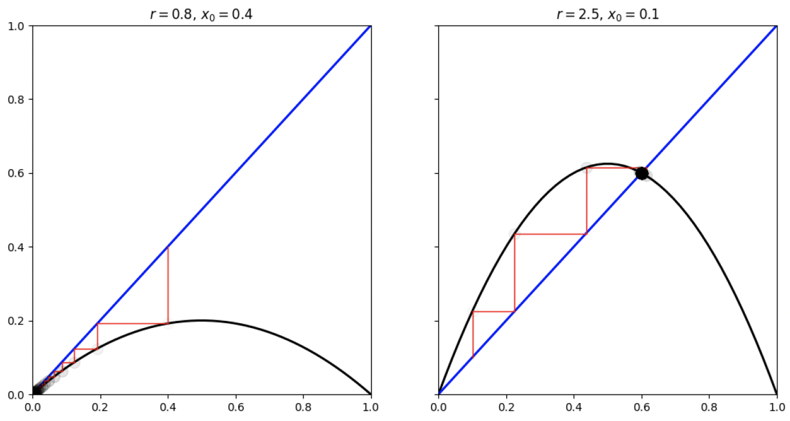
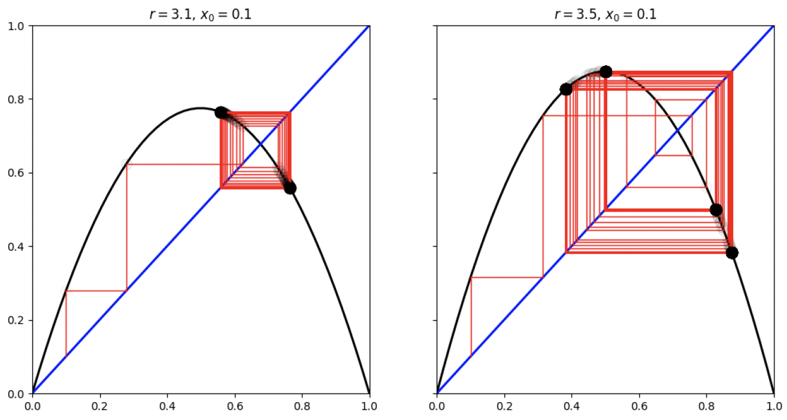
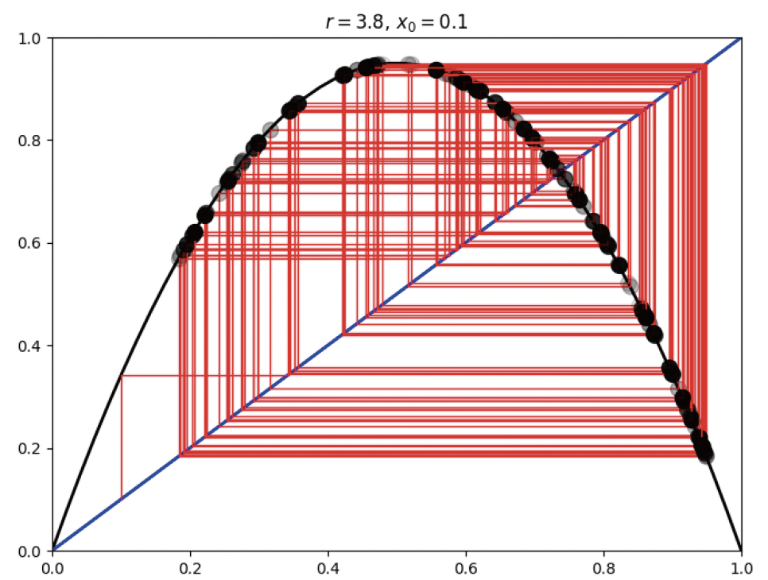
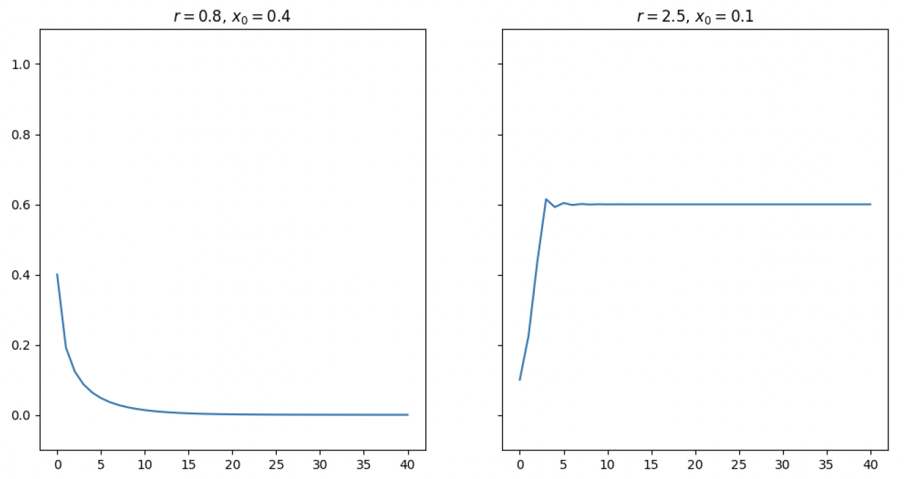
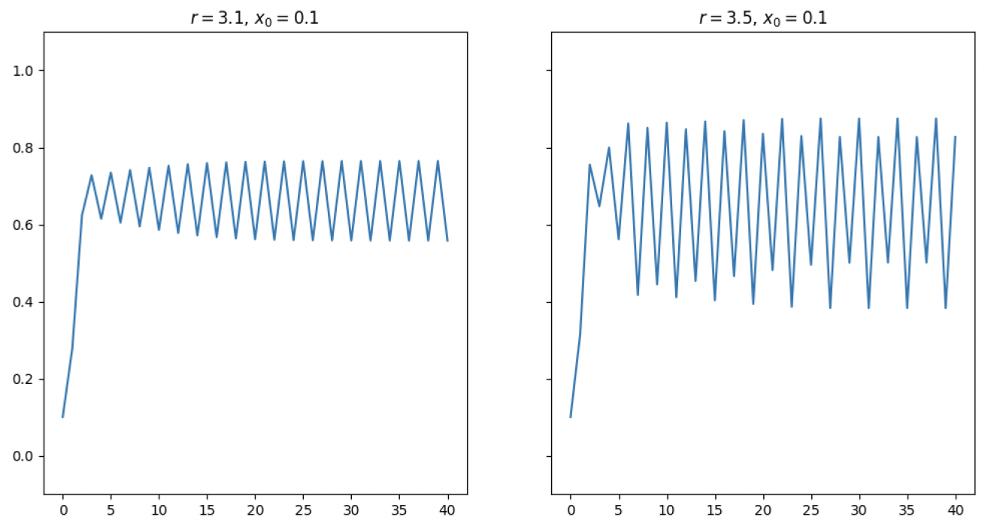
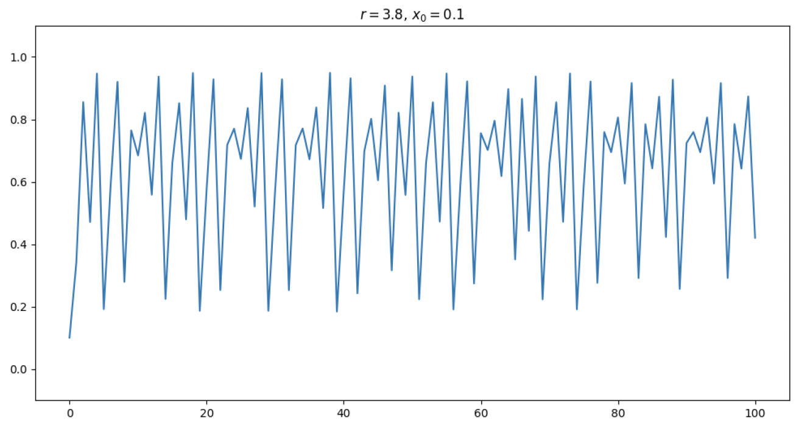

# 复杂系统中的计算方法

!!! quote 
    *When the present determines the future, but the approximate present does not approximately determine the future.* 

    <font align="right">
    
    — Edward Lorenz

    </font>

## 从线性到非线性

!!! tip "混沌 vs. 随机过程"
    - 真随机过程：完全不可预测，可能可以得到概率分布，但无法判断系统演化中特定时间的单次结果
    - 混沌：确定的过程，但由于精确解析解无法求得/计算过程的误差急剧放大，导致无法预测未来状态

### 线性

- 叠加性 $f(x+y) = f(x) + f(y)$
- 齐次性 $f(ax) = af(x)$

即

$$
f(\alpha x + \beta y) = \alpha f(x) + \beta f(y)
$$

### 动力学系统分类

- 迭代映射

$$
x_{n+1} = f(x_n)
$$

- 微分方程

$$
\left \{
\begin{aligned}
\dot{x}_1 &= f_1(x_1, x_2, \ldots, x_n) \\
\dot{x}_2 &= f_2(x_1, x_2, \ldots, x_n) \\
\vdots \\
\dot{x}_n &= f_n(x_1, x_2, \ldots, x_n)
\end{aligned}
\right.
$$

- 1963：Lorenz
- 1970s：分形
- 1980 - ：广泛应用于流体力学、非线性光学、大气科学等

## 离散的迭代映射

!!! info "不动点"
    $$
    x^* = f(x^*)
    $$

    可以用来描述系统的平衡和稳定。

    - 经济学博弈理论：Nash 均衡
    - 物理学相变理论

在不动点附近做小扰动 $x_n = x^* + \eta_n$，得到

$$
x_{n+1} = f(x^* + \eta_n) = f(x^*) + f'(x^*) \eta_n + O(\eta_n^2)
$$

由 $f(x^*) = x^*$ 可得

$$
\eta_{n+1} \approx f'(x^*) \eta_n
$$

不动点的稳定性取决于 $\lambda = f'(x^*)$ 的大小：

- $|\lambda| < 1$：不动点稳定
- $|\lambda| > 1$：不动点不稳定
- $|\lambda| = 1$：不确定

### Logistic 映射

$$
x_{n+1} = r x_n (1 - x_n)
$$

- $x_n \in [0, 1]$，$r \in [0, 4]$
- 两个不动点：$x^* = 0$ 和 $x^* = 1 - \frac{1}{r}$

蛛网图：







随着迭代次数的增加，取值的变化：







#### 结果讨论

- $r < 1$：收敛到 $x^* = 0$，灭绝
- $1 < r < 3$：收敛到 $x^* = 1 - \frac{1}{r}$，稳定
- $3 < r < 3.569$：周期态
- $3.569 < r < 3.83$：混沌

#### 分岔图

```python linenums="1"
import numpy as np
import matplotlib.pyplot as plt

def logistic(r, x):
    return r * x * (1 - x)

n = 10000
xmin = 1
xmax = 4
r = np.linspace(xmin, xmax, n)

iterations = 1000
last = 100
x = 1e-5 * np.ones(n)

for i in range(iterations):
    x = logistic(r, x)
    if i >= (iterations - last):
        plt.plot(r, x, ',k', alpha=0.1) # Bifurcation diagram

plt.xlim(xmin, xmax)
plt.grid()
plt.title("Bifurcation diagram")
plt.xlabel("r")
plt.ylabel("x")
plt.show()
```

#### 二分岔

求解 $f(f(x)) = x$，即

$$
r[rx(1-x)][1-rx(1-x)] = x
$$

## 分形

!!! example ""
    - Cantor 集
    - Koch 曲线
    - Sierpinski 三角形
    - Julia 集

    $$
    f(z) = z^2 + c
    $$

### 分形的维度

- 对于 Koch 曲线

边长关系

$$
L_{n+1} = \frac{4}{3} L_n
$$

当 $n \to \infty$ 时，总长度 $L_n \to \infty$，因此维度 $> 1$。

但曲线不能围成一个平面区域！维度 $< 2$。

!!! tip "维度量化"
    - 自相似维度
    - 盒维度
    - 点态维度

#### 自相似维度

分形往往是自相似的

比例系数 $r$，等分数目 $m$，

$$
m = r^d
$$

#### 盒维度

用边长很小（$\epsilon$）的正方形格子去覆盖分形，确定总共需要的格子数 $N(\epsilon)$，

$$
N(\epsilon) \propto \epsilon^{-d}
$$

## FFT

!!! quote "Top 10 Algorithms in 20th Century"
    - **Metropolis Algorithm for Monte Carlo**
    - Simplex Algorithm for Linear Programming
    - Krylov Subspace Iterative Methods
    - **The Decompositional Approach to Matrix Computation**
    - The Fortran Optimizing Compiler
    - **QR Algorithm for Eigenvalues**
    - QuickSort
    - **Fast Fourier Transform**
    - Integer Relation Detection
    - Fast Multipole Method

$$
\begin{aligned}
F(k) &= \int_{-\infty}^{\infty} f(x) e^{-2 \pi \mathrm{i} k x} \mathrm{d}x \\
f(x) &= \int_{-\infty}^{\infty} F(k) e^{2 \pi \mathrm{i} k x} \mathrm{d}k
\end{aligned}
$$

### 傅里叶级数

$f(x)$ 定义在区间 $[0, L]$ 上，可以展开为傅里叶级数：

$$
f(x) = \sum_{k=0}^{\infty} \alpha_k \cos\left( \frac{2 \pi k x}{L} \right) + \sum_{k=1}^{\infty} \beta_k \sin\left( \frac{2 \pi k x}{L} \right)
$$

转化为复数形式：

$$
f(x) = \sum_{k=-\infty}^{\infty} \gamma_k e^{\frac{2 \pi \mathrm{i} k x}{L}}
$$

其中

$$
\gamma_k = 
\begin{cases}
\frac{1}{2} (\alpha_{-k} + \mathrm{i} \beta_{-k}), & k < 0 \\
\alpha_0, & k = 0 \\
\frac{1}{2} (\alpha_k - \mathrm{i} \beta_k), & k > 0
\end{cases}
$$

也可以利用正交性积分得到 $\gamma_k$ 的表达式：

$$
\gamma_k = \frac{1}{L} \int_0^L f(x) e^{-\frac{2 \pi \mathrm{i} k x}{L}} \mathrm{d}x
$$

### 离散傅里叶变换（DFT）

实际问题中，对于一串实验数据，无法得到 $f(x)$ 的解析形式或者 $f(x)$ 过于复杂，需要离散化处理。

将区间 $[0, L]$ 等分为 $N$ 份，得到 $\delta = L/N$，以及数据序列 $(x_0, f_0), (x_1, f_1), \ldots, (x_N, f_N)$. 