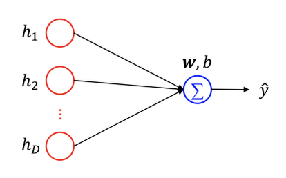

# 深度学习和计算物理

!!! tip "深度学习和计算物理的三要素"
    - 深度学习
        - 神经网络模型
        - 学习准则：损失函数
        - 优化算法：梯度下降
    - 计算物理
        - 物理数学模型
        - 学习准则：拟合函数（$\chi^2$），似然函数（$\mathcal{L}$）
        - 优化算法：求极值，模拟退火

四类问题：

- clustering
- classification
- regression

## 神经网络模型

神经元的信息传递

1. 感受刺激
2. 整合信息
3. 传导冲动

### 神经元建模

神经元接收到来自其他神经元传递过来的{++输入信号++}，这些信号通过带{++权重++}的连接进行传递。神经元将接收到的总输入值与神经元的阈值进行比较，通过{++激活函数++}处理输出，作为其他神经元的输入信号。

最简单的线性模型：

**输入：**

$$
z = \sum_{i=1}^{n} w_i x_i + b
$$

- $x_i$：上一层神经元的输入
- $w_i$：各个突触的权重
- $b$：偏置项

**输出：** 激活函数 $\phi(z)$

### 人工神经网络

主体结构：输入层、隐藏层、输出层

模型因素：

- 网络结构：如何设计神经元之间的连接层级结构？
- 连边大小：如何设定每条连接的权重？训练学习获得
- 节点性质

### 网络的深度

!!! note "通用近似定理（Universal Approximation Theorem）"
    令 $\phi$ 是一个非常数、有界、单调递增的连续函数，

    只要隐藏层神经元的数量足够多，就可以以任意精度逼近任何一个定义在是数控剪中的有界闭集函数。

神经网络可以作为一个“万能”函数，可以进行复杂的特征转换，或逼近一个复杂的条件分布。

$$
\hat{y} = g(\phi(x), \theta)
$$

具有 $d$ 个输入，深度为 $l$，每个隐藏层有 $n$ 个单元的深度整流网络可以描述的线性区域数目为：

$$
\binom{n}{d}^{d(l-1)} n^{d}
$$

## 前馈神经网络（FNN）

- Feedforward Neural Network：最早发明的简单人工神经网络，aka. 多层感知机（Multilayer Perceptron, MLP）
- 单向多层结构
    - 输入层
    - 隐藏层
    - 输出层
- 信号从输入层向输出层单向传播，没有反馈连接

### 激活函数

决定单个神经元输出的兴奋或者抑制的程度。

数学性质要求：

- 函数及导函数尽可能简单
- 连续可导、非线性
- 导函数的值域要在合适的范围内

常见的激活函数：

- Sigmoid
- Tanh
- ReLU

### 参数学习

以 Sigmoid 函数为例：

$$
\phi(z) = \frac{1}{1 + e^{-z}}
$$

$$
\hat{y} = \phi(\omega^T h + b) = \frac{1}{1 + e^{-(\omega^T h + b)}}
$$

单一的 Sigmoid 输出单元可以输出 Bernoulli 分布，适合二分类问题。

## 反向传播算法（Backpropagation）

计算神经网络中参数的梯度。

假设有函数 $\mathsf{Y} = f(\mathsf{X}), \mathsf{Z} = g(\mathsf{Y})$，其中 $\mathsf{X}, \mathsf{Y}, \mathsf{Z}$ 是任意形状的张量。根据链式法则，$\mathsf{Z}$ 关于 $\mathsf{X}$ 的导数为：

$$
\frac{\partial \mathsf{Z}}{\partial \mathsf{X}} = \frac{\partial \mathsf{Y}}{\partial \mathsf{X}} \otimes \frac{\partial \mathsf{Z}}{\partial \mathsf{Y}}
$$

在上面的例子中，

$$
\begin{aligned}
\frac{\partial L(y, \hat{y})}{\partial \omega_{ij}^{(l)}} &= \frac{\partial z^{(l)}}{\partial \omega_{ij}^{(l)}} \otimes \frac{\partial L(y, \hat{y})}{\partial z^{(l)}} \\
\frac{\partial L(y, \hat{y})}{\partial b^{(l)}} &= \frac{\partial z^{(l)}}{\partial b^{(l)}} \otimes \frac{\partial L(y, \hat{y})}{\partial z^{(l)}}
\end{aligned}
$$