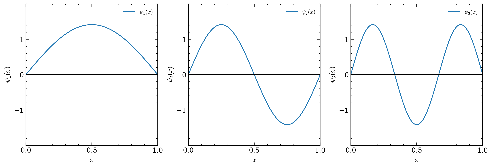

# 第二章 定态薛定谔方程

## 2.1 分离变量法

> 定态：势能 $V$ 不随时间变化

分离变量法：$\Psi(x,t) = \psi(x) \varphi(t)$

代入薛定谔方程：

$$
\begin{equation} \label{eq:shrodinger}
    \mathrm{i} \hbar \frac{\partial}{\partial t} \Psi(x, t) = -\frac{\hbar^2}{2m} \frac{\partial^2 \Psi}{\partial x^2} + V \Psi
\end{equation}
$$

得到

$$
\mathrm{i} \hbar \frac{1}{\varphi(t)} \frac{\mathrm{d} \varphi(t)}{\mathrm{d} t} = -\frac{\hbar^2}{2m} \frac{1}{\psi(x)} \frac{\mathrm{d}^2 \psi(x)}{\mathrm{d} x^2} + V(x) \equiv E
$$

> 注：**$E$ 必须为实数！**

第一个方程：

$$
\begin{equation}
    \mathrm{i} \hbar \frac{1}{\varphi(t)} \frac{\mathrm{d} \varphi(t)}{\mathrm{d} t} = E \implies \varphi(t) = e^{-\mathrm{i} E t / \hbar}
\end{equation}
$$

第二个方程：

$$
\begin{equation} \label{eq:time_independent_schrodinger}
    -\frac{\hbar^2}{2m} \frac{\mathrm{d}^2 \psi}{\mathrm{d} x^2} + V(x) \psi = E \psi
\end{equation}
$$

此即为**定态薛定谔方程（time-independent Schrödinger equation）**。

1.  **定态（stationary state）**
    尽管波函数 $\Psi(x,t)$ 本身随时间变化，但其几率密度

    $$
    |\Psi(x,t)|^2 = \Psi^* \Psi = \psi^* e^{+\mathrm{i} E t / \hbar} \psi e^{-\mathrm{i} E t / \hbar} = |\psi(x)|^2
    $$

    并不依赖于时间！对于任何动力学变量的期望值都是如此：

    $$
    \braket{Q(x,p)} = \int \psi^* Q\left(x, -\mathrm{i} \hbar \frac{\partial}{\partial x}\right) \psi \, \mathrm{d}x
    $$

    $\varphi$ 的时间因子被抵消掉了。
2.  **有确定的总能量**

    $$
    \hat{H} = \frac{\hat{p}^2}{2m} + V(\hat{x})
    $$

    通过替换 $\hat{p} \mapsto -\mathrm{i} \hbar \frac{\partial}{\partial x}$，结合式 \eqref{eq:time_independent_schrodinger} 可得

    $$
    \begin{equation} \label{eq:energy_eigen}
        \hat{H} \psi = E \psi
    \end{equation}
    $$

    这表明 $E$ 是哈密顿算符 $\hat{H}$ 的本征值，$\psi$ 是对应的本征函数。

    $$
    \begin{aligned}
        \braket{\hat{H}} &= \int \psi^* \underset{=E\psi}{\underbrace{\hat{H} \psi}} \, \mathrm{d}x = E \int \psi^* \psi \, \mathrm{d}x = E \\
        \braket{\hat{H}^2} &= \int \psi^* \hat{H}^2 \psi \, \mathrm{d}x = \int \psi^* \hat{H} (E \psi) \, \mathrm{d}x = E \int \psi^* \hat{H} \psi \, \mathrm{d}x = E^2 \\
        \sigma_H^2 &= \braket{\hat{H}^2} - \braket{\hat{H}}^2 = 0
    \end{aligned}
    $$

    $\hat{H}$ 的标准差为零，说明分离变量解有这样的一个性质：每次对总能量的测量结果的值都是确定的 $E$（这也是为什么把分离常数用 $E$ 来表示的原因）。
3.  **一般解是分离变量解的线性组合**
    定态薛定谔方程 \eqref{eq:time_independent_schrodinger} 是一个线性微分方程，会给出一个无限的解集 $\{\psi_1, \psi_2, \ldots\}$，记作 $\{\psi_n\}$。每一个解有相应的分离变量常数 $\{E_n\}$，通解即为它们的线性组合：

    $$
    \Psi(x,t) = \sum_n^{\infty} c_n \psi_n(x) e^{-\mathrm{i} E_n t / \hbar}
    $$

!!! tip "动量本征方程"
    式 \eqref{eq:energy_eigen} 是能量的本征方程（eigenvalue equation）。类似地，动量算符 $\hat{p}$ 的本征方程为

    $$
    \begin{equation} \label{eq:momentum_eigen}
        \hat{P} \psi = p \psi
    \end{equation}
    $$

    考察动量的方差

    $$
    \begin{aligned}
        \braket{\hat{P}} &= \int \psi^* \underset{=p\psi}{\underbrace{\hat{P} \psi}} \, \mathrm{d}x = p \int \psi^* \psi \, \mathrm{d}x = p \\
        \braket{\hat{P}^2} &= \int \psi^* \hat{P}^2 \psi \, \mathrm{d}x = \int \psi^* \hat{P} (p \psi) \, \mathrm{d}x = p \int \psi^* \hat{P} \psi \, \mathrm{d}x = p^2 \\
        \sigma_P^2 &= \braket{\hat{P}^2} - \braket{\hat{P}}^2 = 0
    \end{aligned}
    $$

!!! question "连续性问题"
    薛定谔方程是 PDE，波函数 $\Psi(x,t)$ 在时间、空间上也是连续的。那么能量是否连续？

    :point_right: 能量是力学量，对应算符 $\hat{H}$ 的本征值。能量本征方程 \eqref{eq:energy_eigen} 给出的能量本征值 $E$ 是否连续，取决于 $\hat{H}$ 的形式以及边界条件。

接下来的问题是，在位置表象中

$$
\hat{P} = -\mathrm{i} \hbar \frac{\partial}{\partial x}, \, \hat{H} = -\frac{\hbar^2}{2m} \frac{\partial^2}{\partial x^2} + V(x)
$$

求解不同势能 $V(x)$ 下的定态薛定谔方程 \eqref{eq:time_independent_schrodinger}.

!!! example "例题 2.1"
    一个粒子的初态是两个定态的线性组合：

    $$
    \Psi(x,0) = c_1 \psi_1(x) + c_2 \psi_2(x)
    $$

    假设 $c_1, c_2, \psi_1, \psi_2 \in \mathbb{R}$. 之后任意时刻的波函数 $\Psi(x,t)$ 和几率密度 $|\Psi(x,t)|^2$ 是什么？

    ---

    $$
    \Psi(x,t) = c_1 \psi_1(x) e^{-\mathrm{i} E_1 t / \hbar} + c_2 \psi_2(x) e^{-\mathrm{i} E_2 t / \hbar}
    $$

    这里的 $E_1, E_2$ 是 $\psi_1, \psi_2$ 对应的能量值。

## 2.2 一维无限深方势阱

假设

$$
V(x) = \begin{cases}
    0, & 0 \leq x \leq a \\
    +\infty, & \text{elsewhere}
\end{cases}
$$

在势阱内，薛定谔方程为

$$
-\frac{\hbar^2}{2m} \frac{\mathrm{d}^2 \psi}{\mathrm{d} x^2} = E \psi
$$

方便起见，把常数放到一边

$$
\frac{\mathrm{d}^2 \psi}{\mathrm{d} x^2} = - k^2 \psi
$$

其中 $k = \sqrt{2mE} / \hbar$（由于 $E \geq V_{\min}$ 的要求，$E \geq 0$，所以 $k$ 是实数）。这是一个经典的谐振子方程，通解为

$$
\psi(x) = A \sin(kx) + B \cos(kx)
$$

考虑边界条件。一般来说，$\psi$ 和 $\mathrm{d} \psi / \mathrm{d} x$ 在边界连续[^1].

[^1]: $\mathrm{d} \psi / \mathrm{d} x$ 也可能在边界不连续，之后还会讲到。

$$
\psi(0) = B = 0, \quad \psi(a) = A \sin(ka) = 0
$$

- $A = 0$：不满足归一化条件的平凡解
- $ka = 0, \pm \pi, \pm 2\pi, \ldots$
    - $k = 0$：无意义
    - $k$ 取负值：不给出新解

得到 $k_n = n \pi / a, \, n = 1, 2, \ldots$ 从而

$$
\begin{equation} \label{eq:infinite_well_energy}
    E_n = \frac{\hbar^2 k_n^2}{2m} = \frac{n^2 \pi^2 \hbar^2}{2ma^2}.
\end{equation}
$$

归一化条件：

$$
\int_0^a |A|^2 \sin^2(k_n x) \, \mathrm{d}x = |A|^2 \frac{a}{2} = 1 \implies A = \sqrt{\frac{2}{a}}
$$

最终解为

$$
\begin{equation} \label{eq:infinite_well_basis}
    \psi_n(x) = \sqrt{\frac{2}{a}} \sin\left(\frac{n \pi}{a} x\right), \, n = 1, 2, \ldots
\end{equation}
$$

!!! note "Remarks"
    1.  能级量子化：$E_n \propto n^2$
    2.  空间限域：$E_n \propto 1/a^2$
    3.  相对于势阱中心奇偶交替（对称性）
    4.  态的节点（与 $x$ 轴交点）逐次增加 $1$
    5.  态相互**正交**：

    $$
    \int_0^a \psi_m^*(x) \psi_n(x) \, \mathrm{d}x = \delta_{mn}
    $$

    6.  波函数的**完备性**
        任意函数 $f(x)$ 都可以用 $\{\psi_n\}$ 展开：

    $$
    f(x) = \sum_{n=1}^{\infty} c_n \psi_n(x) = \sqrt{\frac{2}{a}} \sum_{n=1}^{\infty} c_n \sin\left(\frac{n \pi}{a} x\right)
    $$

    其中系数 $c_n$ 由下式给出（可以通过等式两端同时乘以 $\psi_n^*(x)$ 并积分得到）：

    $$
    c_n = \int_0^a \psi_n^*(x) f(x) \, \mathrm{d}x
    $$

最终得到一维无限深方势阱的定态解

$$
\begin{equation} \label{eq:infinite_well_sol}
    \Psi_n(x,t) = \sqrt{\frac{2}{a}} \sin\left(\frac{n \pi}{a} x\right) e^{-\mathrm{i} \frac{n^2 \pi^2 \hbar}{2ma^2} t}
\end{equation}
$$

含时薛定谔方程的最一般的解是定态解 \eqref{eq:infinite_well_sol} 的线性组合：

$$
\Psi(x,t) = \sum_{n=1}^{\infty} c_n \sqrt{\frac{2}{a}} \sin\left(\frac{n \pi}{a} x\right) e^{-\mathrm{i} \frac{n^2 \pi^2 \hbar}{2ma^2} t}
$$

通过选取适当的系数 $c_n$，上式可以描述任何指定的初始波函数 $\Psi(x,0)$：

$$
\Psi(x,0) = \sum_{n=1}^{\infty} c_n \psi_n(x).
$$

!!! note "$|c_n|^2$ 的物理意义"
    - 发现粒子处在第 $n$ 个定态的概率？❌
    - 粒子处在 $\Psi$ 态，而不是在 $\Psi_n$ 态！

    测量某个可观测的力学量，得到一个数值。$|c_n|^2$ 是对能量测量得到 $E_n$ 的概率。

    $$
    \begin{aligned}
        1 &= \int |\Psi(x,0)|^2 \, \mathrm{d}x = \int \left( \sum_{m=1}^{\infty} c_m \psi_m(x) \right)^* \left( \sum_{n=1}^{\infty} c_n \psi_n(x) \right) \, \mathrm{d}x \\
        &= \sum_{m=1}^{\infty} \sum_{n=1}^{\infty} c_m^* c_n \int \psi_m^*(x) \psi_n(x) \, \mathrm{d}x = \sum_{m=1}^{\infty} \sum_{n=1}^{\infty} c_m^* c_n \delta_{mn} \\
        &= \sum_{n=1}^{\infty} |c_n|^2
    \end{aligned}
    $$

    类似地，能量的期望值

    $$
    \begin{aligned}
        \braket{H} &= \int \Psi^*(x,t) \hat{H} \Psi(x,t) \, \mathrm{d}x = \int \left( \sum_{m=1}^{\infty} c_m^* \psi_m^*(x) e^{+\mathrm{i} E_m t / \hbar} \right) \hat{H} \left( \sum_{n=1}^{\infty} c_n \psi_n(x) e^{-\mathrm{i} E_n t / \hbar} \right) \, \mathrm{d}x \\
        &= 
    \end{aligned}
    $$

## 2.3 谐振子

在势能函数极小值处做泰勒展开，可近似视作抛物线。对于任何振动来说，只要振幅足够小，都可近似视作简谐振动。

量子问题是要考察下面的势能函数

$$
V(x) = \frac{1}{2} m \omega^2 x^2
$$

现在要求解定态薛定谔方程：

$$
\begin{equation} \label{eq:harmonic_osc}
    -\frac{\hbar^2}{2m} \frac{\mathrm{d}^2 \psi}{\mathrm{d} x^2} + \frac{1}{2} m \omega^2 x^2 \psi = E \psi
\end{equation}
$$

### 2.3.1 代数法

式 \eqref{eq:harmonic_osc} 可以写成“更具启发式”的形式：

$$
\begin{equation} \label{eq:harmonic_osc2}
    \frac{1}{2m} \left[ \hat{p}^2 + (m \omega x)^2 \right] \psi = E \psi
\end{equation}
$$

巧妙的代数方法：**阶梯算符（ladder operators）**

式 \eqref{eq:harmonic_osc2} 中的哈密顿量可以写成

$$
\begin{equation} \label{eq:harmonic_osc_hamiltonian}
    \hat{H} = \frac{1}{2m} \left[ \hat{p}^2 + (m \omega x)^2 \right]
\end{equation}
$$

现在我们要分解哈密顿算符。注意到方括号内 $[\cdot]$ 的形式类似于 $u^2 + v^2 = (\mathrm{i} u + v)(-\mathrm{i} u + v)$，尝试把 $\hat{H}$ 写成两个算符的乘积。

定义

$$
\begin{equation} \label{eq:ladder_op}
    \begin{aligned}
        \hat{a}_+ &= \frac{1}{\sqrt{2 \hbar m \omega}} (-\mathrm{i} \hat{p} + m \omega \hat{x}) \\
        \hat{a}_- &= \frac{1}{\sqrt{2 \hbar m \omega}} (+\mathrm{i} \hat{p} + m \omega \hat{x}) \\
        \implies \hat{a}_{\pm} &= \frac{1}{\sqrt{2 \hbar m \omega}} (\mp \mathrm{i} \hat{p} + m \omega \hat{x})
    \end{aligned}
\end{equation}
$$

它们的乘积是

$$
\begin{equation} \label{eq:ladder_op_product}
    \begin{aligned}
        \hat{a}_- \hat{a}_+ &= \frac{1}{2 \hbar m \omega} (\mathrm{i} \hat{p} + m \omega \hat{x})(-\mathrm{i} \hat{p} + m \omega \hat{x}) \\
        &= \frac{1}{2 \hbar m \omega} \left[ \hat{p}^2 + (m \omega \hat{x})^2 - \mathrm{i} m \omega (\hat{x} \hat{p} - \hat{p} \hat{x}) \right] \\
    \end{aligned}
\end{equation}
$$

$(\hat{x} \hat{p} - \hat{p} \hat{x})$ 是位置和动量算符的**对易子（commutator）**，记作 $[\hat{x}, \hat{p}]$。有关这个对易子的一个事实是

$$
\begin{equation} \label{eq:xp_commutator}
    \begin{aligned}
        \left[\hat{x}, \hat{p} \right] f(x) &= x \left(-\mathrm{i} \hbar \frac{\mathrm{d} f}{\mathrm{d} x}\right) - \left(-\mathrm{i} \hbar \frac{\mathrm{d}}{\mathrm{d} x}(x f)\right) \\
        &= -\mathrm{i} \hbar x \frac{\mathrm{d} f}{\mathrm{d} x} + \mathrm{i} \hbar \left( f + x \frac{\mathrm{d} f}{\mathrm{d} x} \right) \\
        &= \mathrm{i} \hbar f(x)
    \end{aligned}
\end{equation}
$$

得到重要关系

$$
\begin{equation} \label{eq:xp_relation}
    \boxed{
        [\hat{x}, \hat{p}] = \mathrm{i} \hbar
    }
\end{equation}
$$

称为**正则对易关系（canonical commutation relation）**。

利用式 \eqref{eq:xp_relation} 和 \eqref{eq:harmonic_osc_hamiltonian}，\eqref{ladder_op_product} 可写成

$$
\begin{aligned}
    \hat{a}_- \hat{a}_+ &= \frac{1}{\hbar \omega} \hat{H} - \frac{1}{2} \implies \hat{H} = \hbar \omega \left( \hat{a}_- \hat{a}_+ - \frac{1}{2} \right) \\
    \hat{a}_+ \hat{a}_- &= \frac{1}{\hbar \omega} \hat{H} + \frac{1}{2} \implies \hat{H} = \hbar \omega \left( \hat{a}_+ \hat{a}_- + \frac{1}{2} \right)
\end{aligned}
$$

由上式还可以发现

$$
\left[\hat{a}_-, \hat{a}_+ \right] = 1
$$

*现在断言*，如果 $\psi$ 满足本征能量为 $E$ 的薛定谔方程，则 $\hat{a}_+ \psi$ 满足能量为 $(E + \hbar \omega)$ 的薛定谔方程：$\hat{H} (\hat{a}_+ \psi) = (E + \hbar \omega)(\hat{a}_+ \psi)$。

证明：

$$
\begin{aligned}
    \hat{H} (\hat{a}_+ \psi) &= \hbar \omega \left( \hat{a}_+ \hat{a}_- + \frac{1}{2} \right) (\hat{a}_+ \psi) = \hbar \omega \left( \underset{\text{不可交换顺序 !}}{\underbrace{\hat{a}_+ \hat{a}_- \hat{a}_+}} + \frac{1}{2} \hat{a}_+ \right) \psi \\
    &= \hat{a}_+ \hbar \omega \left( \hat{a}_- \hat{a}_+ + \frac{1}{2} \right) \psi \\
    &= \hat{a}_+ \hbar \omega \left( \hat{a}_+ \hat{a}_- + 1 + \frac{1}{2} \right) \psi \\
    &= \hat{a}_+ (\hat{H} + \hbar \omega) \psi = \hat{a}_+ (E + \hbar \omega) \psi \\
    &= (E + \hbar \omega)(\hat{a}_+ \psi)
\end{aligned}
$$

同理，$\hat{a}_- \psi$ 是能量为 $(E - \hbar \omega)$ 的解：

$$
\begin{aligned}
    \hat{H} (\hat{a}_- \psi) &= \hbar \omega \left( \hat{a}_- \hat{a}_+ - \frac{1}{2} \right) (\hat{a}_- \psi) = \hbar \omega \hat{a}_- \left( \hat{a}_+ \hat{a}_- - \frac{1}{2} \right) \psi \\
    &= \hat{a}_- (\hat{H} - \hbar \omega) \psi = \hat{a}_- (E - \hbar \omega) \psi \\
    &= (E - \hbar \omega)(\hat{a}_- \psi)
\end{aligned}
$$

$\square$

由此可见，$\hat{a}_{\pm}$ 可以升降能级，因此称作**升降算符（ladder operators）**。但是如果反复用降算符，能量迟早会减到负值，就不可能归一化了！因此规定最低状态的波函数满足

$$
\hat{a}_- \psi_0 = 0
$$

## 2.4 自由粒子

势能 $V(x) = 0$，定态薛定谔方程为

$$
\begin{equation} \label{eq:free_particle_schrodinger}
    -\frac{\hbar^2}{2m} \frac{\mathrm{d}^2 \Psi}{\mathrm{d} x^2} = E \Psi
\end{equation}
$$

## 2.5 $\delta$ 函数势

### 2.5.1 束缚态和散射态

| 束缚态 | 散射态 |
| :---: | :---: |
| 分立指标 $n$ | 连续变量 $k$ |
| 求和形式 | 积分形式 |

由于隧穿效应，粒子可以穿透任何有限势垒。关键看无穷远处的势能。

$$
\begin{cases}
    E < V(-\infty) \text{ and } E < V(+\infty) & \text{束缚态} \\[1ex]
    E > V(-\infty) \text{ or } E > V(+\infty) & \text{散射态} 
\end{cases}
$$

### 2.5.2 $\delta$ 函数势阱

考虑势函数：

$$
V(x) = -\alpha \delta(x), \quad \alpha > 0
$$

定态薛定谔方程为

$$
\begin{equation} \label{eq:delta_potential_schrodinger}
    -\frac{\hbar^2}{2m} \frac{\mathrm{d}^2 \psi}{\mathrm{d} x^2} - \alpha \delta(x) \psi = E \psi
\end{equation}
$$

容易由先前讨论得到 **$E < 0$ 时为束缚态，$E > 0$ 时为散射态**（这就是 $\delta$ 函数势的巧妙之处）。先考虑 $E < 0$ 的情形。

#### 束缚态

$x < 0$ 时，式 \eqref{eq:delta_potential_schrodinger} 化为

$$
\begin{equation} \label{eq:potential_zero_schrodinger}
    \frac{\mathrm{d}^2 \psi}{\mathrm{d} x^2} = -\frac{2mE}{\hbar^2} \psi
\end{equation}
$$

令 $\kappa = \sqrt{-2mE}/\hbar > 0$，得到通解

$$
\psi(x) = A e^{-\kappa x} + B e^{\kappa x}
$$

前一项 $A e^{-\kappa x}$ 在 $x \to -\infty$ 时发散，舍去。故 $x < 0$ 时，$\psi(x) = B e^{\kappa x}$. 同理得 $x > 0$ 时，$\psi(x) = C e^{-\kappa x}$. 由连续性条件 $\psi(0^-) = \psi(0^+)$，得 $B = C$. 故

$$
\begin{equation} \label{eq:zero_potential_bound_state}
    \psi(x) = \begin{cases}
        B e^{\kappa x}, & x < 0 \\
        B e^{-\kappa x}, & x > 0
    \end{cases}
\end{equation}
$$

由归一化条件可得

$$
\int_{-\infty}^{+\infty} |\psi(x)|^2 \, \mathrm{d}x = 2 |B|^2 \int_0^{+\infty} e^{-2 \kappa x} \, \mathrm{d}x = \frac{|B|^2}{\kappa} = 1 \implies B = \sqrt{\kappa}
$$

观察 $\psi(x)$ 的形式可以发现，$\mathrm{d} \psi / \mathrm{d} x$ 在 $x = 0$ 处不连续！这显然与 $\delta$ 函数的奇异性有关。下面对此进行讨论。

!!! note "$\mathrm{d} \psi / \mathrm{d} x$ 连续性与势能 $V(x)$ 的关系"
    对定态薛定谔方程 \eqref{eq:time_independent_schrodinger} 从 $-\varepsilon$ 积分到 $+\varepsilon$，得

    $$
    -\frac{\hbar^2}{2m} \int_{-\varepsilon}^{\varepsilon} \frac{\mathrm{d}^2 \psi}{\mathrm{d} x^2} \, \mathrm{d}x + \int_{-\varepsilon}^{\varepsilon} V(x) \psi(x) \, \mathrm{d}x = E \int_{-\varepsilon}^{\varepsilon} \psi(x) \, \mathrm{d}x
    $$

    取 $\varepsilon \to 0$ 的极限，等号右边因为 $\psi(x)$ 有限而趋于零。上式化为

    $$
    -\frac{\hbar^2}{2m} \left(\left.\frac{\mathrm{d} \psi}{\mathrm{d} x}\right|_{-\varepsilon}^{+\varepsilon}\right) + \int_{-\varepsilon}^{\varepsilon} V(x) \psi(x) \, \mathrm{d}x \to 0
    $$

    **在势能有限的情况下，**$\int_{-\varepsilon}^{\varepsilon} V(x) \psi(x) \, \mathrm{d}x \to 0$，从而有

    $$
    \left.\frac{\mathrm{d} \psi}{\mathrm{d} x}\right|_{+\varepsilon} = \left.\frac{\mathrm{d} \psi}{\mathrm{d} x}\right|_{-\varepsilon}
    $$

    对于 $\delta$ 函数势，$\int_{-\varepsilon}^{\varepsilon} V(x) \psi(x) \, \mathrm{d}x = -\alpha \psi(0)$，从而

    $$
    \begin{equation} \label{eq:delta_derivative_jump}
        \left.\frac{\mathrm{d} \psi}{\mathrm{d} x}\right|_{+\varepsilon} - \left.\frac{\mathrm{d} \psi}{\mathrm{d} x}\right|_{-\varepsilon} = -\frac{2m \alpha}{\hbar^2} \psi(0)
    \end{equation}
    $$

    综上，可以得出结论：

    > **$\mathrm{d} \psi / \mathrm{d} x$ 在势能有限点处连续。

### 2.5.3 $\delta$ 函数势垒

量子隧穿效应

## 2.6 有限深方势阱

势能函数：

$$
V(x) = \begin{cases}
    -V_0, & |x| \leq a
    0, & |x| > a \\
\end{cases}
$$

### 束缚态

能量取值范围为 $-V_0 < E < 0$.[^2] 当 $|x| > a$ 时，薛定谔方程与式 \eqref{eq:potential_zero_schrodinger} 相同，解的形式也与式 \eqref{eq:zero_potential_bound_state} 相同，记作 $\psi(x) = F e^{-\kappa |x|}$，其中 $\kappa = \sqrt{-2mE}/\hbar > 0$.

[^2]: 为了使波函数不发散，必须有 $E > V_{\min}$. 详见教材习题 $(2.2)$.

$|x| < a$ 时，薛定谔方程为

$$
\begin{equation} \label{eq:finite_square_well_inside}
    -\frac{\hbar^2}{2m} \frac{\mathrm{d}^2 \psi}{\mathrm{d} x^2} - V_0 \psi = E \psi
\end{equation}
$$

令 $\ell = \sqrt{\frac{2m(V_0 + E)}{\hbar^2}} > 0$，则式 \eqref{eq:finite_square_well_inside} 化为

$$
\frac{\mathrm{d}^2 \psi}{\mathrm{d} x^2} = -\ell^2 \psi
$$

通解为

$$
\psi(x) = C \sin(\ell x) + D \cos(\ell x)
$$

由于势能函数是偶函数，波函数可以取为偶函数或奇函数。下面只考虑偶函数，则解为

$$
\psi(x) =
\begin{cases}
    F e^{-\kappa x}, & x > a \\[1ex]
    D \cos(\ell x), & |x| \leq a \\[1ex]
    F e^{\kappa x}, & x < -a
\end{cases}
$$

利用对称性后，只需考虑一边的边界条件。在 $x = a$ 处，$\psi$ 和 $\mathrm{d} \psi / \mathrm{d} x$ 连续：

$$
\left \{
\begin{aligned}
    & F e^{-\kappa a} = D \cos(\ell a) \\
    & -F \kappa e^{-\kappa a} = -D \ell \sin(\ell a)
\end{aligned}
\right.
$$

上下相除得到

$$
\begin{equation} \label{eq:finite_square_well_condition}
    \kappa = \ell \tan(\ell a)
\end{equation}
$$

由于 $\kappa, \ell$ 均为能量 $E$ 的函数，式 \eqref{eq:finite_square_well_condition} 是一个关于 $E$ 的超越方程，解出 $E$ 即可得到束缚态的能量本征值。下面采用画图法讨论。

引入记号

$$
z = \ell a, \quad z_0 = a \sqrt{\frac{2m V_0}{\hbar^2}}
$$

则有关系

$$
\kappa^2 + \ell^2 = \frac{2m V_0}{\hbar^2} \implies \kappa a = \sqrt{z_0^2 - z^2}
$$

代入到式 \eqref{eq:finite_square_well_condition} 中，得到

$$
\begin{equation} \label{eq:finite_square_well_graph}
    \tan z = \sqrt{\left(\frac{z_0}{z}\right)^2 - 1}
\end{equation}
$$

!!! note "讨论"
    1.  **深、宽势阱。** $V_0, a$ 大，$z_0$ 大，$\tan z$ 的图像与 $\sqrt{(z_0/z)^2 - 1}$ 的图像有多个交点，略小于 $\frac{\pi}{2}, \frac{3\pi}{2}, \ldots$，所以有
        $$
        E_n + V_0 \approx \frac{n^2 \pi^2 \hbar^2}{2 m (2a)^2}, \quad n = 1, 3, 5, \ldots
        $$

        对比式 \eqref{eq:infinite_well_energy} 可见，深、宽势阱的束缚态能级近似于宽度为 $2a$ 的无限深方势阱的能级（的一半，因为 $n$ 取奇数。另一半其实是奇函数解）。
    2.  **浅、窄势阱。** $z_0$ 小，束缚态少。但只要 $V_0 \neq 0$，就至少存在一个束缚态。

### 散射态

当 $E > 0$ 时，

$$
\psi(x) =
\begin{cases}
    A e^{\mathrm{i} k x} + B e^{-\mathrm{i} k x}, & x < -a \\[1ex]
    F e^{\mathrm{i} k x} \quad (G = 0), & x > a \\[1ex]
    C \sin(lx) + D \cos(lx), & -a < x < a
\end{cases}
$$

代入 $x = \pm a$ 的边界条件，消去 $C,D$ 解出 $B,F$.