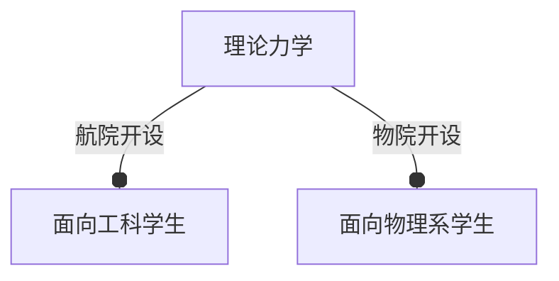

# **理论力学**

有两个版本的理论力学：

## 工科版

### 课程简介

- 5.5 学分
    - 4 学分：理论力学（传统工科必修内容）
    - 1 学分：高等动力学（分析力学的皮毛）
    - 0.5 学分：实验（3个）
- 航院开设
- 

### 个人评价

- 修读时间：大二秋冬
- 个人感觉就是高中物理竞赛...

## 理科版

- 4 学分
- 物院开设

### 个人评价

- 修读时间：（本应是大二春夏，但是和主修课程时间冲突了，得跨校区来读了