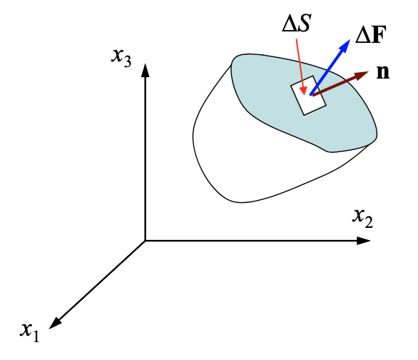
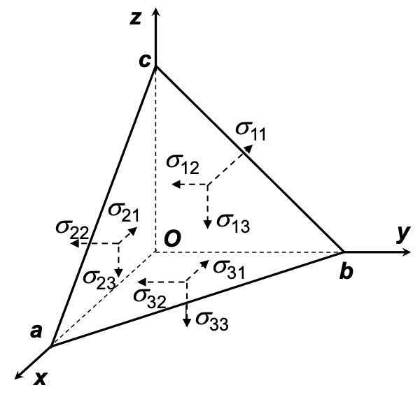

# 第二章 应力状态理论

确定弹性体的受力状态和变形需要考虑三
类基本关系：

1. 平衡关系：力之间的平衡
2. 几何关系：变形与位移的关系
3. 物理关系：力与变形之间的相互联系

## 2-1 体力和面力

- 体力：作用在物体微粒体上的力

$$
\mathbf{p} = \lim_{\Delta V \to 0} \frac{\Delta \mathbf{P}}{\Delta V} = \frac{\mathrm{d} \mathbf{P}}{\mathrm{d} V} \quad (\mathrm{N/m}^3)
$$

例：重力、惯性力、电磁力

- 面力：作用在物体表面的分布力

$$
\mathbf{T} = \lim_{\Delta S \to 0} \frac{\Delta \mathbf{F}}{\Delta S} = \frac{\mathrm{d} \mathbf{F}}{\mathrm{d} S} \quad (\mathrm{N/m}^2)
$$

例：风力、液体压力、两物体间的接触力

> 量纲分析：G.I. Taylor
>
> 《呼啸山庄》
>
> $\implies$ **scaling law** 尺度律

## 2-2 应力和一点的应力状态

劈开物体内部，内力成为了另一部分施加的面力

$$
\begin{aligned}
    \mathbf{f}_n &= \lim_{\Delta S \to 0} \frac{\Delta \mathbf{F}}{\Delta S} = \frac{\mathrm{d} \mathbf{F}}{\mathrm{d} S} \\
    &= f_{n1} \mathbf{e}_1 + f_{n2} \mathbf{e}_2 + f_{n3} \mathbf{e}_3 \\
    &= \sigma_n \mathbf{n} + \tau_n \boldsymbol{\tau}
\end{aligned}
$$

切开得到的面元方向不同，应力也会不同。可见应力数值不仅依赖于空间点，而且依赖于微元面积的方向！

> 冯元桢指出：
>
> $$ \mathbf{f}_n = \lim_{\Delta S \to \Delta S_{\lim}} \frac{\Delta \mathbf{F}}{\Delta S} = \frac{\mathrm{d} \mathbf{F}}{\mathrm{d} S} $$
>
> 更贴近物理真实

!!! question "如何衡量一点的应力状态？"
    **应力张量**

    $$
    (\sigma_{ij}) = \begin{bmatrix}
        \sigma_x & \tau_{xy} & \tau_{xz} \\
        \tau_{yx} & \sigma_y & \tau_{yz} \\
        \tau_{zx} & \tau_{zy} & \sigma_z
    \end{bmatrix} = \begin{bmatrix}
        \sigma_{11} & \sigma_{12} & \sigma_{13} \\
        \sigma_{21} & \sigma_{22} & \sigma_{23} \\
        \sigma_{31} & \sigma_{32} & \sigma_{33}
    \end{bmatrix}
    $$

    为什么这个东西能表示应力状态？Cauchy 在两百年前给出了证明。

## 2-3 斜面上的应力

在 $O$ 点处截取一个微元体 $Oabc$

$x$ 方向力的平衡：

$$
f_{nx} \Delta S_{abc} - \sigma_x \Delta S_{Obc} - \tau_{yx} \Delta S_{Oac} - \tau_{zx} \Delta S_{Oab} + \cancel{F_x \Delta V} = 0
$$

$\Delta V \to 0, \, \Delta V \sim o(\Delta S)$，故可忽略体力项。取极限得

$$
f_{nx} = \sigma_x l + \tau_{yx} m + \tau_{zx} n
$$

加上 $y, z$ 方向的力平衡，得到 **Cauchy's stress theorem**（斜面应力公式）：

$$
\begin{equation} \label{eq:cauchy_stress_theorem}
    \begin{aligned}
        f_{nx} &= \sigma_x l + \tau_{yx} m + \tau_{zx} n \\
        f_{ny} &= \tau_{xy} l + \sigma_y m + \tau_{zy} n \\
        f_{nz} &= \tau_{xz} l + \tau_{yz} m + \sigma_z n
    \end{aligned}
\end{equation}
$$

静力可能应力：满足平衡条件的应力状态

## 2-4 平衡微分方程与应力边界条件

