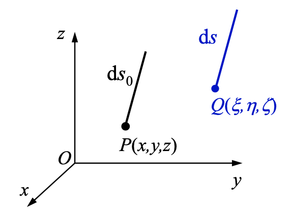

# 应变状态理论

!!! abstract "基本任务"
    - 一点的应变状态
    - 几何方程和应变协调方程

## 3-1 位移和应变及其关系

## 补充：有限变形情形

> 小变形假设下，不区分变形前后的构型（configuration），认为是一致的。

考虑没有小变形假设的情况，点 $P(x,y,z)$ 变形到 $Q(\xi, \eta, \zeta).$

新旧坐标位移关系

$$
\begin{aligned}
    \xi &= x + u \\
    \eta &= y + v \\
    \zeta &= z + w
\end{aligned}
$$

### Lagrange 描述

用变形前的坐标 $(x,y,z)$ 描述变形后的坐标 $(\xi, \eta, \zeta).$ 即

$$
\begin{aligned}
    \xi &= \xi(x,y,z) \\
    \eta &= \eta(x,y,z) \\
    \zeta &= \zeta(x,y,z)
\end{aligned}
$$

取微分，

$$
\begin{aligned}
    \mathrm{d} \xi &= \mathrm{d} x + \mathrm{d} u = \mathrm{d} x + \frac{\partial u}{\partial x} \mathrm{d} x + \frac{\partial u}{\partial y} \mathrm{d} y + \frac{\partial u}{\partial z} \mathrm{d} z \\
    \mathrm{d} \eta &= \mathrm{d} y + \mathrm{d} v = \mathrm{d} y + \frac{\partial v}{\partial x} \mathrm{d} x + \frac{\partial v}{\partial y} \mathrm{d} y + \frac{\partial v}{\partial z} \mathrm{d} z \\
    \mathrm{d} \zeta &= \mathrm{d} z + \mathrm{d} w = \mathrm{d} z + \frac{\partial w}{\partial x} \mathrm{d} x + \frac{\partial w}{\partial y} \mathrm{d} y + \frac{\partial w}{\partial z} \mathrm{d} z
\end{aligned}
$$

小线元的长度变化

$$
\begin{aligned}
    (\mathrm{d} s)^2 - (\mathrm{d} s_0)^2 &= (\mathrm{d} \xi)^2 + (\mathrm{d} \eta)^2 + (\mathrm{d} \zeta)^2 - (\mathrm{d} x)^2 - (\mathrm{d} y)^2 - (\mathrm{d} z)^2 \\
    &= 2 \tilde{\varepsilon}_x \, (\mathrm{d} x)^2 + 2 \tilde{\varepsilon}_y \, (\mathrm{d} y)^2 + 2 \tilde{\varepsilon}_z  \, (\mathrm{d} z)^2 + 2 \tilde{\gamma}_{xy} \, \mathrm{d} x \mathrm{d} y + 2 \tilde{\gamma}_{yz} \, \mathrm{d} y \mathrm{d} z + 2 \tilde{\gamma}_{zx} \, \mathrm{d} z \mathrm{d} x
\end{aligned}
$$

其中

$$
\begin{aligned}
    \tilde{\varepsilon}_x &= \frac{\partial u}{\partial x} + \frac{1}{2} \left[ \left( \frac{\partial u}{\partial x} \right)^2 + \left( \frac{\partial v}{\partial x} \right)^2 + \left( \frac{\partial w}{\partial x} \right)^2 \right] \\
\end{aligned}
$$