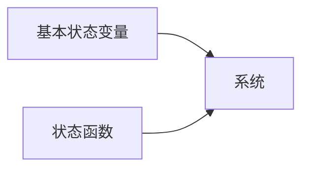
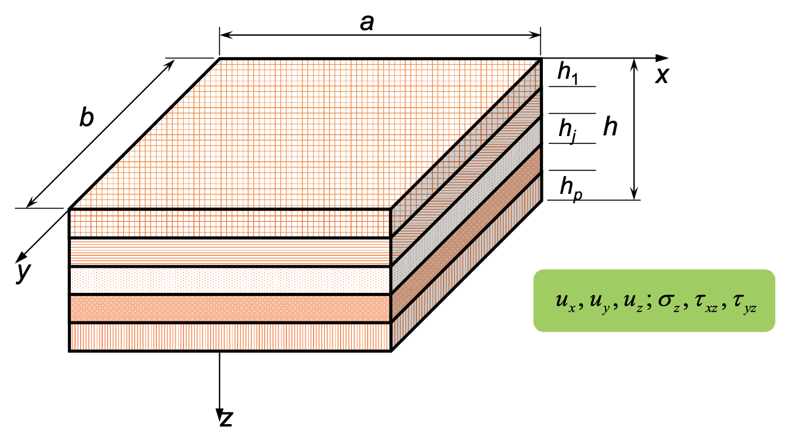

# 弹性力学问题的建立和一般原理

!!! abstract "本章内容"
    - 弹性力学的基本方程及问题分类（按边界条件）
    - 弹性力学的解法
        - 位移解法
        - 应力解法
        - 混合解法
    - 重要原理
    - 简单问题求解示例

## 5-1 基本方程及边值问题

### 基本方程（15 个）

1.  平衡（运动）微分方程 *（3 个）*
    $$
    \sigma_{ij,j} + F_i = 0 \quad (\rho \ddot{u}_i)
    $$
2.  几何方程 *（6 个）*
    $$
    \varepsilon_{ij} = \frac{1}{2} (u_{i,j} + u_{j,i})
    $$
3.  物理方程 *（6 个）*
    $$
    \begin{aligned}
        \sigma_{ij} &= \lambda \varepsilon_{kk} \delta_{ij} + 2 G \varepsilon_{ij} \\
        \varepsilon_{ij} &= \frac{1}{E}[(1 + \nu) \sigma_{ij} - \nu \sigma_{kk} \delta_{ij}]
    \end{aligned}
    $$

### 边界条件

1.  全部边界上已知面力（Neumann）
    $$
    \sigma_{ij} n_j = \bar{f}_i \quad (\text{on } S)
    $$
2.  全部边界上已知位移（Dirichlet）
    $$
    u_i = \bar{u}_i \quad (\text{on } S)
    $$
3.  部分边界上已知面力，部分边界上已知位移（Robin）
    $$
    \begin{aligned}
        \sigma_{ij} n_j &= \bar{f}_i \quad (\text{on } S_{\sigma}) \\
        u_i &= \bar{u}_i \quad (\text{on } S_u)
    \end{aligned}
    $$

### 初始条件（弹性动力学问题）

$$
\begin{aligned}
    u_i(\mathbf{x}, 0) &= u_{i0} \quad (\mathbf{x} \in V) \\
    \dot{u}_i(\mathbf{x}, 0) &= v_{i0} \quad (\mathbf{x} \in V)
\end{aligned}
$$

## 应变协调方程

张量形式：

$$
e_{ikm} e_{jln} \varepsilon_{ij,kl} = 0
$$

## 5-2 位移解法

用位移表达应力

## 5-C 补充：混合解法

典型场景：层合板（laminated plate）

- 选取一组混合状态变量（3 个位移 + 3 个应力）
    - 以 $u_x, u_y, u_z; \, \sigma_z, \tau_{xz}, \tau_{yz}$ 为例

### 状态方程的推导

$$
\begin{align}
    \frac{\partial \sigma_x}{\partial x} + \frac{\partial \tau_{yx}}{\partial y} + \frac{\partial \tau_{zx}}{\partial z} + F_x &= \rho \frac{\partial^2 u}{\partial t^2} \label{eq:equilibrium-1}\\
    \frac{\partial \tau_{xy}}{\partial x} + \frac{\partial \sigma_y}{\partial y} + \frac{\partial \tau_{zy}}{\partial z} + F_y &= \rho \frac{\partial^2 v}{\partial t^2} \label{eq:equilibrium-2}\\
    \frac{\partial \tau_{xz}}{\partial x} + \frac{\partial \tau_{yz}}{\partial y} + \frac{\partial \sigma_z}{\partial z} + F_z &= \rho \frac{\partial^2 w}{\partial t^2} \label{eq:equilibrium-3}
\end{align}
$$

!!! note "唯一性定理"
    