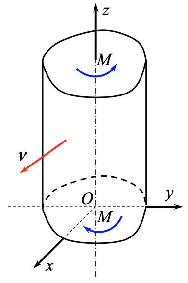

# 柱形杆的扭转和弯曲

## 9-1 扭转问题的位移解法

由 $(5-15)$ 式，设任意截面柱形杆的位移满足

!!! info inline end ""
    

$$
\begin{equation} \tag{9.1.1} \label{eq:torsion-displacement}
    \left \{
    \begin{aligned}
        u &= - \alpha yz \\
        v &= \alpha xz\\
        w &= \alpha \phi(x,y)
    \end{aligned}
    \right.
\end{equation}
$$

其中 $\phi(x,y)$ 为**圣维南扭转函数**，对应着横截面的翘曲。$\alpha$ 是杆的单位长度扭转角。

将 \eqref{eq:torsion-displacement} 式代入以位移表示的平衡微分方程，前两个方程自动满足，第三个方程得到

$$
\begin{equation} \label{eq:phi-laplace} \tag{9.1.2}
    \nabla^2 \phi = 0
\end{equation}
$$

通过位移解出应力分量：

$$
\begin{aligned}
    \sigma_x &= \lambda \theta + 2 G \frac{\partial u}{\partial x} = 0, \quad \sigma_y = \lambda \theta + 2 G \frac{\partial v}{\partial y} = 0 \\
    \sigma_z &= \lambda \theta + 2 G \frac{\partial w}{\partial z} = 0, \quad \tau_{xy} = G \left( \frac{\partial v}{\partial x} + \frac{\partial u}{\partial y} \right) = 0 \\
    \tau_{yz} &= \tau_{zy} = G \left( \frac{\partial w}{\partial y} + \frac{\partial v}{\partial z} \right) = \alpha G \left( \frac{\partial \phi}{\partial y} + x \right) \\
    \tau_{zx} &= \tau_{xz} = G \left( \frac{\partial u}{\partial z} + \frac{\partial w}{\partial x} \right) = \alpha G \left( \frac{\partial \phi}{\partial x} - y \right)
\end{aligned}
$$

!!! note "Remarks"
    - 在式 \eqref{eq:torsion-displacement} 的假设下，横截面内只有切应力分量 $\tau_{zy}, \, \tau_{zx}$，且与 $z$ 无关，即在所有横截面上都相等。
    - 如果翘曲函数 $\phi(x,y) = 0$，