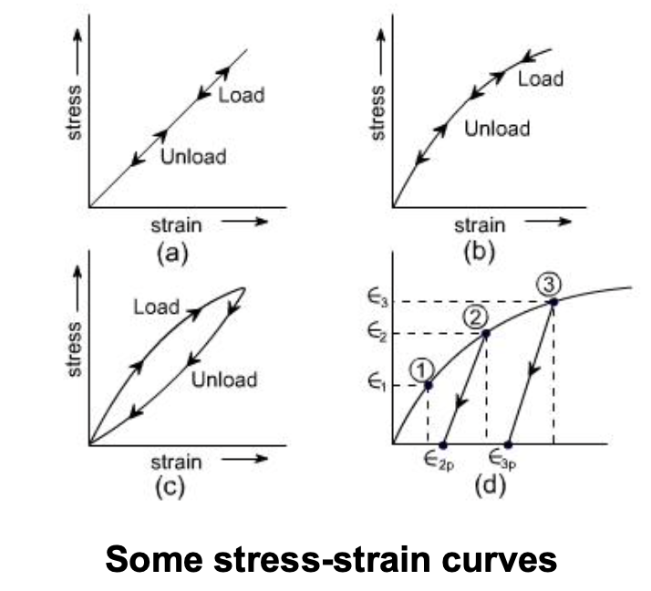

# 绪论

## 基本假设

- **连续性假设**（最基本、最重要）
    - 连续介质模型（Continuum model）
    - 能用于宏观，也能用于纳米尺度（碳纳米管）

    > 连续性假设的**要点**：宏观无限小，微观足够大
    >
    > 宏观上看是一个点，但在微观上包含足够多的分子/原子
    >
    > **方法**：均匀化 Homogenization

- 均匀性假设
- 各向同性假设
    - 很多材料并不各向同性，甚至金属也不完全是（例如锌）
- 完全弹性假设

    

    1. 线性
    2. 非线性
    3. 伪弹性（pseudoelasticity）
    4. 能量耗散

- 小变形假设
    - aka. **几何线性**假设
    - 此外还有**材料线性**（即本构关系）
- 无初始应力假设
    - 拉索桥，必须考虑预应力

## 张量基础

> 1. 简化书写
> 2. 简化推导

!!! quote "History"
    - William Rowan Hamilton (1805-1865) 
        - 四元数 Quaternions
    - Woldemar Voigt (1850-1919)
        - Piezoelectric effect
        - 描述物态
    - Arthur Caylay (1821-1895)
        - 协变量与逆变量
        - Caylay-Hamilton theorem
    - Bernhard Riemann (1826-1866)
        - 曲率张量
        - Christoffel 符号
    - Gregorio Ricci-Curbastro (1853-1925)
        - 协变系统
    - Albert Einstein (1879-1955)
        - 广义相对论
        - 张量分析的现代热潮

> 删繁就简三秋树
> 领异标新二月花

### 指标符号与求和约定

$A, B, C, \ldots \longrightarrow a_i \, (i = 1, 2, \ldots, n)$

哑指标与自由指标（见 [连续介质力学笔记](../Others/连续介质力学/Tensor.md#_3){data-preview}）

- 求导的简写

$$
\frac{\partial F}{\partial x_i} = F_{,i}
$$

### 置换符号

#### 用 Kronecker delta 定义

$$
\varepsilon_{ijk} = \begin{vmatrix}
    \delta_{i1} & \delta_{i2} & \delta_{i3} \\[1ex]
    \delta_{j1} & \delta_{j2} & \delta_{j3} \\[1ex]
    \delta_{k1} & \delta_{k2} & \delta_{k3} \\
\end{vmatrix}
$$

#### 其它

$$
\varepsilon_{ijk} \varepsilon_{kmn} = \delta_{im} \delta_{jn} - \delta_{in} \delta_{jm}
$$

> 口诀：前前后后 - 里里外外

### 矢量的运算

$$
\mathbf{A} = A_i \mathbf{e}_i, \quad \mathbf{B} = B_i \mathbf{e}_i, \quad \mathbf{D} = D_i \mathbf{e}_i
$$

#### 点乘

$$
\mathbf{A} \cdot \mathbf{B} = (A_i \mathbf{e}_i) \cdot (B_j \mathbf{e}_j) = A_i B_j (\mathbf{e}_i \cdot \mathbf{e}_j) = A_i B_j \delta_{ij} = A_i B_i
$$

#### 叉乘

$$
\mathbf{D} = \mathbf{A} \times \mathbf{B} = (A_i \mathbf{e}_i) \times (B_j \mathbf{e}_j) = A_i B_j (\mathbf{e}_i \times \mathbf{e}_j) = A_i B_j \varepsilon_{ijk} \mathbf{e}_k
$$

记

$$
D_k := \varepsilon_{ijk} A_i B_j = \begin{vmatrix}
    A_1 & A_2 & A_3 \\[1ex]
    B_1 & B_2 & B_3 \\[1ex]
    \delta_{k1} & \delta_{k2} & \delta_{k3}
\end{vmatrix}
$$

#### 坐标变换

两个坐标系 $\{\mathbf{e}_1, \mathbf{e}_2, \mathbf{e}_3\}$ 和 $\{\mathbf{e}_{1'}, \mathbf{e}_{2'}, \mathbf{e}_{3'}\}$

对于同一个矢量，

$$
x_i \mathbf{e}_i = x_{i'} \mathbf{e}_{i'}
$$

:thinking: 如何用原坐标系 $\{\mathbf{e}_1, \mathbf{e}_2, \mathbf{e}_3\}$ 下的分量 $x_i$ 表示新坐标系 $\{\mathbf{e}_{1'}, \mathbf{e}_{2'}, \mathbf{e}_{3'}\}$ 下的分量 $x_{i'}$？

:point_right: 同时点乘 $\mathbf{e}_{k'}$

### 笛卡尔张量的定义

#### 定义一

满足坐标变换关系

$$
T_{p'q'} = a_{p'i} a_{q'j} T_{ij}; \quad T_{ij} = a_{ip'} a_{jq'} T_{p'q'}
$$

#### 定义二

### 二阶张量

#### 矩阵表示

$$
[T_{ij}] = \begin{bmatrix}
    T_{11} & T_{12} & T_{13} \\[1ex]
    T_{21} & T_{22} & T_{23} \\[1ex]
    T_{31} & T_{32} & T_{33}
\end{bmatrix}
$$

#### 对称与反对称

$$
\begin{aligned}
    T_{ij} &= T_{ji}, \quad [T_{ij}] = \begin{bmatrix}
        T_{11} & T_{12} & T_{13} \\[1ex]
        T_{12} & T_{22} & T_{23} \\[1ex]
        T_{13} & T_{23} & T_{33}
    \end{bmatrix} \\
    T_{ij} &= -T_{ji}, \quad [T_{ij}] = \begin{bmatrix}
        0 & T_{12} & T_{13} \\[1ex]
        -T_{12} & 0 & T_{23} \\[1ex]
        -T_{13} & -T_{23} & 0
    \end{bmatrix} \\
\end{aligned}
$$

反对称张量的反偶矢量

$$
T_k = -\frac{1}{2} \varepsilon_{ijk} T_{ij}
$$

#### 分解

- 分解为对称与反对称部分

$$
T_{ij} = \frac{1}{2} (T_{ij} + T_{ji}) + \frac{1}{2} (T_{ij} - T_{ji}) = S_{ij} + A_{ij}
$$

- 分解为球张量和偏张量

$$
T_{ij} = B_{ij} + D_{ij}, \quad B_{ij} = \frac{1}{3} T_{kk} \delta_{ij}
$$

#### 主方向、主值

$$
T_{ij} A_j = \lambda A_i
$$

##### 不变量

$$
\begin{aligned}
    I_1 &= T_{ii} = T_{11} + T_{22} + T_{33} = \lambda_1 + \lambda_2 + \lambda_3 \\
    I_2 &= \frac{1}{2} (T_{ii} T_{jj} - T_{ij} T_{ji}) = \begin{vmatrix}
        T_{22} & T_{23} \\[1ex]
        T_{32} & T_{33}
    \end{vmatrix} + \begin{vmatrix}
        T_{11} & T_{13} \\[1ex]
        T_{31} & T_{33}
    \end{vmatrix} + \begin{vmatrix}
        T_{11} & T_{12} \\[1ex]
        T_{21} & T_{22}
    \end{vmatrix} = \lambda_1 \lambda_2 + \lambda_2 \lambda_3 + \lambda_3 \lambda_1 \\
\end{aligned}
$$