# Chapter 1: Intro

!!! abstract "Grading"
    - 期末 60%
    - HW 25%
    - 考勤 5%
    - project 10%

> 平板、壳、杆件
>
> - Leonardo da Vinci
> - Galileo Galilei
> - Isaac Newton
> - Robert Hooke
> - Leonhard Euler
> - Stephen Timoshenko

- Principle objective of Mechanics of Materials
- Fundamental assumptions of deformable bodies
- External force, internal force, and cross-sectional method (截面法)
- Stress, displacement, deformation, and strain
- *Engineering design process

## 1.1 Objectives

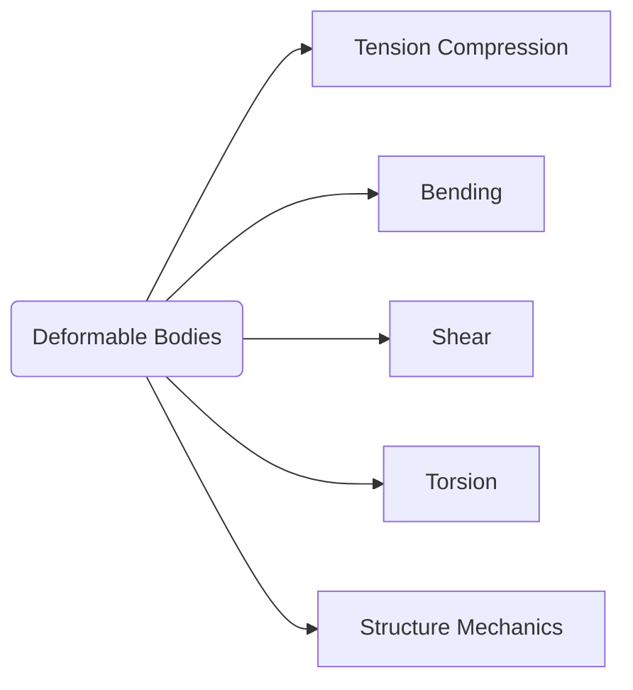

### Contents
To determine the stresses, strains, and displacements in the structures and their components subjected to external loads.

{++从理论上计算应力应变++}

大部分内容：实验先行 --> 理论

{==对象：杆件==}

### Tasks

不同受力的杆有不同的名字：

- column: 拉压杆
- shaft: 扭转杆（轴）
- beam: 弯曲杆（梁）

分析：

- normal stress
- shear stress

解决：deflection problem

- **Strength**: Ability to resist fracture or materials do not collapse under large plastic deformation. $\Longrightarrow$ **抵抗破坏的能力**
- **Rigidity**: Ability to resist deformation. $\Longrightarrow$ **抵抗变形的能力**
- **Stability**: Ability to keep equilibrium configuration. $\Longrightarrow$ **抵抗失稳的能力**

!!! example "压杆失稳"
    压杆的两头，杆弯曲变形

其它性能：

抗撞性能（controlled deceleration）

## 1.2 Fundamental Assumptions

- **Continuity**: 杆件是**连续**的，没有裂纹、孔洞
- **Homogeneity**: 杆件是**均匀**的
- **Isotropy**: 杆件是**各向同性**的
- **Small deformation**: **小变形**假设

!!! info ""
    微观上来看，没有材料满足这些假设

## 1.3 External Force

### Acting modes

力的作用方式：

- Surface force（面力）
    - distribution force （力作用的面积和杆件大小同个数量级）
    - concentration force
- Body force
    - self-weight
    - inertia force

### Loading vs. Time

载荷是否变化：

- Static load
- Dynamic load
    - Alternating load
    - impact load

## 1.4 Internal Force & Stress

### Internal Force

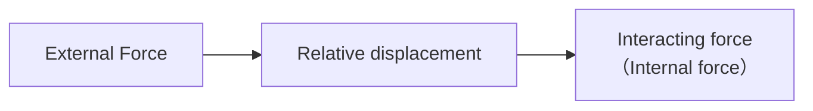

!!! tip ""
    **内力由外力引起**

#### Characteristics

1. Continuously distributed force
2. Equilibrium forces with external forces

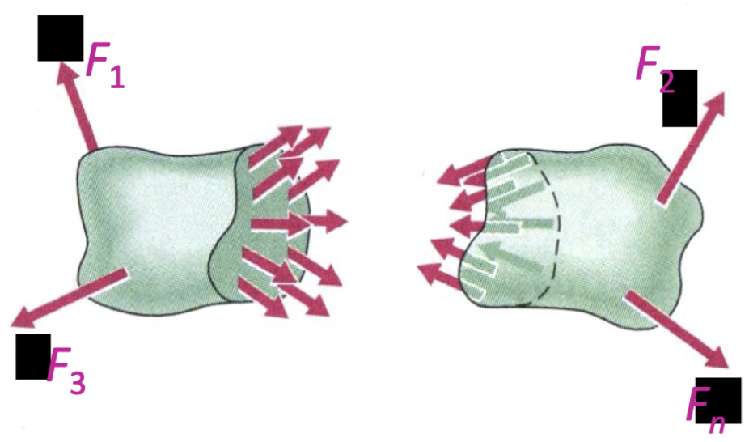

**图1.** 内力与外力平衡

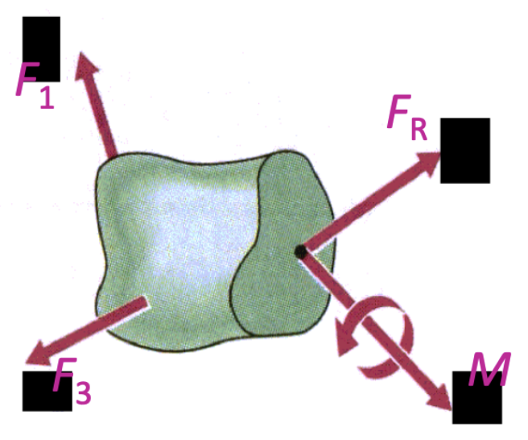

**图2.** 内力简化力系

#### Components

- Normal
- Shear

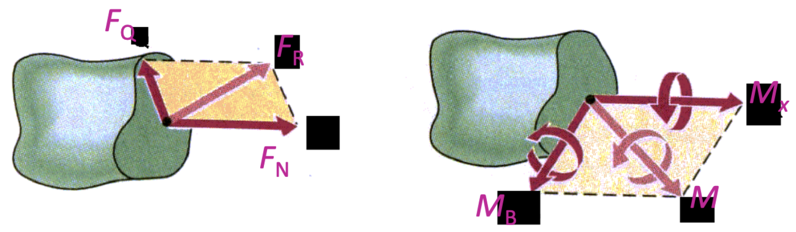

**图3.** 内力简化力系的四个分量

- $F_N$: normal force（法向）
- $F_Q$: shear force（剪切）
- $M_x$: torsion（扭矩）
- $M_B$: bending moment（弯矩）

#### Sign Rule

At the same position, the internal forces **on both side** cross-sections possess the **same sign**.

**法向力**

拉为正，压为负。

**剪力**

对其内部的任意一点取矩，顺时针为正，逆时针为负。

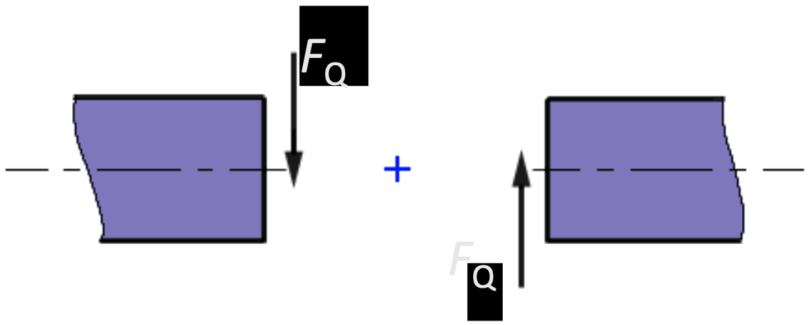

**弯矩**

凸朝下为正，凸朝上为负。

**扭矩**

右手螺旋大拇指指向外法线方向为正。

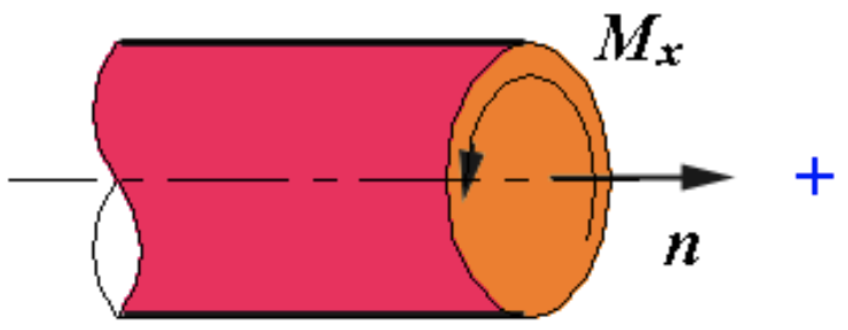

### Cross-sectional Method

截面法确定内力，分三步：

1. Cut
2. Replace with Resultant force and moment
3. Equilibrium eq.

!!! example "Example 1-1"
    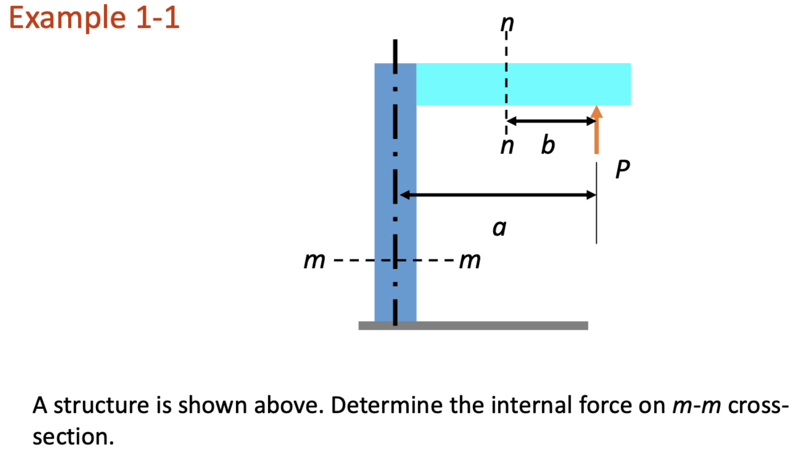

    取 m-m 截面的上半部分分析

    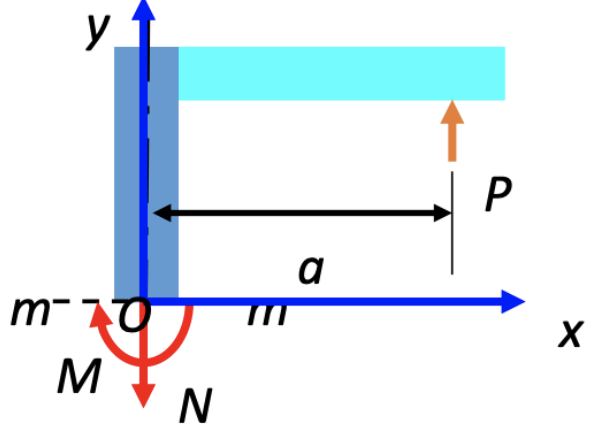

    - 水平方向不受力，没有剪力
    - $P$ 对 $O$ 点有力矩，有弯矩
    - 显然无扭矩

    列平衡方程：

    $$\begin{aligned}
    \sum F_y &= 0：P - N = 0 \\
    \sum M_O &= 0：P \cdot a - M = 0
    \end{aligned}$$

### Stress

!!! question "Motivating Question"   
    同样的力，相同材料做的越细的杆件，越容易断。
    
    如何反映力作用的*程度* ？

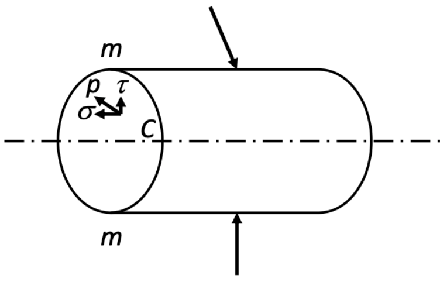

$$\begin{equation} \tag{1-1}
    p = \lim_{\Delta A \to 0} \frac{\Delta F}{\Delta A}
\end{equation}$$

- $p$: stress（应力）
- $\sigma$: normal stress（法向应力）
- $\tau$: shear stress（剪切应力）

!!! question "应力是什么量？"
    - $\Delta F$: 矢量
    - $\Delta A$: 矢量

    矢量除以矢量？？

    $\Longrightarrow$ **{==应力是张量==}**

## 1.5 Deformation & Strain

**线应变**

$$\begin{equation} \tag{1-2}
    \varepsilon_m = \lim_{MN \to 0} \frac{M'N' - MN}{MN} = \lim_{\Delta x \to 0} \frac{\Delta s}{\Delta x}
\end{equation}$$

**切应变（角应变）**

$$\begin{equation} \tag{1-3}
    \gamma = \lim_{MN \to 0, ML \to 0} \left( \frac{\pi}{2} - \angle L'M'N' \right)
\end{equation}$$

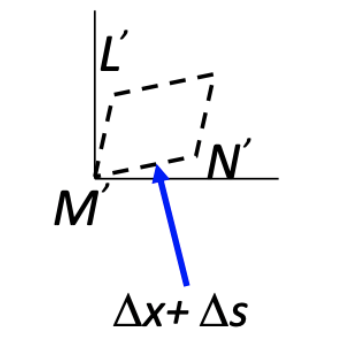

显然应变是无量纲数

!!! example "Example 1-2"
    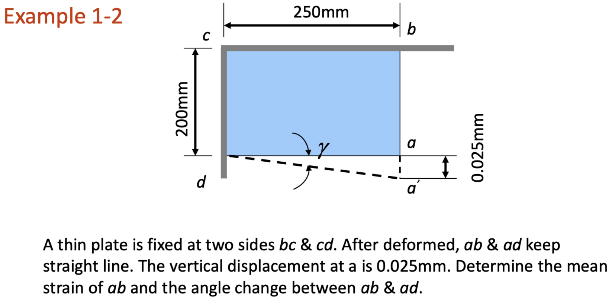

    求 $ab$ 边的平均应变

    （1）线应变

    $$ \varepsilon_m = \frac{a'b - ab}{ab} = \frac{0.025}{200} = 1.25 \times 10^{-4} $$

    （2）切应变

    $$ \gamma \approx \tan \gamma = \frac{0.025}{250} = 1 \times 10^{-4} $$

## 1.6 Basic Types of Deformation

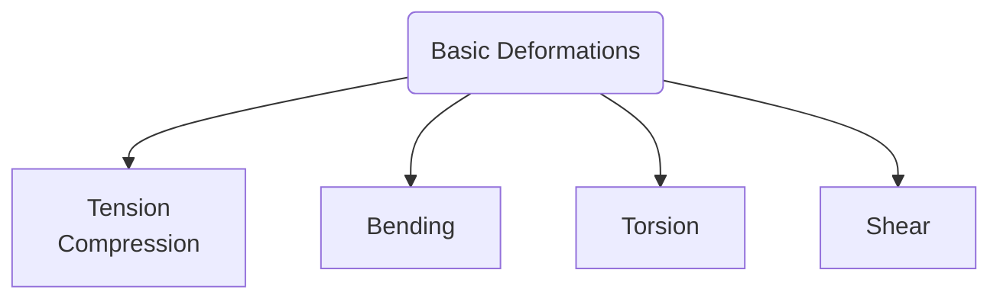

- Combined loading

## 1.7 Engineering Design Process