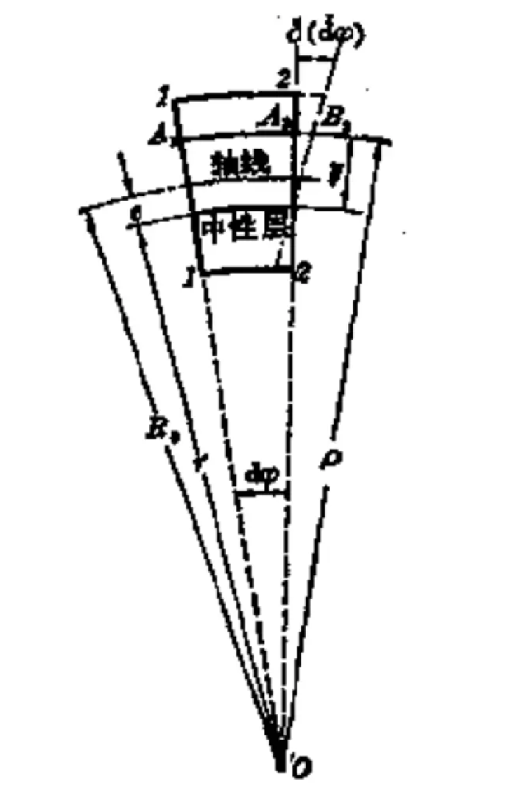

# Chapter 15: Curved Beams

## 15.1 Introduction

Characteristics of curved beams:

1. A longitudinal symmetric plane
2. Axial line is located in the symmetric plane

本章讨论梁的曲率相对于高度不可忽略的情况。

## 15.2 Normal Stress Analysis of Curved Beams Subjected to Pure Bending

Two assumptions: