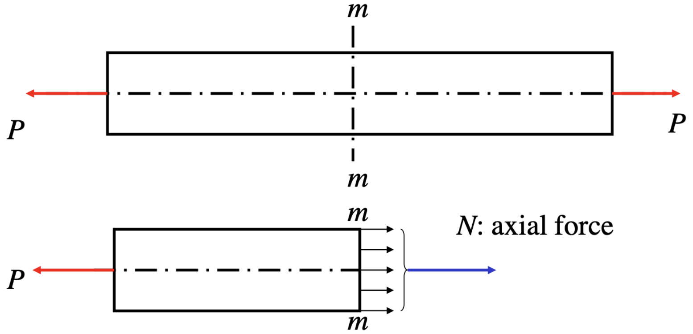
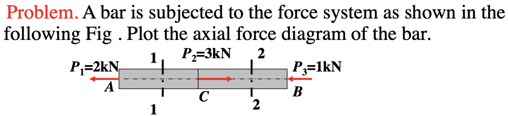
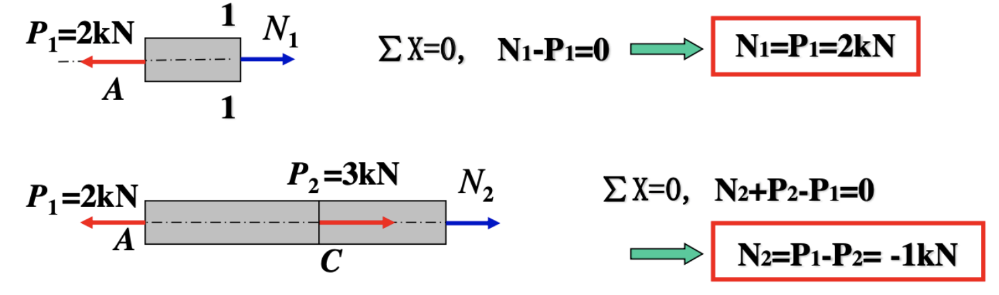
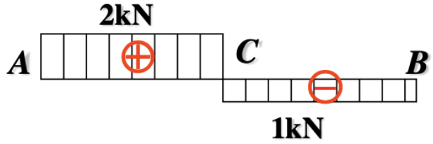
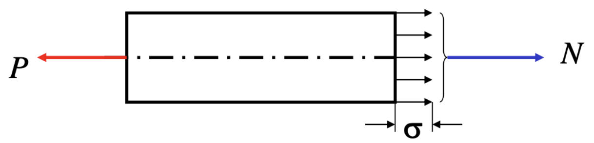
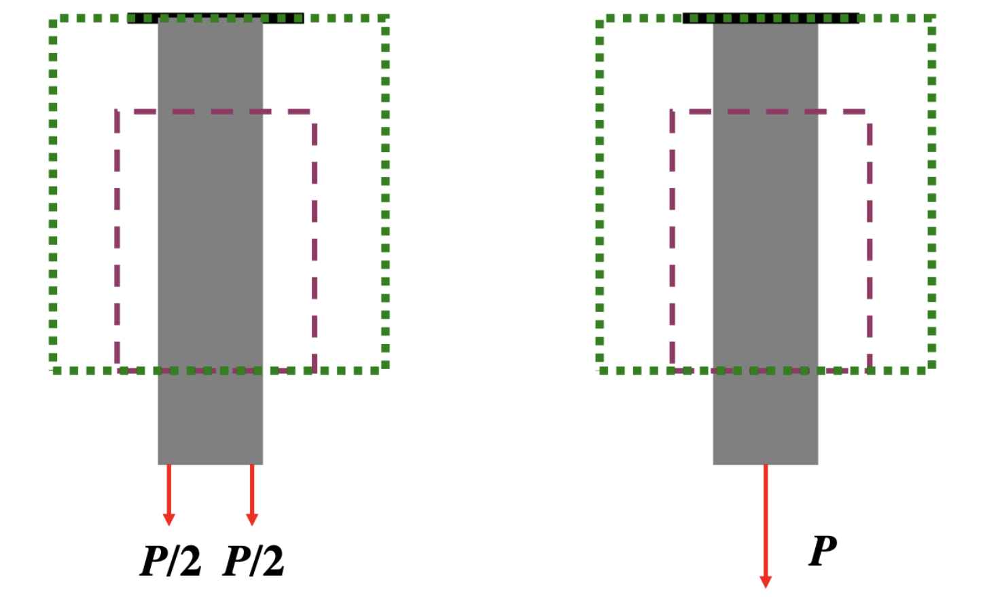

# Chapter 2: Tension, Compression & Direct Shear

## 2.1 Axial Tension and Compression

!!! quote "Historical perspective"
    Before Industrial Revolution:

    - Timber, Brick, & Mortar
    - $\Rightarrow$ Compressive Loads
  
    After Industrial Revolution:

    - Metals, Polymers, Plastics, etc
    - $\Rightarrow$ Tensile Loads

### Internal force on cross section

- **Force feature**: 外力沿着轴线方向
- **Deformation feature**: 杆件沿轴线方向拉伸或压缩

Axial force diagram（轴力图）

!!! example "Example 2-1"
    

    切两个截面 1-1 和 2-2

    

    轴力图：

    

## 2.2 Internal force & Stress

### Stress on cross section

$$N = \int_A \sigma \, dA$$

!!! tip "Plane cross-section assumption（平截面假设）"
    If the cross section is initially plane, it remains plane after deformation and perpendicular to the axial line.

    在截面处，应力分布是均匀的，所以有

    $$\sigma = \mathrm{const.}$$

由平截面假设，可以得到

$$\begin{equation} \tag{2-1}
    \sigma = \frac{N}{A}
\end{equation}$$

若 $N(x), A(x)$ 变化不剧烈，则下式也成立：

$$\sigma(x) = \frac{N(x)}{A(x)}$$

!!! info "Saint-Venant’s Principle"
    如果作用在弹性体{++一小块表面上的力被静力等效力系替代++}，这种替换{==仅仅会使**局部表面**产生显著的应力变化==}，而在比应力变化表面的线性尺寸更远的地方，其影响可忽略不计。

    影响的区域：圣维南区域

    

!!! example "Example 2-2"
    