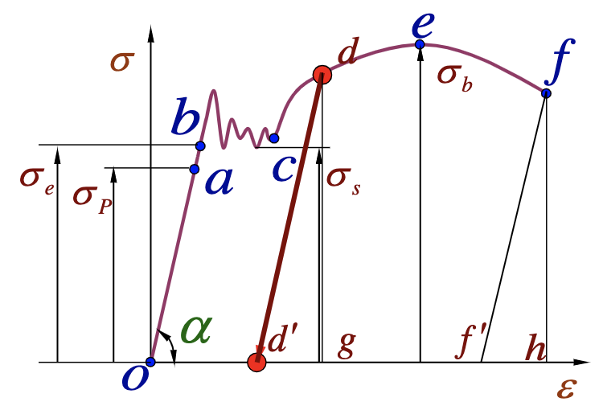

# Chapter 2: Tension, Compression & Direct Shear

## 2.1 Axial Tension and Compression

!!! quote "Historical perspective"
    Before Industrial Revolution:

    - Timber, Brick, & Mortar
    - $\Rightarrow$ Compressive Loads
  
    After Industrial Revolution:

    - Metals, Polymers, Plastics, etc
    - $\Rightarrow$ Tensile Loads

### Internal force on cross section

- **Force feature**: 外力沿着轴线方向
- **Deformation feature**: 杆件沿轴线方向拉伸或压缩

Axial force diagram（轴力图）

!!! example "Example 2-1"
    

    切两个截面 1-1 和 2-2

    

    轴力图：

    

## 2.2 Internal Force & Stress

### Stress on Cross Section

$$N = \int_A \sigma \, dA$$

!!! tip "{==Plane cross-section assumption（平截面假设）==}"
    If the cross section is initially plane, it remains plane after deformation and perpendicular to the axial line.

    在截面处，应力分布是均匀的，所以有

    $$\sigma = \mathrm{const.}$$

由平截面假设，可以得到

$$\begin{equation} \tag{2-1}
    \sigma = \frac{N}{A}
\end{equation}$$

若 $N(x), A(x)$ 变化不剧烈，则下式也成立：

$$\sigma(x) = \frac{N(x)}{A(x)}$$

!!! info "Saint-Venant’s Principle"
    如果作用在弹性体{++一小块表面上的力被静力等效力系替代++}，这种替换{==仅仅会使**局部表面**产生显著的应力变化==}，而在比应力变化表面的线性尺寸更远的地方，其影响可忽略不计。

    影响的区域：圣维南区域

    

!!! example "Example 2-2"
    

### Internal Force on Inclined Section

$A_{\alpha}$ 为斜截面面积，$P_{\alpha}$ 为斜截面上的内力

$$A_{\alpha} = \frac{A}{\cos \alpha}, \quad P_{\alpha} = P$$

得到

$$p_{\alpha} = \frac{P_{\alpha}}{A_{\alpha}} = \frac{P}{A} \cos \alpha = \sigma \cos \alpha$$

正应力 $\sigma_{\alpha} = p_{\alpha} \cos \alpha = \sigma \cos^2 \alpha$，剪应力 $\tau_{\alpha} = p_{\alpha} \sin \alpha = \sigma \sin \alpha \cos \alpha$

Discussions:

1. $\alpha = 0$，$\max \sigma_{\alpha} = \sigma$
2. $\alpha = 45^{\circ}$，$\max \tau_{\alpha} = \frac{\sigma}{2}$
3. $\alpha = 90^{\circ}$，$\sigma_{\alpha} = \tau_{\alpha} = 0$（**自由面**）

## 2.3 Mechanical Properties of Materials Under Tension/Compression

- Strength
- Hardness
- Toughness（韧性）
- Elasticity
- Plasticity
- Brittleness（脆性）
- Ductility, Malleability（延展性）

应力和应变：

$$\sigma = \frac{P}{A}, \quad \varepsilon = \frac{\Delta l}{l}$$

### Elastic Range

- Hooke's Law:

$$\sigma = E \varepsilon$$

$E$: Elastic Modulus / Young's Modulus（弹性模量/杨氏模量）

属于**本构关系**

- Proportional Limit $\sigma_{\mathrm{p}}$
- Elastic Limit $\sigma_{\mathrm{e}}$

### Yielding Range

1. Upper yielding limit: unstable
2. Lower yielding limit: stable
   **$\sigma_{\mathrm{s}}$ reflects the strength of materials.**（屈服应力）
3. Yielding is related to the maximum sheering stress.

材料进入屈服即失效。

### Hardening Range

在 d 处卸载，应力退为零，但应变不为零，从弹性转变为了**塑性**

- Ultimate Strength $\sigma_{\mathrm{b}}$

### Necking Range

颈缩：几何缺陷导致失稳

f 处断裂

### Elongation & Reduction of Area

1. Residual relative elongation $\delta = \frac{l - l_0}{l_0}$
   - $\delta < 5\%$：Brittle materials
   - $\delta > 5\%$：Ductile materials
2. Permanent relative reduction of area $\psi = \frac{A_0 - A}{A_0}$

### Unloading and Cold-hardening

1. d 处卸载，斜率也为 $E$
2. 重新加载，和卸载的曲线重合，但是强度提高（$\sigma_{\mathrm{p}}$ 增大）

工艺：冷硬化

### Mechanical Properties of other Materials in Tension

- 对于塑性材料，若没有明显的屈服，工程上约定 $\sigma_{\mathrm{p0.2}}$（offset strain = 0.2）为屈服应力
  
- 对于脆性材料，线性部分不明显，用割线代替
  

### Mechanical Properties of Materials under Compression

## 2.4 Criterion of Strength Design

### Safety Factor and Allowable Stress

- Failure
    - Ductile: Plastic deformation
    - Brittle: Fracture
- Limit stress $\sigma_{\mathrm{u}}$
    - Ducitle: $\sigma_{\mathrm{s}}$
    - Brittle: $\sigma_{\mathrm{b}}$
- Allowable stress $\left[\sigma \right] = \frac{\sigma_{\mathrm{u}}}{n}$（许用应力）
    - $\frac{\sigma_{\mathrm{s}}}{n_{\mathrm{s}}}$: Ductile, $n_{\mathrm{s}} = 1.2 \sim 2.5$
    - $\frac{\sigma_{\mathrm{b}}}{n_{\mathrm{b}}}$: Brittle, $n_{\mathrm{b}} = 2 \sim 3.5$

### Criterion of Strength Design

$$\sigma = \frac{F_N}{A} \leq \left[\sigma \right]$$

- Strength checking: $\sigma \leq \left[\sigma \right]$
- Cross-section designing: $A \geq \frac{F_N}{\left[\sigma \right]}$
- Allowable load determining: $F_N \leq A \left[\sigma \right]$

!!! question "How to determine the safety factor?"
    - 用途越关键，安全系数越大（保守）
    - 辅助作用，安全系数较小（经济）

!!! example "Example 2-3"
    

!!! example "Example 2-4"
    

!!! example "Example 2-5"
    

    

    注意图中的 ┘└ 记号，表示有两块角钢！槽钢同理也有两块。横截面积要 $\times 2$。

## 2.5 Deformation of Bar under Tension and Compression

### Axial Strain

$$
\begin{aligned}
    \varepsilon &= \frac{\Delta l}{l} \\
    \sigma &= E \varepsilon \\
    \sigma &= \frac{F_N}{A} \\[2ex]
    \Rightarrow \Delta l &= \frac{F_N l}{E A}
\end{aligned}
$$

- $EA$: tensile rigidity（拉伸刚度）

可以看到，这就是胡克定律。

### Lateral Strain

$$
\Delta b = b_1 - b, \, \varepsilon' = \frac{\Delta b}{b}
$$ 

在线弹性范围内，$\varepsilon' / \varepsilon = \mathrm{const.}$ 称为泊松比 $\mu$。

$$\mu = -\frac{\varepsilon'}{\varepsilon}$$

从热力学上可以证明，$\mu \in (-1, 0.5)$。

- $\mu = 0.5$：变形后总体积不变
- $\mu < 0$：材料拉长，横截面还变大（负泊松比材料）

> For steel, $E \sim 200 \text{ GPa}$, $\, \mu \sim 0.3$

!!! example ""
    

!!! tip "找两根铰接杆变形后的交点"
    

    - $C'$：精确的交点
    - $C''$：近似的交点

!!! example "Example 2-6"
    

    

### Non-uniform bars

- 横截面积分段变化

  

  $$\Delta l = \sum \Delta l_i = \sum \frac{N_i l_i}{E_i A_i}$$

  通常情况下轴力 $N_i$ 相同
- 横截面积连续变化

  

  $$\Delta l = \int \frac{N(x) dx}{E A(x)}$$

## 2.6 Strain Energy of Bar under Tension and Compression

应变能：物体在外力作用下发生形变时，吸收的能量

$$dW = F d(\Delta l)$$

$$
\begin{aligned}
U = W = \int_0^{\Delta l} F d(\Delta l) &= \int_0^{\Delta l} \frac{EA \Delta l}{l} d(\Delta l) = \frac{1}{2} F \Delta l \\
&= \frac{F^2 l}{2EA} = \frac{EA (\Delta l)^2}{2l}
\end{aligned}
$$

应变能密度

$$u = \frac{U}{V} = \frac{P \Delta /2}{Al} = \frac{1}{2}\sigma \varepsilon = \frac{1}{2}E \varepsilon^2 = \frac{\sigma^2}{2E}$$

## 2.7 Statically Indeterminate Structures

约束反力多于独立平衡方程数，需要增加几何变形约束方程和本构方程求解。

静不定结构：结构的强度和刚度均得到提高

求解：

- Equilibrium equation
- Constitutive equation
- Compatibility equation
    - 变形协调方程，几何约束

