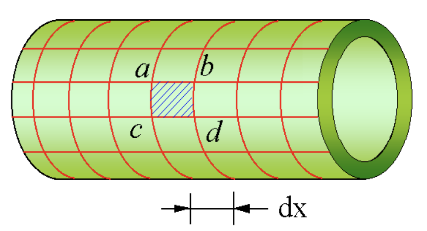
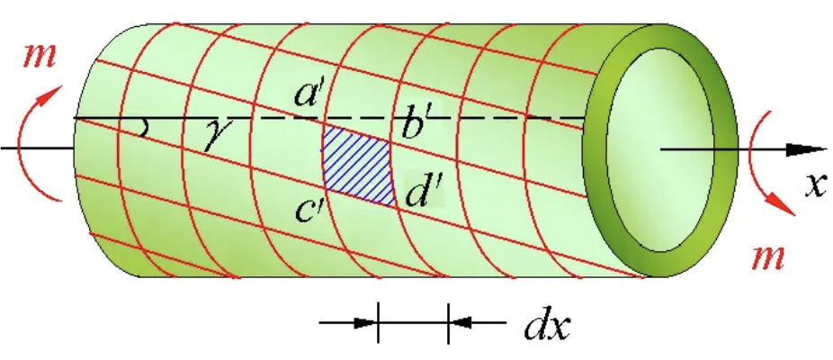
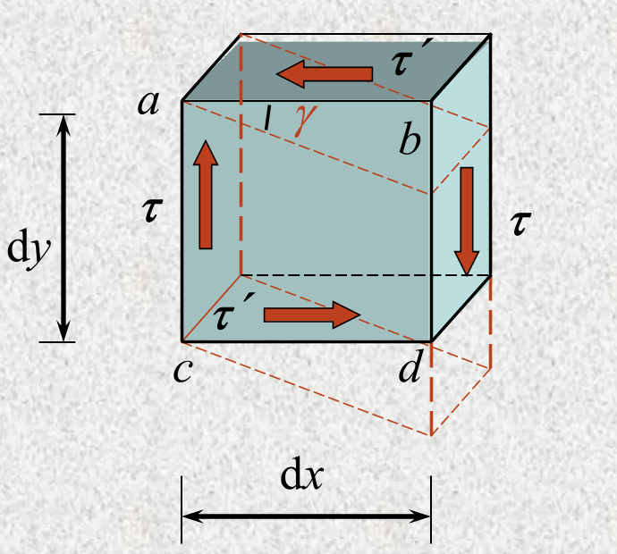
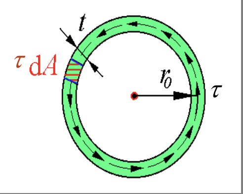
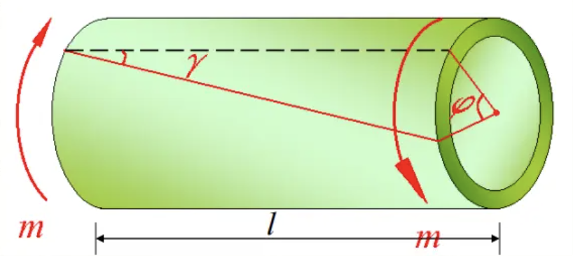
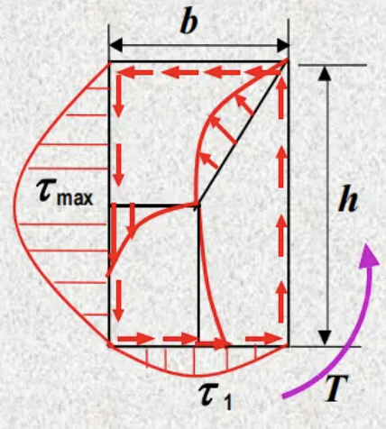
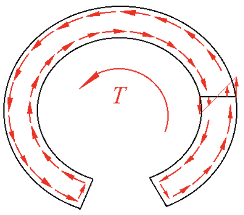
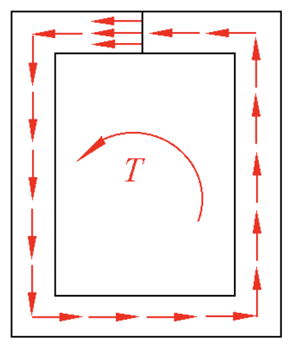
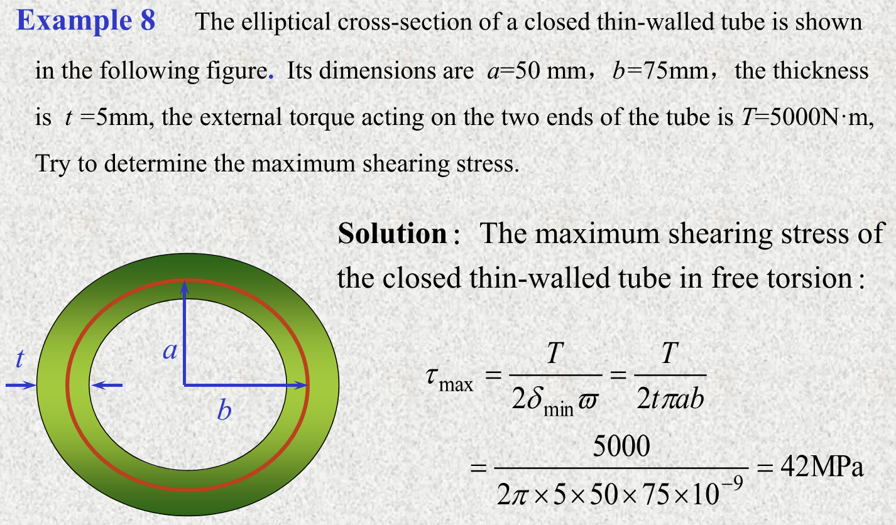

# Chapter 3: Torsion

## 3.1 Concept

- Shaft（轴）：torsion is its primary deformation.
- Torsion（扭转）：扭矩作用下的变形，扭矩作用面与轴线垂直
- Angle of twist（扭转角 $\varphi$）：一个横截面相对于另一个横截面转过的角度
- Shearing strain（切应变 $\gamma$）：The change of a right angle between two straight lines.

Examples:
- Steering rod
- 丝锥

## 3.2 External/Internal Torque of A Driving Shaft

### External torque of a driving shaft

$W = Pt = m \cdot \omega \cdot t$

$$\begin{equation} \tag{3-1}
    m = 9549 \cdot \frac{P}{n} \quad\mathrm{(N \cdot m)}
\end{equation}$$

- $P$: power（功率，kW）
- $n$: speed（转速，r/min 或 rpm）

### Internal torque and its diagram

Sign convention: 右手螺旋定则（右手拇指指向外法线正方向为正）

## 3.3 Torsion of the Thin-Walled Hollow Shafts

壁厚 $t < 0.1D$

!!! example "Experiment"

    Before deformation:

    

    After deformation:

    

    - The circumference lines do not change
    - The longitudinal lines are changed into slants

    Conclusions:
    - 圆周线不变
    - 所有纵线转过的角度都是 $\gamma$
    - 所有正方形变形成相同的平行四边形

取一个小体积元

- 没有正应力，只有剪应力 $\tau$
- 在同一个截面上，剪应力 $\tau$ 处处相等（因为壁很薄，沿半径方向 $z$ 的变化忽略不计），垂直于半径方向

### Magnitude of the shear stress $\tau$

内力矩

$$\int_A \tau \cdot dA \cdot r_0 = T$$

$\tau, r_0$ 为常数，得到

$$\tau \cdot r_0 \cdot 2\pi r_0 t = T$$

即

$$\begin{equation} \tag{3-2}
    \tau = \frac{T}{2\pi r_0^2 t} = \frac{T}{2A_0 t}
\end{equation}$$

### Theorem of conjugate shearing stresses

!!! tip "切应力互等定理"

    

    $$
    \begin{aligned}
    \sum m_z &= 0 \\
    \tau t dx \cdot dy &= \tau' t dy \cdot dx
    \end{aligned}
    $$

    故

    $$\boxed{\tau = \tau'}$$

### Hooke's law of shear

几何关系：$\gamma l = r \varphi$

结合式 \eqref{3-2} 得到

## 3.5 Deformation of a Circular Shaft

### Deformation in torsion

From the formula

$$\frac{d\varphi}{dx} = \frac{T}{GI_p}$$

$$\varphi = \int d\varphi = \int_0^l \frac{T}{GI_p} dx \overset{T = \text{const.}}{=} \frac{Tl}{GI_p}$$

### Angle of twist per unit length $\theta$

$$\theta = \frac{d\varphi}{dx} = \frac{T}{GI_p}$$

$GI_p$ 反映了材料抵抗扭转的能力（扭转刚度）

Rigidity Check

## 3.6 Statically Indeterminate Problems of Round Shafts

## 3.7 Stress & Deformation in Springs

$$\tau_{\max} = \tau_Q + \tau_T = \frac{Q}{A} + \frac{T}{W_t} = \frac{PD/2}{\pi d^3/16} + \frac{P}{\pi d^2/4} = \left(\frac{d}{2D} + 1\right) \frac{8PD}{\pi d^3}$$

## 3.8 Stress & Deformation of Non-Circular Shafts

!!! info inline end ""
    

1. Free torsion: Warping of each cross section in torsion is not restricted and the magnitude is the same.（每个横截面翘曲的程度相同）
2. Restricted torsion: 翘曲程度不同
3. Shearing stress on the section of the rectangular rod
   - 角点：切应力为0
   - 形心
   - 边中点：最大切应力

$$\tau_{\max} = \frac{|T|_{\max}}{W_t}, \quad W_t = \alpha hb^2$$

## 3.9 Stress of Opened and Closed Thin-Walled Rods

开口比闭口的更容易变形

- 开口

  

  中心线上切应力为0

- 闭口

  

  切应力均匀分布

$$T = \oint (\tau \delta ds) \rho = 2 \tau \delta \oint \frac{1}{2} \rho ds = 2 \tau \delta A$$

!!! example "Example 3-8"

    