# Chapter 4: Internal Forces in Bending

## 4.1 Concepts

### Bending

**{==外力/外力偶与轴线垂直，形成弯曲。==}**

- **梁（beam）**：以弯曲变形为主的构件。

- 纵向对称面

- 对称弯曲
    - 外力都作用在对称面上
    - 弯曲变形后仍对称，轴线在对称面内

## 4.2 Types of Supports & Loading for Beams

### Supports

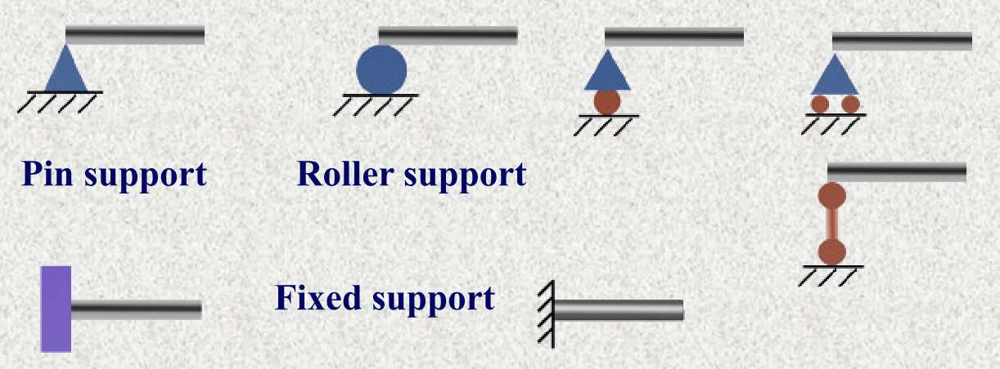

- Pin support：固定铰支端
- Roller support：可动铰支端
- Fixed support：固定支端

### Loading

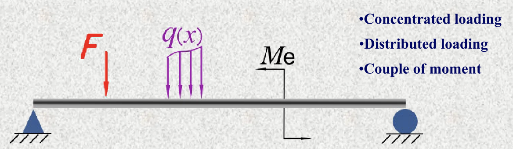

- Concentrated load：集中力
- Distributed load：分布力
- Couple of moment：弯矩

### Basic types of beams

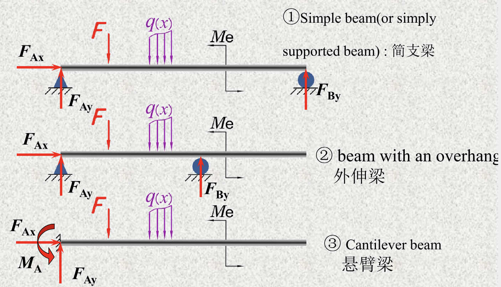

1. Simple beam：简支梁
2. Beam with overhang：外伸梁
3. Cantilever beam：悬臂梁

!!! example "Example 4-1"
    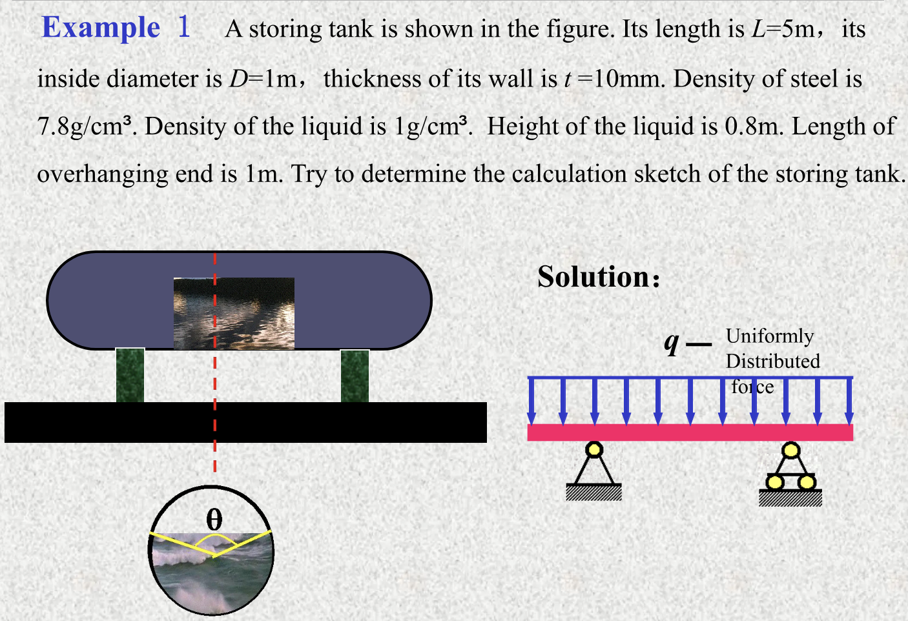

    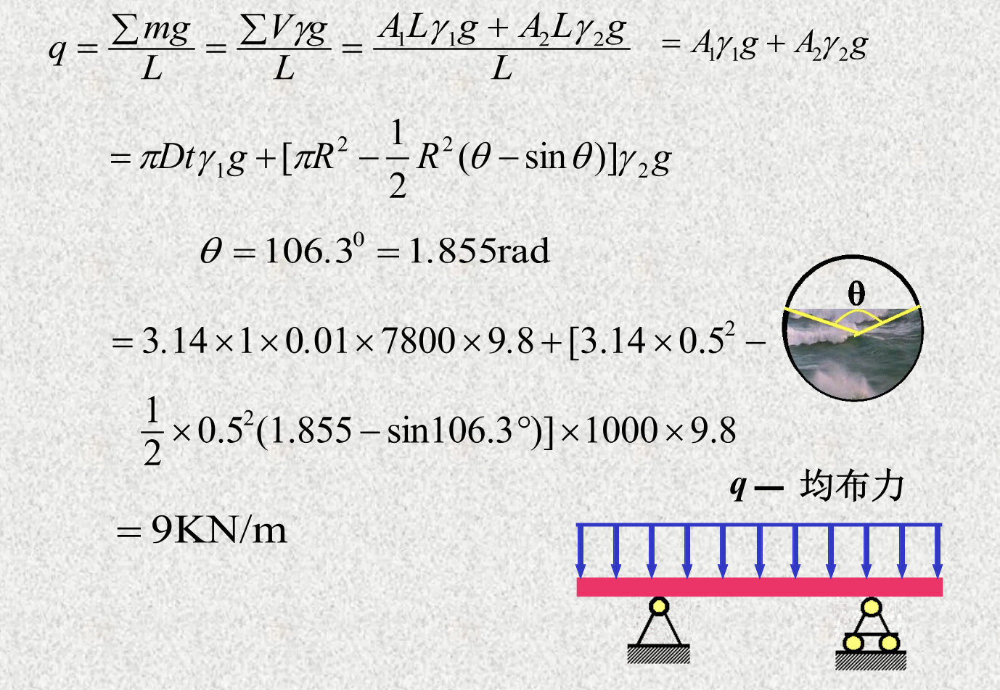
    
## 4.3 Shearing Force & Bending Moment

### Internal force in bending

!!! tip "Example"
    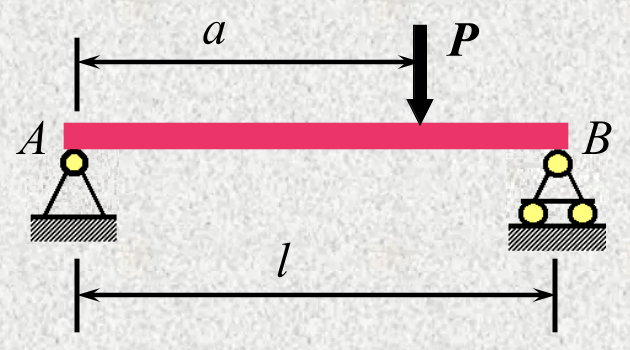

    1. 求外力

    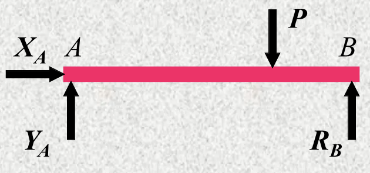

    $$
    \begin{aligned}
    \sum F_x = 0 &\Rightarrow X_A = 0 \\
    \sum M_A = 0 &\Rightarrow R_B = \frac{Pa}{l} \\
    \sum F_y = 0 &\Rightarrow Y_A = \frac{P(l-a)}{l}
    \end{aligned}
    $$

    2. 求内力：截面法

    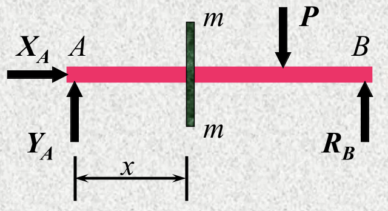

    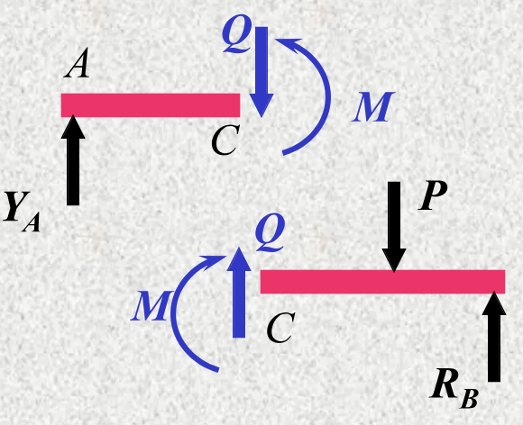

    $$
    \begin{aligned}
    \sum F_y = 0 &\Rightarrow Q = Y_A = \frac{P(l-a)}{l} \\
    \sum M_C = 0 &\Rightarrow M = Y_A \cdot x
    \end{aligned}
    $$

#### Bending moment $M$

构件受弯时，横截面上其作用面垂直于截面的内力偶矩。

#### Shearing force $Q$

构件受弯时，横截面上其作用线平行于截面的内力。

#### Sign convention

- Shearing force $Q$：
  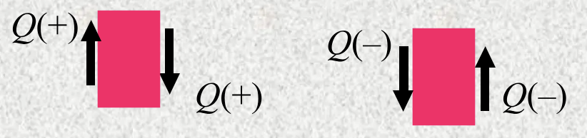
- Bending moment $M$：
  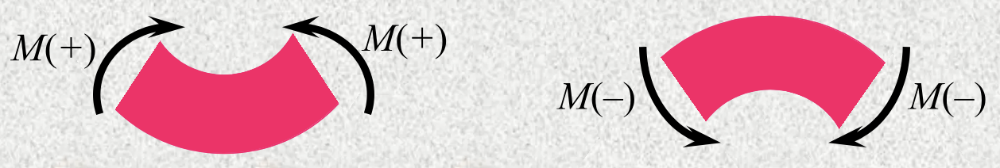

## 4.4 Equations & Diagrams

!!! example ""

## 4.5 Relations between $q(x)$, $Q(x)$, and $M(x)$

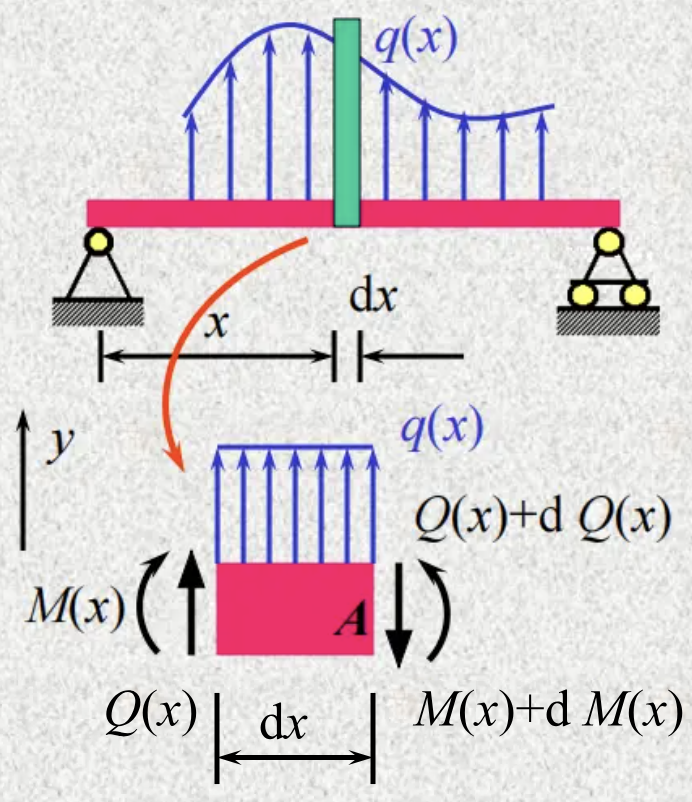

$$
\begin{aligned}
Q(x) + \mathrm{d}Q &= q(x) \cdot \mathrm{d}x + Q(x) \\
\Rightarrow \frac{\mathrm{d}Q(x)}{\mathrm{d}x} &= q(x)
\end{aligned}
$$