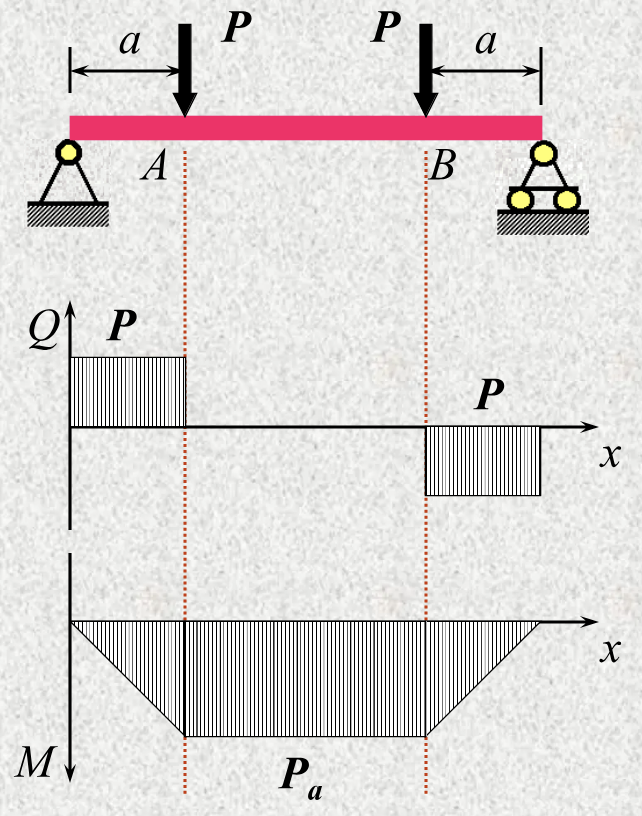
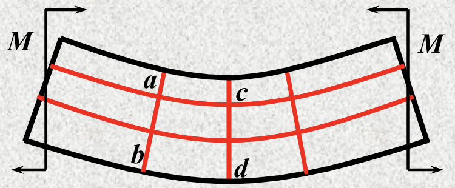
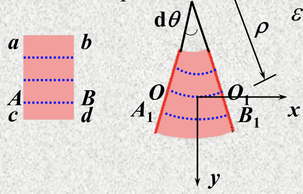
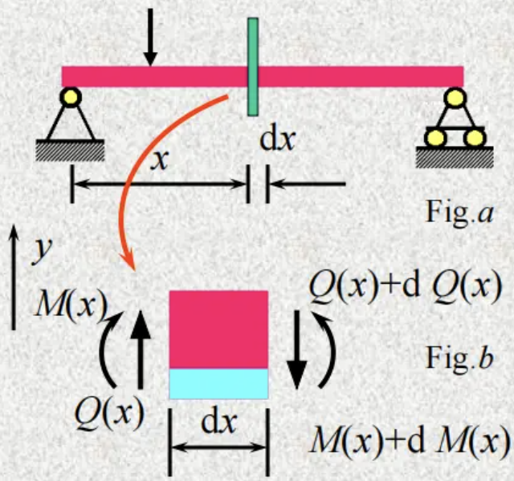
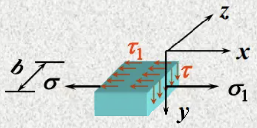

# Chapter 5: Stresses in Bending

## 5.1 Pure Bending

横轴面上只有弯矩 $M$，没有剪力 $Q$。

### Experiment

- Lateral lines remain straight and rotate
- longitudinal straight lines change into curves and are still normal to the lateral lines

### Concepts

1. Neutral layer：中性面
2. Neutral axis：中性轴

### Hypothesis

1. Hypothesis of plane section: The cross sections remain planes and only rotate through some angles around their neutral axes after deformation. 横截面变形后仍为平面。
2. No normal stress between longitudinal fibers. 纵向层纤维之间无正应力。

## 5.2 Normal Stress On The Cross Sections Of The Beam In Pure Bending

1. Geometric eq.

$OO_1$  为中性面。

$$
\begin{aligned}
\varepsilon_x &= \frac{A_1 B_1 - AB}{AB} = \frac{A_1 B_1 - OO_1}{OO_1} \\
&= \frac{(\rho + y)d\theta - \rho d\theta}{\rho d\theta} = \frac{y}{\rho}
\end{aligned}
$$

中性面以下受拉，为正；上方受压，为负。

2. Physical relation

纵向纤维之间无正应力，每一层相当于拉压杆

$$
\begin{equation} \tag{2}
\sigma_x = E\varepsilon_x = \frac{Ey}{\rho}
\end{equation}
$$

3. Static relations

$$\sum N_x = \int_A \sigma dA = \int_A \frac{Ey}{\rho} dA = \frac{E}{\rho} \cdot \underset{\text{静矩, Static moment}}{\boxed{\int_A y\,dA}} = \frac{ES_z}{\rho} = 0$$

$\Longrightarrow S_z = 0$, so $z$-axis (neutral axis) is through the center of the section. 中性轴过形心。

$$\sum M_y = \int_A (\sigma dA)z = \int_A \frac{Eyz}{\rho} dA = \frac{E}{\rho} \cdot \underset{\text{惯性矩}}{\boxed{\int_A yz\,dA}} =  \underset{\text{(Symmetric plane)}}{\frac{E I_{yz}}{\rho} \equiv 0}$$

$$\sum M_z = \int_A (\sigma dA)y = \int_A \frac{Ey^2}{\rho} dA = \frac{E}{\rho} \int_A y^2\,dA = \frac{E I_{z}}{\rho} = M$$

得到

$$\begin{equation} \tag{3}
\frac{1}{\rho} = \frac{M}{E I_z}
\end{equation}$$

- $E I_z$ 为梁的**抗弯刚度（flexural rigidity）**

$$\begin{equation} \tag{4}
\sigma_x = \frac{My}{I_z}
\end{equation}$$

## 5.3 Normal Stress On The Cross Sections Of The Beam In Nonuniform Bending

## 5.4 Shearing Stress On The Cross Sections Of The Beam

### Beam with rectangular sections

两个假设：

- 剪力和切应力平行
- 在横截面上，离中轴线距离相同的位置，切应力相同

1. 梁上截取一小段 $\mathrm{d}x$
   
2. $y$ 方向截取小方块（Fig. b 中蓝色部分）
   

$$\sum X = N_2 - N_1 - \tau_1 b\, dx = 0$$

- $N_1$ 为 $\sigma$ 正应力的合力

$$
\left \{
\begin{aligned}
N_1 &= \int_{A^*} \sigma\, dA = \frac{M}{I_z} \int_{A^*} y\, dA = \frac{M S_z^*}{I_z} \\
N_2 &= \frac{(M + dM)S_z^*}{I_z} \\
\tau_1 &= \frac{dM}{dx} \frac{S_z^*}{b I_z} = \frac{Q S_z^*}{b I_z}
\end{aligned}
\right.
$$

From the theory of the conjugate shearing stress（切应力互等定理），

$$\tau = \tau_1 = \frac{Q S_z^*}{b I_z}$$

$$S_z^* = y_c^* A^* = \frac{\frac{h}{2}+y}{2} b (\frac{h}{2} - y) = \frac{b}{2} (\frac{h^2}{4} - y^2)$$

So

$$\tau = \frac{Q}{2 I_z} (\frac{h^2}{4} - y^2)$$

$$\tau_{\max} = \tau|_{y = 0} = \frac{3}{2} \frac{Q}{A} = \frac{3}{2} \bar{\tau}$$

剪应力的大小分布是抛物线，最大剪应力为平均剪应力的 $1.5$ 倍。

### Beam with other shapes of sections

#### I-section（工字梁）

$$\tau_{\max} \approx \frac{Q}{A_f}$$

- $A_f$ 为腹板的面积

- 翼缘（flange）：几乎只承受正应力
- 腹板（web）：几乎只承受铅垂剪应力

#### Circular section

$$\tau_{\max} = \frac{4}{3} \frac{Q}{A} = \frac{4}{3} \bar{\tau}$$

#### Thin-walled cirque

$$\tau_{\max} = 2 \frac{Q}{A} = 2 \bar{\tau}$$

## 5.5 Strength Conditions Of $\sigma$ And $\tau$

$$\begin{equation} \tag{5}
\sigma_{\max} = \frac{M_{\max}}{W_z} \leq [\sigma], \quad \tau_{\max} = \frac{Q_{\max} S_{z\max}^*}{b I_z} \leq [\tau]
\end{equation}$$

同时有正应力和切应力时，上面的强度条件可能会失效。第七章将介绍新的强度条件。

## Appendix I: Geometrical Properties Of Plane Areas

### I.1 Intro

- Tension $$\sigma = \frac{N}{A}$$
- Torsion: 

### I.2 Centroid & Static Moment

$$\begin{aligned}
\bar{y} &= \frac{\int y\, dA}{A} \\
\bar{z} &= \frac{\int z\, dA}{A} \\
S_z &= \int y\, dA \\
S_y &= \int z\, dA
\end{aligned}$$

!!! note "Notes"
    $$S_z = \bar{y} A, \, S_y = \bar{z} A$$

    $$S_y = 0, \, S_z = 0 \iff \bar{z} = 0, \, \bar{y} = 0$$

    - Centroid and static moment of the composite area

    $$S_z = \int_A y\, dA = \sum_i \int_{A_i} y\, dA_i = \sum_i A_i \bar{y}_i$$

### I.3 Moment of Inertia of an Area

- 惯性积（Product of inertia）

- 极惯性矩（Polar moment of inertia）

### I.4 Parallel Axis Theorem

