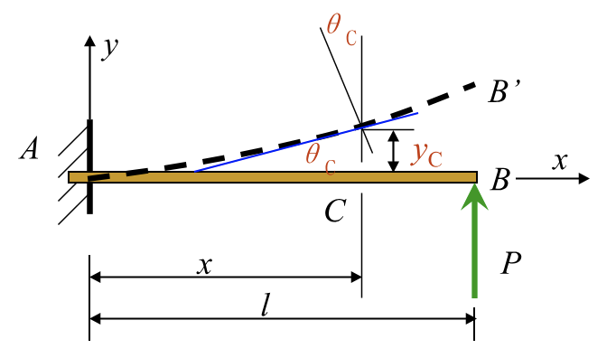
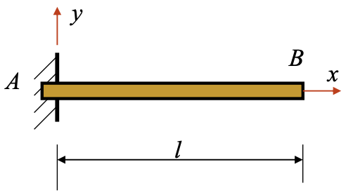
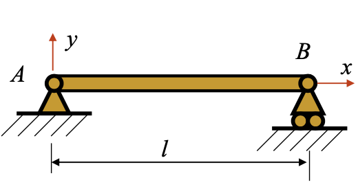
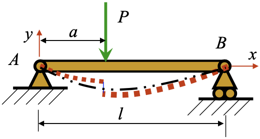
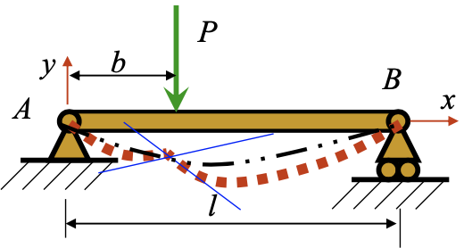

# Chapter 6: Deformations of Beams

## 6.1 Introduction

绝大部分情况下，不希望变形太大

## 6.2 Deflection and Angle of Rotation

- The deflection curve（挠曲线）
- The deflection of beam（梁的挠度）：竖直方向上的位移
- The angle of rotation（转角）：梁绕中性轴转过的角度

The equation of the deflection curve

$$
\left \{
    \begin{aligned}
        &y = f(x) \\
        &\theta \approx \tan\theta = \frac{dy}{dx}
    \end{aligned}
\right.
$$

!!! tip "Discussion"
    1. 小变形：$y_{\max} < \frac{l}{1000} \sim \frac{l}{250}$
    2. Convention of sign:
    
    - $x$ 轴正方向：右
    - $y$ 轴正方向：上
    - $\theta$：逆时针

## 6.3 Approximate Differential Equations of the Deflection Curve

$$
\underset{\text{Pure bending}}{\frac{1}{\rho} = \frac{M}{E I}} \overset{l \gg h}{\longrightarrow} \text{Shearing bending}
$$

小变形，曲率很小

$$
\kappa = \frac{1}{\rho} = \pm \frac{\frac{d^2y}{dx^2}}{\left[1 + \left(\frac{dy}{dx}\right)^2\right]^{\frac{3}{2}}} \overset{\frac{dy}{dx} \ll 1}{=} \pm \frac{d^2y}{dx^2}
$$

得到

$$
\pm \frac{d^2y}{dx^2} = \frac{M(x)}{E I}
$$

根据 $M(x)$ 的符号定义：

- $M(x) > 0$：凸向下，$y'' > 0$
- $M(x) < 0$：凸向上，$y'' < 0$

可知 $M(x)$ 与 $y''$ 同号。故

$$
\begin{equation} \tag{1}
\frac{d^2y}{dx^2} = \frac{M(x)}{E I}
\end{equation}
$$

## 6.4 Beam Deformations by Integration

对式 \eqref{1} 积分一次，

$$
EI \frac{dy}{dx} = \int M(x) \, \mathrm{d}x + C
$$

再积分一次，

$$
EI y = \iint M(x) \, \mathrm{d}x\mathrm{d}x + C_1 x + C_2
$$

### Boundary conditions

- Rigidly fixed support（刚性固定支撑）

$$
\begin{aligned}
    \left. y \right|_{x = 0} &= 0 \\
    \left. \theta \right|_{x = 0} &= 0
\end{aligned}
\quad \text{or} \quad
\begin{aligned}
    \left. y \right|_{x = 0} &= 0 \\
    \left. y' \right|_{x = 0} &= 0
\end{aligned}
$$

- Movable (or fixed) hinged support（活动或固定铰支撑）

$$
\begin{aligned}
    \left. y \right|_{x = 0} &= 0 \\
    \left. y \right|_{x = l} &= 0
\end{aligned}
$$

> 铰链不提供转矩！

### Continuity conditions

- Deflection

$$
\left. y_1 \right|_{x = a} = \left. y_2 \right|_{x = a}
$$

- Angle of rotation

$$
\left. \theta_1 \right|_{x = b} = \left. \theta_2 \right|_{x = b}
\quad \text{or} \quad
\left. y_1' \right|_{x = b} = \left. y_2' \right|_{x = b}
$$

## 6.5 Beam Deformations by Superposition

在小变形假设下，$y$ 和 $\theta$ 都是外力的线性函数！

!!! tip "结构形式叠加原理（逐段刚化法）"
    外伸梁 = 简支梁 + 悬臂梁

    

