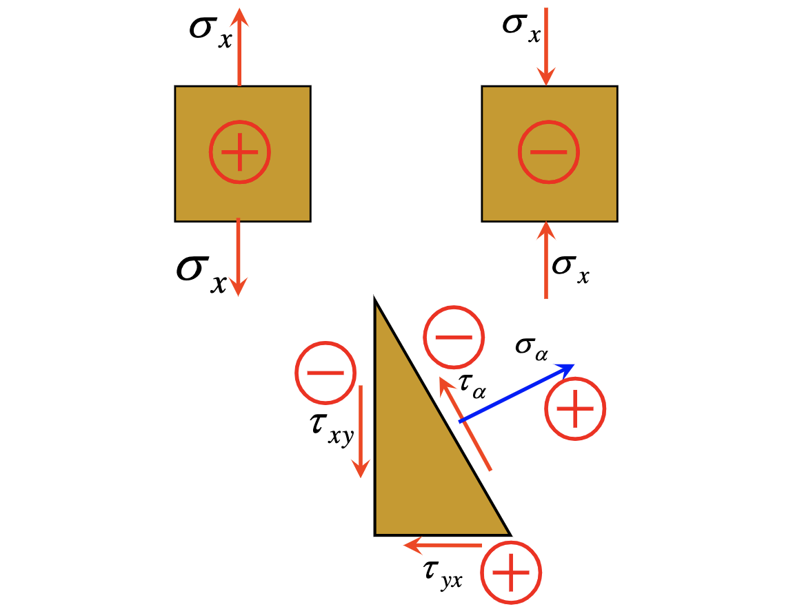
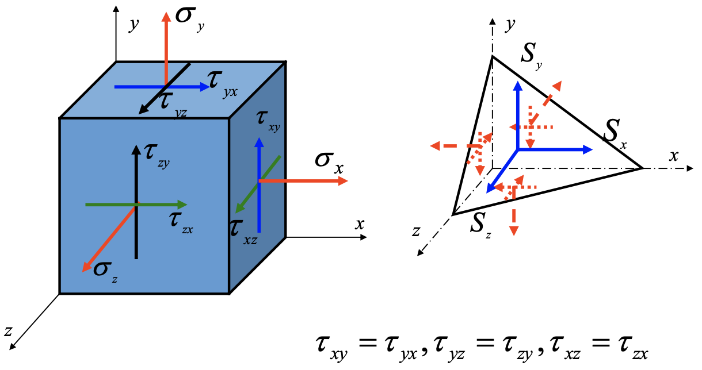

# Chapter 7: Stress and Strain Analysis & Strength Theory

## 7.1 Introduction: Stress State

> 为什么要做应力应变分析？

同一个位置，作不同的截面，应力值不同。但应该是同一个状态！

### Combined stresses

- 主平面（Principal plane）：剪应力为0
- 主应力（Principal stress）：主平面上的正应力
- 单相应力状态（Uniaxial stress state）：只有一个主应力不为0
- 二相应力状态（Biaxial stress state）：有两个主应力不为0
- 三相应力状态（Triaxial stress state）：有三个主应力不为0

!!! note ""
    三者代数值关系（含正负号）：
    $$
    \sigma_1 \geq \sigma_2 \geq \sigma_3
    $$

## 7.2 Examples of State of Biaxial and Triaxial Stresses

## 7.3 Plane Stress State Analysis: Analytical Method

$\tau_{xy}$：

- $x$（第一个下标）：截面的外法线方向
- $y$（第二个下标）：应力方向

$$
\begin{aligned}
& \Sigma F_x = 0, \quad \sigma_{\alpha} \mathrm{d}A \cos \alpha + \tau_{\alpha} \mathrm{d}A \sin \alpha - \sigma_x \mathrm{d}A \cos \alpha + \tau_{yx} \mathrm{d}A \sin \alpha = 0 \\
& \Sigma F_y = 0, \quad \sigma_{\alpha} \mathrm{d}A \sin \alpha - \tau_{\alpha} \mathrm{d}A \cos \alpha - \sigma_y \mathrm{d}A \sin \alpha + \tau_{xy} \mathrm{d}A \cos \alpha = 0 \\
\end{aligned}
$$

化简得

$$
\begin{aligned}
\sigma_{\alpha} &= \sigma_x \cos^2 \alpha + \sigma_y \sin^2 \alpha - 2 \tau_{xy} \sin \alpha \cos \alpha \\
\tau_{\alpha} &= \sigma_x \sin \alpha \cos \alpha - \sigma_y \sin \alpha \cos \alpha + \tau_{xy} (\cos^2 \alpha - \sin^2 \alpha)
\end{aligned}
$$

即

$$
\begin{equation} \tag{7-1}
\boxed{
\begin{aligned}
\sigma_{\alpha} &= \frac{\sigma_x + \sigma_y}{2} + \frac{\sigma_x - \sigma_y}{2} \cos 2\alpha - \tau_{xy} \sin 2\alpha \\
\tau_{\alpha} &= \frac{\sigma_x - \sigma_y}{2} \sin 2\alpha + \tau_{xy} \cos 2\alpha
\end{aligned}
}
\end{equation}
$$

!!! info "符号规定"
    - 正应力 $\sigma$
        - $\oplus$：拉
        - $\ominus$：压
    - 切应力 $\tau$
        - $\oplus$：顺时针
        - $\ominus$：逆时针
    - 角度 $\alpha$（法线与 $x$ 轴的夹角）
        - $\oplus$：逆时针
        - $\ominus$：顺时针

    

### Extremum of $\sigma_{\alpha}$

$$
\frac{\mathrm{d} \sigma_{\alpha}}{\mathrm{d} \alpha} = -2\left[\frac{\sigma_x - \sigma_y}{2} \sin 2\alpha + \tau_{xy} \cos 2\alpha\right] = 0
\implies \tan 2\alpha = -\frac{2\tau_{xy}}{\sigma_x - \sigma_y}
$$

## 7.4 Plane Stress State Analysis: Mohr's Circle

$$
\left(\sigma_{\alpha} - \frac{\sigma_x + \sigma_y}{2}\right)^2 + \tau_{\alpha}^2 = \left(\frac{\sigma_x - \sigma_y}{2}\right)^2 + \tau_{xy}^2
$$

- Radius $R$：

$$
R = \sqrt{\left(\frac{\sigma_x - \sigma_y}{2}\right)^2 + \tau_{xy}^2}
$$

- Center $C$：

$$
C = \left(\frac{\sigma_x + \sigma_y}{2}, 0\right)
$$

## 7.5 State of Triaxial Stress

### Stresses on the inclined plane

在微元体 $\mathrm{d}x \mathrm{d}y \mathrm{d}z$ 内取一个斜截面。记 $S$ 为合应力，斜截面法向量为 $\vec{n} = (l, m, n) = (\cos \alpha, \cos \beta, \cos \gamma)$，则有平衡方程

$$
\left \{
\begin{aligned}
\Sigma F_x = 0, \quad S_x \mathrm{d}A - \sigma_x \mathrm{d}A \cdot l - \tau_{yx} \mathrm{d}A \cdot m - \tau_{zx} \mathrm{d}A \cdot n &= 0 \\
\Sigma F_y = 0, \quad S_y \mathrm{d}A - \tau_{xy} \mathrm{d}A \cdot l - \sigma_y \mathrm{d}A \cdot m - \tau_{zy} \mathrm{d}A \cdot n &= 0 \\
\Sigma F_z = 0, \quad S_z \mathrm{d}A - \tau_{xz} \mathrm{d}A \cdot l - \tau_{yz} \mathrm{d}A \cdot m - \sigma_z \mathrm{d}A \cdot n &= 0
\end{aligned}
\right.
$$

得到

$$
\begin{equation} \tag{7-2}
\begin{aligned}
S_x &= \sigma_x l + \tau_{yx} m + \tau_{zx} n \\
S_y &= \tau_{xy} l + \sigma_y m + \tau_{zy} n \\
S_z &= \tau_{xz} l + \tau_{yz} m + \sigma_z n
\end{aligned}
\end{equation}
$$

合应力向法向投影，

### The principal stresses

## 7.8 Generalized Hooke's Law

### 广义胡克定律

轴向拉伸/压缩：$\sigma = E\varepsilon$

泊松比 $\varepsilon' = -\mu \varepsilon$

纯剪切：$\tau = G\gamma$

叠加原理条件：

1. $\sigma \leq \sigma_p, \tau \leq \tau_p$
2. 小变形
3. 各向同性材料

$$
\begin{equation} \tag{Hooke's Law} \label{Hooke's Law}
\boxed{
\begin{aligned}
    \varepsilon_x &= \frac{1}{E} \left[\sigma_x - \mu (\sigma_y + \sigma_z)\right] \\
    \varepsilon_y &= \frac{1}{E} \left[\sigma_y - \mu (\sigma_x + \sigma_z)\right] \\
    \varepsilon_z &= \frac{1}{E} \left[\sigma_z - \mu (\sigma_x + \sigma_y)\right] \\
    \gamma_{xy} =& \frac{\tau_{xy}}{G}, \, \gamma_{xz} = \frac{\tau_{xz}}{G}, \, \gamma_{yz} = \frac{\tau_{yz}}{G}
\end{aligned}
}
\end{equation}
$$

### The relative change in volume

变形前：$V_0 = \mathrm{d}x \mathrm{d}y \mathrm{d}z$

变形后：

$$
\begin{aligned}
V &= (\mathrm{d}x + \varepsilon_1 \mathrm{d}x)(\mathrm{d}y + \varepsilon_2 \mathrm{d}y)(\mathrm{d}z + \varepsilon_3 \mathrm{d}z) \\
&= (1 + \varepsilon_1)(1 + \varepsilon_2)(1 + \varepsilon_3) \mathrm{d}x \mathrm{d}y \mathrm{d}z 
\end{aligned}
$$

忽略应变的乘积项，得到

$$
V = (1 + \varepsilon_1 + \varepsilon_2 + \varepsilon_3) \mathrm{d}x \mathrm{d}y \mathrm{d}z
$$

体应变（Volume strain）:

$$
\theta = \frac{V - V_0}{V_0} = \varepsilon_1 + \varepsilon_2 + \varepsilon_3
$$

!!! tip "Discussion"
    1. 结合 \eqref{Hooke's Law}，有

    $$
    \theta = \varepsilon_1 + \varepsilon_2 + \varepsilon_3 = \frac{1 - 2\mu}{E} \left(\sigma_1 + \sigma_2 + \sigma_3\right)
    $$

    当 $\mu = 0.5$ 时，$\theta = 0$，即不论外力如何变化，总体积不变。这种材料称为不可压缩材料（incompressible material），如橡胶。

    2. 令

## 7.10 Intro to Strength Theory

### Two typical failure modes

- 塑性：屈服
- 脆性：断裂

### Two types of resistance

- Resistance to rupture（$\sigma_{\text{rupt}}$）
- Resistance to shear（$\tau_{\text{sh}}$）

- Ductile：$\sigma_{\text{rupt}} > \tau_{\text{sh}}$
- Brittle：$\sigma_{\text{rupt}} < \tau_{\text{sh}}$

## 7.11 Four Practical Strength Theories

### 最大拉应力

### 最大正应变

$$
\varepsilon = \frac{1}{E} \left[\sigma - \mu (\sigma_1 + \sigma_2)\right] < \varepsilon_m
$$

### 最大剪应力

单轴拉伸，$\tau_{\max} = \frac{\sigma}{2}$