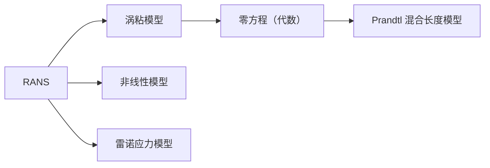

# 湍流理论

> 湍流无处不在
>
> - 风卷云涌、火山喷发、木星大红斑
> - 几乎所有的宏观工程应用场景

!!! info "Osborne Reynolds（1842-1912）"
    德国力学家、物理学家、工程师。

    1. 引入表征流体惯性力和粘性力之比的一个量纲为 1 的数，后人称之为雷诺数。
    2. 发现流动的相似律
    3. 研究管道流动的稳定性，发现层流到湍流的转变规律
    4. 雷诺平均的引入

!!! quote "Quotes"
    问上帝两个问题

    *湍流是经典物理中最后一个未解决的且重要的问题*。
 —— Richard P. Feynman

## Flow States

Three regimes of viscous flow:

- Laminar Flow（层流）
- Transition（转捩）
- Turbulent Flow（湍流）

## 什么是湍流？

类似于涡，湍流没有准确的定义。

- 首先，肯定不是层流 
- Irregularity
- Diffusivity
- Large Reynolds Numbers
    - Turbulent flows {++always++} have high Reynolds numbers
    - 唯象学
- Three-dimensional vorticity fluctuations
- Continuum
- Dissipation and Cascade

!!! quote 
    

    Big whirls have little whirls,

    that feed on their velocity.

    Little whirls have lesser whirls,

    and so on to viscosity.

    

    
 —— Lewis Fry Richardson 

- Turbulent flows are flows
    - 是流动状态而非物质属性
- unsteady

!!! info "Theodore von Kármán (1881-1963)"
    匈牙利裔美国空气动力学家、机械工程师、物理学家。

    - 1908, Universität Göttingen, PhD
    - 1912

!!! info "Geoffrey Ingram Taylor (1886-1975)"
    英国力学家。

    1. 阐明激波内部结构（1910）；对大气湍流和湍流扩散

!!! info "Lewis Fry Richardson (1881-1953)"
    

!!! info "Andrei Nikolaevich Kolmogorov (1903-1987)"
    苏联数学家、力学家。
    他对湍流统计理论的贡献至今无人能够推进。

!!! info "周培源（1902-1993）"
    中国著名力学家

    湍流模式理论

## 统计平均方法

### 时间平均法

在湍流场中某一点 $x$ 处，测量流动物理量 $u$ 随时间的变化，其时均值的定义为

$$
\bar{u}(\boldsymbol{x}; T, t_0) = \frac{1}{T} \int_{t_0}^{t_0 + T} u(\boldsymbol{x}, t) \, \mathrm{d} t
$$

其中，$T$ 为实行平均运算的时间区间（远大于物理量高频脉动周期），$t_0$ 为该区间的起点。

如果平均值于参考时刻 $t_0$ 无关，

$$
\bar{u}(\boldsymbol{x}) = \frac{1}{T} \int_{t_0}^{t_0 + T} u(\boldsymbol{x}, t) \, \mathrm{d} t
$$

### 空间平均法

在管道轴线上取长度为 $L$ 的一段，

$$
\tilde{u}(t; x_0, L) = \frac{1}{L} \int_{x_0}^{x_0 + L} u(x, t) \, \mathrm{d} x
$$

如果空间平均值 $\tilde{u}$ 与参考位置 $x_0$ 无关，

$$
\tilde{u}(t) = \frac{1}{L} \int_{x_0}^{x_0 + L} u(x, t) \, \mathrm{d} x
$$

### 系综平均法

对于某一种湍流流动，在实验室中采用相同的实验条件做大量的实验，在每一个实验中在同一位置和相应时刻测出相应物理量 $q$ 的值，将所有数值做算术平均，得到系综平均值 $\braket{q}$.

$$
\braket{q}(\boldsymbol{x}, t) = \frac{1}{N} \sum_{n=1}^N q^{(i)} (\boldsymbol{x}, t)
$$

但是实验又昂贵又耗时！经常用时间平均和空间平均来代替系综平均，而这么做的依据是**各态遍历性假设（ergodic hypothesis）**.

!!! info "各态遍历性假设"
    如果在多次实验中，一个随机变量出现的所有可能状态能够在一次实验的相当长的时间或相当大的空间范围内以相同的概率出现，则称之为各态遍历的。

    在各态遍历假设下，时间平均值、空间平均值和系综平均值三者是等价的：

    $$
    \bar{u}(\boldsymbol{x}) = \tilde{u}(t) = \braket{u}(\boldsymbol{x}, t)
    $$

    这一观点受到挑战。

    > Multiple states in turbulence（多湍流态）
    > 
    > 迟滞现象

### 平均运算（Reynolds decomposition）

将流动物理量 $q$ 进行分解

$$
q = \braket{q} + q'
$$

其中 $q'$ 为流动物理量的脉动值。有如下性质

- $\braket{q'} = 0$
- $\braket{\braket{q}} = \braket{q}$
- $\braket{q \, \braket{p}} = \braket{q} \, \braket{p}$
- 求导算符和平均算符可以互换位置：$\braket{\frac{\partial q}{\partial t}} = \frac{\partial \braket{q}}{\partial t}$

## 雷诺方程

不可压缩牛顿流体的流动满足 N-S 方程和连续性方程：

$$
\begin{align}
    & \frac{\partial u_i}{\partial t} + u_j \frac{\partial u_i}{\partial x_j} = -\frac{1}{\rho} \frac{\partial p}{\partial x_i} + \nu \frac{\partial^2 u_i}{\partial x_j \partial x_j} + f_i \tag{1}\\
    & \frac{\partial u_j}{\partial x_j} = 0 \tag{2}
\end{align}
$$

对上述方程做平均，得到

$$
\begin{align}
    & \frac{\partial \braket{u_i}}{\partial t} + \braket{u_j \frac{\partial u_i}{\partial x_j}} = -\frac{1}{\rho} \frac{\partial \braket{p}}{\partial x_i} + \nu \frac{\partial^2 \braket{u_i}}{\partial x_j \partial x_j} - \frac{\partial \braket{u_i' u_j'}}{\partial x_j} + \braket{f_i} \\
    & \frac{\partial \braket{u_j}}{\partial x_j} = 0
\end{align}
$$

对于非线性项，

$$
\begin{aligned}
    \left\langle u_j \frac{\partial u_i}{\partial x_j} \right\rangle &= \left\langle \frac{\partial u_i u_j}{\partial x_j} - \cancel{u_i \frac{\partial u_j}{\partial x_j}}\right\rangle = \frac{\partial \braket{u_i u_j}}{\partial x_j} \\
    &= \frac{\partial \Big\langle(\braket{u_i} + u_i')(\braket{u_j} + u_j')\Big\rangle}{\partial x_j} \\
    &= \frac{\partial}{\partial x_j} \Big( \braket{u_i} \braket{u_j} + \cancel{\braket{u_i'} u_j' + \braket{u_j'} u_i'} + \underset{一般不为 \, 0 \; (!)}{\underbrace{\textcolor{tomato}{\braket{u_i' u_j'}}}} \Big) \\
    &= 
\end{aligned}
$$

得到雷诺平均动量方程：

$$
\begin{equation} \label{eq:reynolds-avg-momentum} \tag{3}
    \frac{\partial \braket{u_i}}{\partial t} + \braket{u_j} \frac{\partial \braket{u_i}}{\partial x_j} = -\frac{1}{\rho} \frac{\partial \braket{p}}{\partial x_i} + \nu \frac{\partial^2 \braket{u_i}}{\partial x_j \partial x_j} - \frac{\partial \braket{u_i' u_j'}}{\partial x_j} + \braket{f_i}
\end{equation}
$$

### 湍动能方程

对雷诺应力方程的下标 $i, j$ 取为相同，得到湍动能方程

- $-\varepsilon$ 表征了多少动能耗散到了内能

## Kolmogorov's Turbulent Theory

- {++Kolmogorov's hypothesis of local isotropy++}: At sufficiently high Reynolds numbers, the small-scale turbulent motions ($l \ll l_0$) are **statistically isotropic**.
- {++Kolmogorov's first similarity hypothesis++}: In every turbulent flow at sufficiently high Reynolds number, the statistics of the small-scale motions ($l \ll l_{\mathrm{EI}}$) have a universal form that is **uniquely determined by the kinematic viscosity $\nu$ and the rate of dissipation of turbulent kinetic energy per unit mass $\varepsilon$（湍流耗散率）**.
- {++Kolmogorov's second similarity hypothesis++}: In every turbulent flow at sufficiently high Reynolds number, the statistics of the motions of scale $l$ in the range $\eta \ll l \ll l_0$ have a universal form that is **uniquely determined by $\varepsilon$, independent of $\nu$**.

在惯性子区，湍流统计量只依赖于湍流耗散率 $\varepsilon$，与流体粘性无关。

根据量纲分析，能谱的唯一可能形式是 $\boxed{E(k) \propto \varepsilon^{2/3} k^{-5/3}}$

## 湍流模拟的方法

- 直接数值模拟（DNS, Direct Numerical Simulation）
- 大涡模拟（LES, Large Eddy Simulation）
- 雷诺平均纳维-斯托克斯方程（RANS, Reynolds-Averaged Navier-Stokes Equations）

计算效率：DNS < LES < RANS

数值精度：DNS > LES > RANS

区分：模型方程（算雷诺应力或者涡粘系数的方程）和 RANS 方程（即雷诺方程，用来算速度场）

### 混合长度模型

类比平均自由程

### S-A 单方程模型

完全是拼凑出来的经验模型

- Spalart 和 Allmaras 于 1992 年提出的，针对翼型亚声速流动设计，求解的是运动涡粘度（湍流粘度）的输运方程
- 专门为涉及壁面边界流动的航空航天应用而设计，对受逆压梯度的边界层有良好的计算结果，但不是通用模型

### $k-\varepsilon$ 双方程模型

> $\nu$ 对于不可压缩流体是常数，但湍流粘性 $\nu_t$ 是局部的

> 参数一多了，啥都能拟合出来，但是普适性就不好说了
>
> “三个参数可以在纸上画一个大象，四个参数就可以让它动起来”

> 没有一种 RANS 模型是普适的！
> 
> David Corson：S-A, SST（F. Menter）, $k-\omega$ 可以解决大部分工程问题

### LES

!!! note "Remarks"
    - LES 是非定常计算，需要时间步进，计算量比 RANS 大得多
    - LES 和 RANS 在涡粘假设下有相同的形式，仅特征尺度不同

## 壁湍流（Wall-bounded Turbulence）

- 湍流研究中非常重要的一个研究内容，与工业工程应用密切相关
- 三类壁湍流标准模型
    - 槽道湍流（channel flow）
    - 管道湍流（pipe flow）
    - 平板边界层湍流（flat-plate boundary layer turbulence）

### 槽道湍流

- 流向（streamwise, $x$）统计均匀
- 壁面法向（wall-normal, $y$）
- 展向（spanwise, $z$）统计均匀
- 壁面位于 $y = 0, y = 2 \delta(h)$
    - $\delta$ 为半槽宽度（half-width）
- 特征雷诺数

#### 平均运动方程

流向和展向均匀、各态遍历，

$$
\frac{\partial \braket{u}}{\partial x} = 0, \quad \frac{\partial \braket{w}}{\partial z} = 0, \quad \braket{w} = 0
$$

代入到不可压缩条件

$$
\nabla \cdot \braket{\mathbf{u}} = \frac{\partial \braket{u}}{\partial x} + \frac{\partial \braket{v}}{\partial y} + \frac{\partial \braket{w}}{\partial z} = 0
$$

得到 $\frac{\partial \braket{v}}{\partial y} = 0$. 而壁面条件要求 $\braket{v}\big|_{y=0} = 0$，所以 $\braket{v} = 0$. 故平均速度只有流向分量（法向和展向分量为 0）

### 湍流边界层

没有精确解
